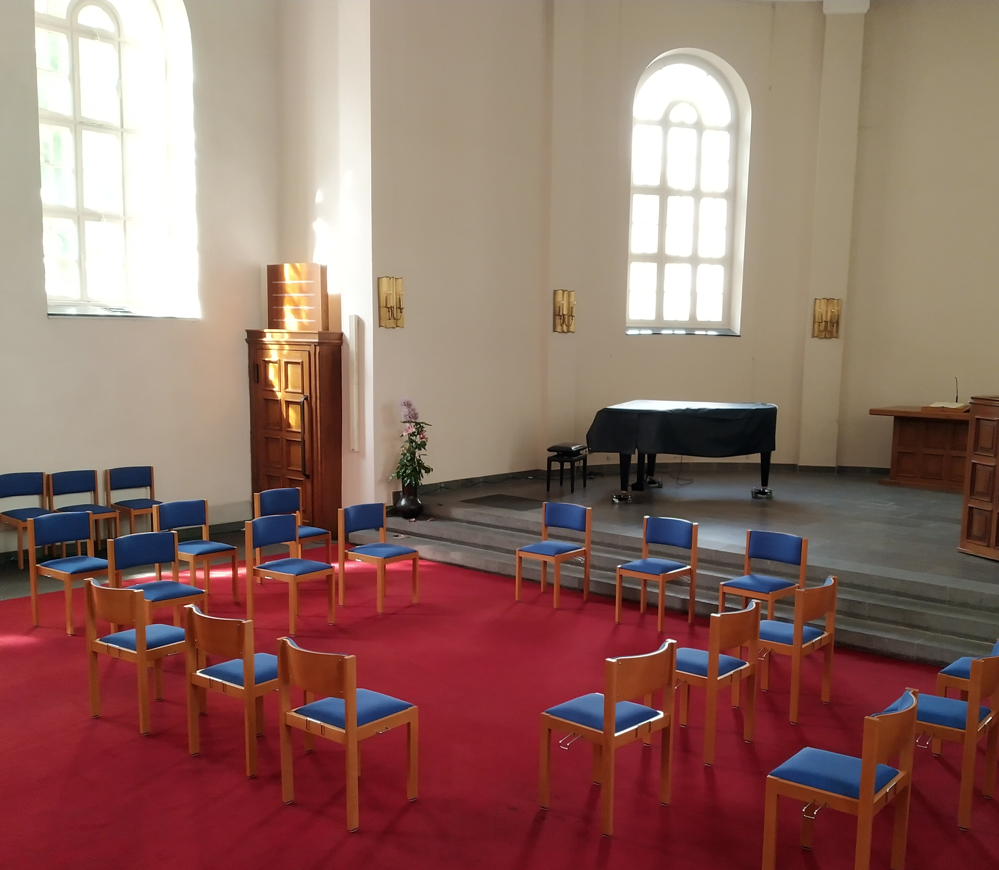
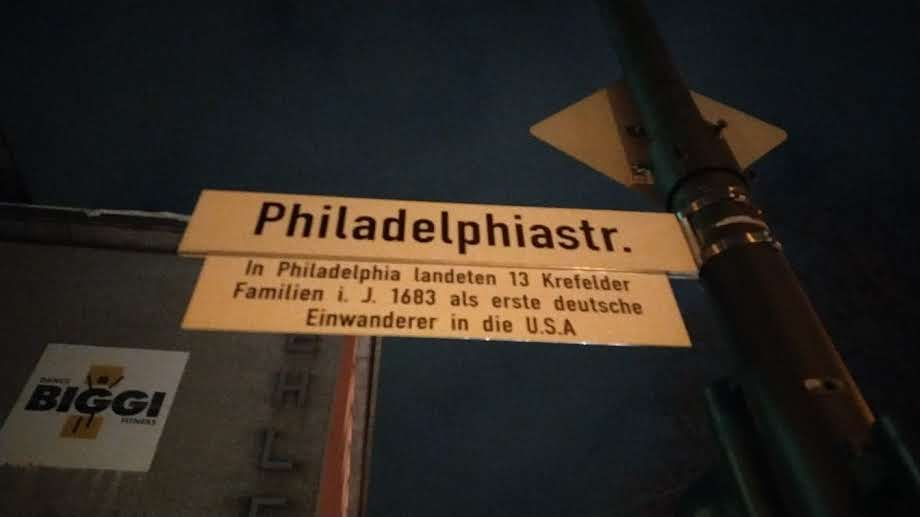
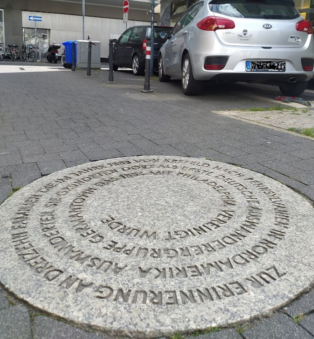

> *... Denn alles, wonach mein Herz verlangt, ist in dir allein. Schweigen sollen alle Gelehrten, stille sein alle Geschöpfe vor deinem Angesichte: du allein rede zu mir!*

Die Aussage stammt von dem Augustiner-Mönch Thomas von Kempen. Sie hätte aber genauso von einem Quäker stammen können. In den „unprogrammierten Andachten” der Quäker wird die Aufmerksamkeit auf Gott und seine unmittelbare Offenbarung gerichtet. Es gibt keinen vorbestimmten Ablauf, mit Gesang, Predigt und liturgischen Handlungen. Stattdessen sammeln sich die Anwesenden in Stille, kommen zur Ruhe und schaffen so Raum für den inneren Dialog mit Gott. Wo sich eine Person vom Geist bewegt fühlt, wird sie entsprechend etwas laut äußern.

Wie läuft die Quäker-Andacht in Krefeld genau ab?
-------------------------------------------------

Die Andachten findet zwei mal im Monat, in der [Königstraße 132, in 47798 Krefeld](https://goo.gl/maps/Nyc3iZEUAGLM1JKd7) Statt. Das konkrete Datum und die Uhrzeit wird über die Website der Krefelder Mennonitengemeinde bekannt gegeben ( [mennoniten-kr.de](https://mennoniten-kr.de/) ). Es wird empfohlen, ein paar Minuten früher zu kommen, um seinen Platz zu suchen und zur Ruhe zu kommen.

Nach Begrüßung und einleitenden Worten folgt schon die Sammlung in der Stille. Wer durchs Lesen spiritueller Texte (während der Andacht) Inspiration und Unterstützung sucht, dem ist freigestellt, dies zu tun. Handlungen, die vom Zweck der Andacht – der inneren Sammlung – ablenken, sollten möglichst unterbleiben.

Wer sich dazu berufen fühlt, kann das Wort ergreifen und zu den Versammelten sprechen. Dazu wird traditionell aufgestanden, wenn es möglich ist und angemessen erscheint. Es wird frei und spontan gesprochen und nicht abgelesen. Ein solches Wort soll mit offener wohlwollender Grundeinstellung aufgenommen werden. Widerreden sind möglich. Alle sollten aber darauf achten, in welchem Geist sie sprechen. Es gilt, sich Zeit zu lassen und zu prüfen, bevor man spricht.

> *„Nicht ihr werdet dann reden, sondern der Geist eures Vaters wird durch euch reden.”*
>
> Mt 10,20

> *„Wer aber die Wahrheit Gottes liebt und das tut, was er will, der tritt ins Licht!  Dann zeigt sich: Gott selbst bestimmt das Handeln dieses Menschen.”*
>
> Joh 4,21

Die Andacht wird vom Versammlungsleiter oder -Leiterin nach ca. 60 Min. beendet. Traditionell, durch das Händereichen zum Sitznachbarn. In pandemisch-epidemischen-Zeiten wird das ersetzt durch eine Berührung mit dem Ellenbogen (und einem freundlichen Lächeln). Im Anschluss gibt es Gelegenheit zum „Gespräch aus der Stille”. Hier können Erfahrungen, Fragen und Gedanken geteilt werden, die während der Stille gesammelt wurden. Dieser Teil hat keine formalen Regeln oder Abläufe.

Was sind diese Quäker?
----------------------

Die Quäker entstanden während der Wirren des englischen Bürgerkriegs im 16. Jahrhundert im Kontext der [Dissenter-Bewegung](https://de.wikipedia.org/wiki/Dissenter), aus der auch die Baptisten stammen. „Quäker” war anfänglich eine Spottbezeichnung, die aber schließlich von der Glaubensgemeinschaft als Selbstbezeichnung verwendet wurde. Der formale Name lautet „Religious Society of Friends” zu Deutsch „Religiöse Gesellschaft der Freunde”. Quäker formulierten kein verbindliches Glaubensbekenntnis. Ein „Zeugnis geben” bezieht sich in erster Linie auf ihre Lebensführung und weniger auf ein verbales Bekenntnis. Hier kristallisierten sich [die Vier (Quäker-)Zeugnisse](https://de.wikipedia.org/wiki/Qu%C3%A4kerzeugnis) heraus, die bis heute in allen Zweigen anerkannt sind.:

- ***Peace Testimony*** (Friedenszeugnis)
- ***Testimony of Integrity*** (Zeugnis der Wahrhaftigkeit)
- ***Testimony of Equality*** (Zeugnis der Gleichheit)
- ***Testimony of Simplicity*** (Zeugnis der Einfachheit)

Das Friedenszeugnis machte die Quäker zu einer [historischen Friedenskirche](https://de.wikipedia.org/wiki/Friedenskirche_(Konfession))

> *"Jesus antwortete: Mein Reich ist nicht von dieser Welt; wenn mein Reich von dieser Welt wäre, so hätten meine Diener gekämpft, damit ich den Juden nicht überliefert würde, jetzt aber ist mein Reich nicht von hier."*
>
> Joh 18:36

Das zweite Zeugnis begründet das Verbot von Glücksspiel und die Eidesverweigerung

> *"Ich aber sage euch: Schwört überhaupt nicht, [...] Eure Rede sei: Ja ja, nein nein; was darüber hinausgeht, stammt vom Bösen."*
>
> Mt 5,34-37

Aus dem Zeugnis der Gleichheit, leitet sich das allgemeine Priestertum ab, das von Anfang an Frauen mit einschloss.

> *"Und Gott schuf den Menschen als sein Bild, als Bild Gottes schuf er ihn; als Mann und Frau schuf er sie."*
>
> 1.Mose 1,27

Das Zeugnis der Einfachheit richtet sich gegen Verschwendung und Eitelkeit

> *"Und warum seid ihr um Kleidung besorgt? Betrachtet die Lilien des Feldes, wie sie wachsen; sie mühen sich nicht, auch spinnen sie nicht. Ich sage euch aber, dass selbst nicht Salomo in all seiner Herrlichkeit bekleidet war wie eine von diesen."*
>
> Mt 6,28

Die Bibel hat nach wie vor bei vielen Quäker eine zentrale Rolle. Sie ist aber nicht allein Maßstab des Handelns der Einzelnen oder der Gemeinde. Je nach theologischer Ausrichtung der Versammlung (Gemeinde), hat die unmittelbare Offenbarung - Quäker sprechen vom „inneren Licht” - sogar höhere Autorität. Im Quäkertum gibt es weder zentralistische Organisation, noch hat es autoritäre Strukturen. Dies führt zu grossen Unterschieden in den weltweit verbreiteten Gemeinschaften.

Was haben Quäker mit den Mennoniten und mit Krefeld zu tun?
-----------------------------------------------------------

Auch wenn die Mennoniten ca. 100 Jahre älter sind als die Quäker, gibt es eine Reihe theologischer Überschneidungen. Im deutschsprachigen Raum trafen die beiden Gemeinschaften früh aufeinander. Es wurde leidenschaftlich miteinander gestritten, aber auch vertrauensvoll kooperiert. Für außenstehende Zeitgenossen war es oft nicht leicht zu erkennen, wer zu welcher Gruppe gehörte. Erschwerend kam hinzu, das es immer wieder zu Übertritten und Mischehen kam. Auch Patenschaften für Kinder sind konfessionsübergreifend dokumentiert.

Eine der bedeutendsten Kooperationen der beiden Gruppen entstand in Krefeld. Der lutherische Pietist [Franz Daniel Pastorius](https://de.wikipedia.org/wiki/Franz_Daniel_Pastorius) organisierte die Auswanderung von dreizehn Mennoniten- und Quäker-Familien nach Pennsylvania. Das Schiff „Concord”, dass die Gruppe transportierte, wird auch als „deutsche Mayflower“ bezeichnet. Noch im Jahr ihrer Ankunft 1683 wurde die Siedlung Germantown gegründet, die erste deutsche Ansiedlung in Nordamerika. Fünf Jahre nach ihrer Ankunft 1688 initiierten Abraham und Hermann Isacks op den Graeff, Gerrit Henderich und Pastorius den ersten schriftlich überlieferten Protest gegen die Sklaverei in Amerika.

Im Vergleich zur Verbreitung von Quäkern in Nordamerika, Großbritannien und heute vor allem in Afrika, sind die Zahlen im deutschsprachigen Raum immer bescheiden geblieben und dürften kaum über den dreistelligen Bereich hinausgekommen sein. Zweimal ist das Quäker-Leben in Deutschland komplett zum Erliegen gekommen, so dass das heutige Quäkertum keine durchgehende Geschichte hat.

Als Name unseres Andachtksreises wurde ***Concord*** gewählt, um an alte Krefelder Traditionen anzuknüpfen und dazu zu ermuntern, spirituell und geistig mobil zu bleiben. Darüber hinaus soll der Name motivieren, sich gegenseitig zu unterstützen, neue Wege zu beschreiten und sich von Gott leiten zu lassen.

