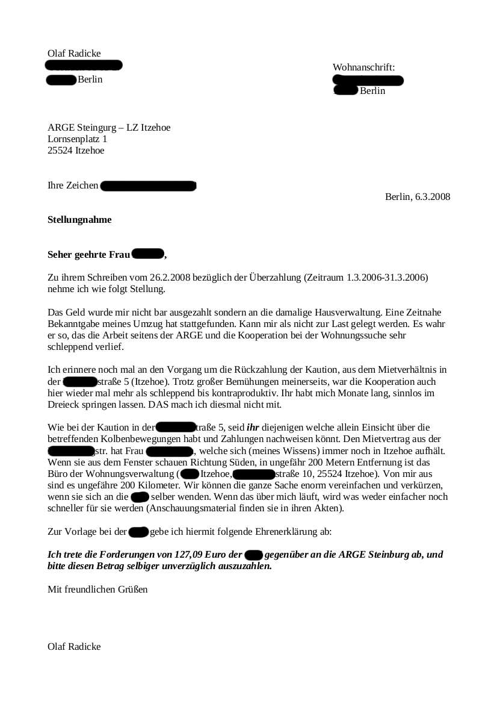
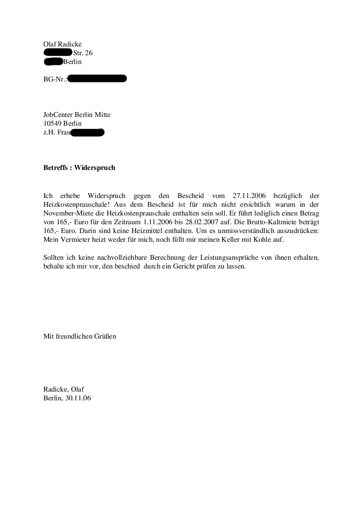
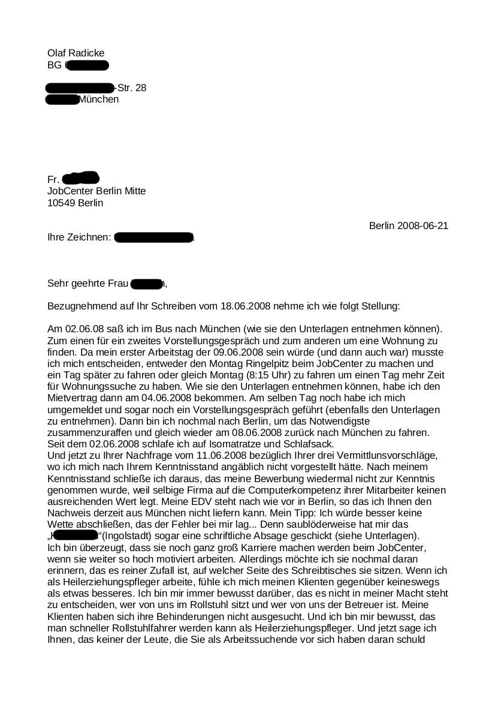
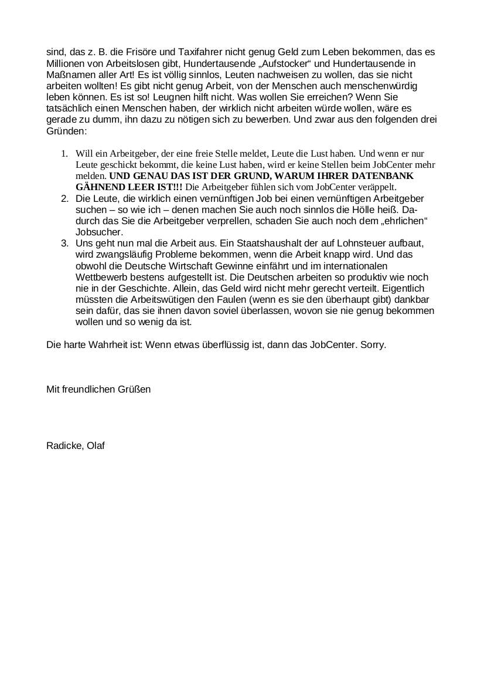
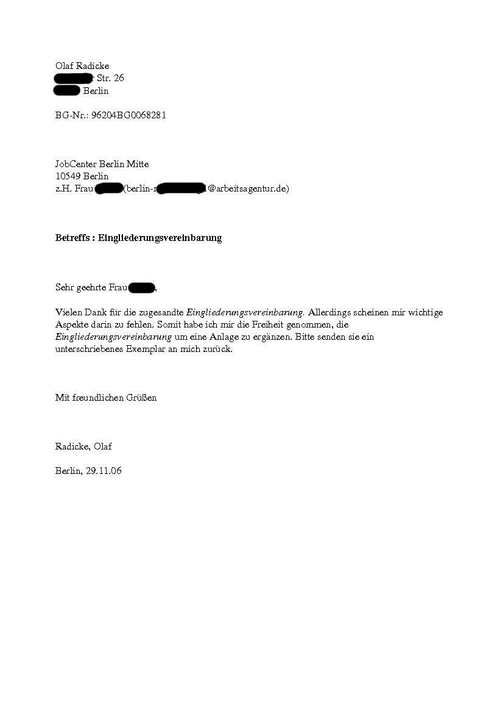
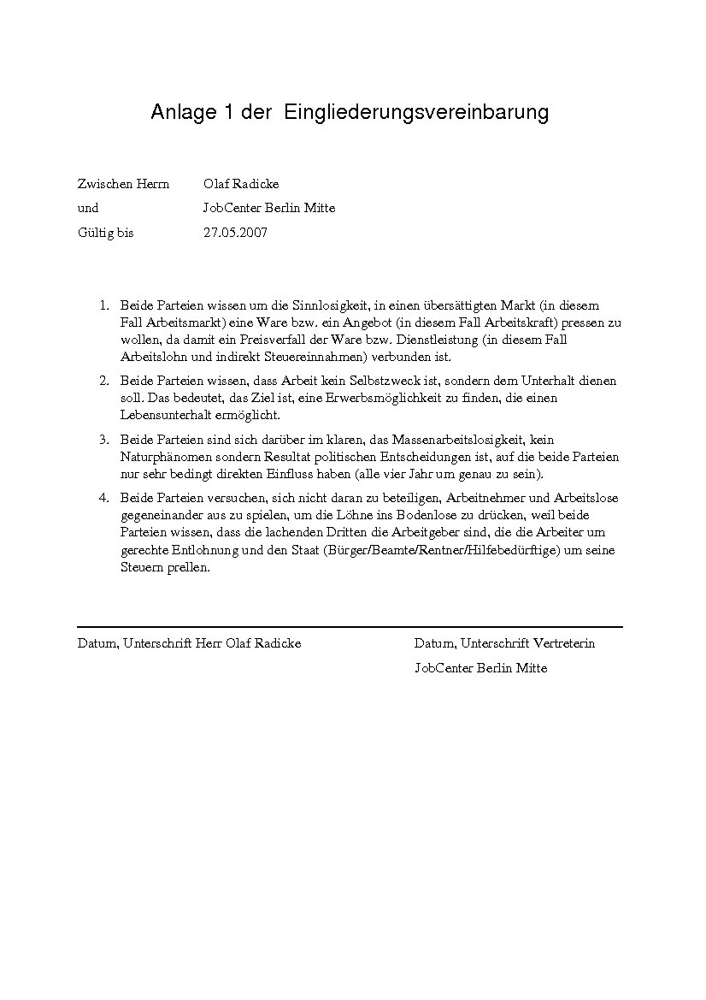
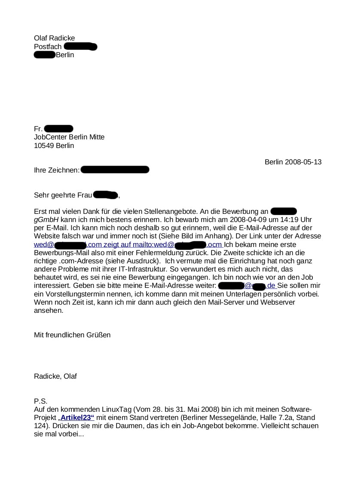

<b>Der Artikel stammt aus dem Archiv!</b> Die Formatierung kann beschädigt sein.

Verfolgungsbetreuung ist eine Umschreibung für institutionelles Mobbing. Den Begriff (ersteren) gibt es tatsächlich. In Wikipedia wird er so definiert:
<i>„Verfolgungsbetreuung“ ist ein in einigen Arbeitsagenturen kursierendes polemisches Schlagwort für Tätigkeiten, die eine Leistungseinstellung bewirken sollen.</i>[1]

Und das ist keine urban legends[2] sondern etwas was mittlerweile der ganz normale Wahnsinn ist. Um Anderen nicht das Gefühl zu geben die Einzigsten zu sein die Spiesruten laufen beim JobCenter und um den Widerstand gegen unmenschliche Behandlung zu stärken, und auch  um der dummen Harz-IV-Hetze in den Boulevard-Medien was entgegen zu setzen, hier mal ein Paar Anschreiben von mir an das JobCenter mit verschiedenen Streitigkeiten.

Auf Grund des Schreibens <i>2006_03_06_ARGE_Itzehoe.jpg</i>

wurde die Forderungen zurückgezogen.  Auch dem Einspruch <i>2006_11_30_einspruch-heizkosten.jpg</i>

wurde statt gegeben. Auch die Behauptung/Verdacht ich hätte mich nicht nicht beworben, wurde nach meinem Schreiben <i>2008_06_21_JobCenter-1.jpg</i>

und <i>2008_06_21_JobCenter-2.jpg</i>

fallen gelassen. Meine Version des "Wiedereingliederungsvertrags" (<i>eingiederungsvertrag-1.jpg</i>

und <i>eingiederungsvertrag-2.jpg</i>

)habe ich natürlich nicht unterschrieben wieder zurück bekommen. Auf meinen Brief <i>2008_05_13_Bewerbungsnachweis.jpg</i>

bekam ich nie eine Antwort geschweige eine Kürzung meiner Bezüge. Die Behauptung war einfach wieder mal Haltlos.

Ganz wichtig bei Behörden: Nichts dem Zufall überlassen, Alle Belege aufheben, alles Quittieren lassen und nichts ohne Zeugen tun, was ihr sonst nicht nachweisen könntet.

<h2>Links/Quellen</h2>
<ul>
    <li>[1] Wikipedia zu „Verfolgungsbetreuung“ http://de.wikipedia.org/wiki/Verfolgungsbetreuung</li>
    <li>[2] Wikipedia zu „Moderne Sage" http://de.wikipedia.org/wiki/Moderne_Sage<li>
</ul>
