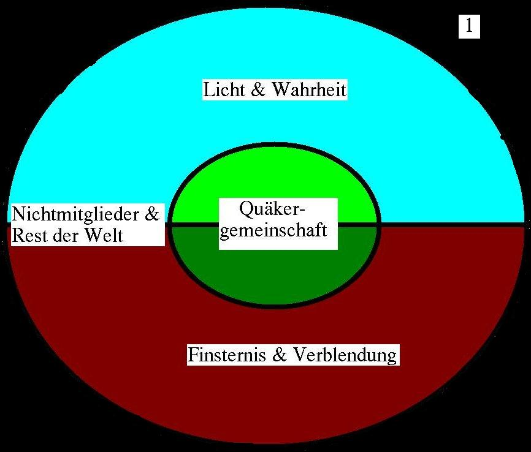
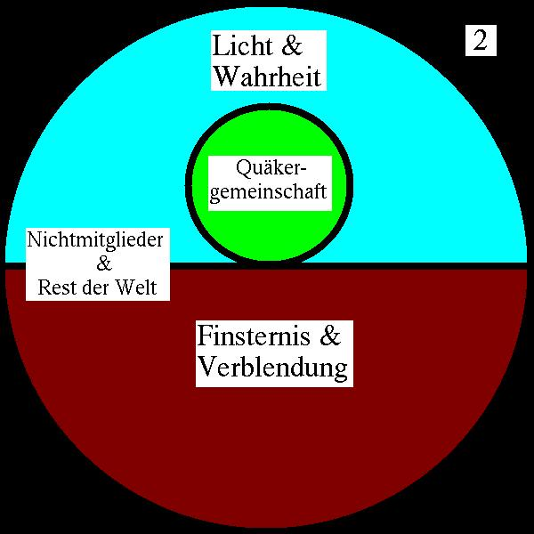

**Der Artikel stammt aus dem Archiv!** Die Formatierung kann beschädigt sein.

Im "Quäker" 4/2008 auf Seite 222 [7] ist der Artikel "Quäker-Mitglied werden" von Martin Januschek zu finden. Mein erster Eindruck: Wirr. absolut wirr. Nicht wirklich klar. Der Artikel setzt an mit dem Satz:

<i>**"Ein kurzer Aufsatz über ein ganz einfaches Thema, dessen Einfachheit sich lohnt, mit Überzeugung und überzeugter Begeisterung herausgestellt zu werden."**</i>

Beim ersten Lesen des Artikels dachte ich, entweder fehlt dem Autor die Gabe sich klar aus zu drücken, oder sind seine Gedanken wirklich so sprunghaft und wenig konsequent zu Ende gedacht. 

Es ist ja nichts dagegen einzuwenden, eigene Begrifflichkeiten zu entwickeln, aber dann ist man dem Leser gegenüber in der Pflicht, diese zu definieren und dessen Grundannahme zu erörtern. Das tut aber Martin Januschek nicht. Statt dessen überlässt er es der freien Assoziation des Lesers, irgendetwas hinein zu interpretieren.

Die erste Formulierung, die mir Kopfzerbrechen bereitete war:

<i>**"In eigener Entscheidung und nach kurzer Zeit beitreten kann man nur zu Gruppierungen, <u>deren Wesen gesondertvondenzugehörigenPersonen in einem verbindlichem Regelwerk erfasst oder darstellbar ist. Und so etwas gibt es bei uns nicht."</u>**</i>

Also das Wort <i>gesondertvondenzugehörigenPersonen</i> mag noch ein unglücklicher Schreibfehler gewesen sein. Was er mit <i>Regelwerke gesondert von den zugehörigen Personen</i> versteht oder ausdrücken wollte, bleibt mir unklar. Dass die GYM (German Yearly Meeting) kein verbindliches und darstellbares Regelwerk hätte, kann ich nicht nachvollziehen. Was ist dann die "Ordnung des Zusammenlebens"? Sicher, einige Mitglieder mögen der Meinung sein, sie könnten die <i>"Ordnung des Zusammenlebens"</i> halten wie ein Dachdecker. Aber ich glaube nicht, das sie so gedacht war. Was Martin Januschek vielleicht meinte, aber damit nicht ausdrückte, ist, dass bei der Aufnahme in die Gemeinschaft/Gesellschaft kein festgelegtes Glaubensbekenntnis gesprochen werden muss. Aber nicht aus dem Grund, weil jeder glauben und sagen darf was er will, sondern weil die frühen Freunde die Auffassung vertraten, dass bloße Beteuerungen nur Schall und Rauch seien. Sie verlangen, dass der Lebensstil die Überzeugung erkennen lassen muss. Das geht also im Kern sogar weit über ein verbales Glaubensbekenntnis hinaus. Es ist also nicht so zu verstehen, dass der Verzicht auf ein Glaubensbekenntnis Ausdruck von Liberalität ist, sondern genau gegenteilig, nämlich als radikale Forderung, dass das gesamte Leben ein Glaubensbekenntnis sein solle. Und zwar im Sinne der Auffassungen und Moralvorstellungen der Quäker. Im dritten Abschnitt von "Abriss der Geschichte, der Lehren, und der Zucht der Freunde, die man Quäker nennet." herausgegeben vom <i>meeting for suffering</i> (Jahresversammlung) in London aus dem Jahre 1792 lesen wir:

<i>**"[Eine Monatsversammlung hat die Aufgabe...] über die Aufrichtigkeit und Fähigkeit solcher Personen zu urteilen, die sich von den Grundsätzen der Gesellschaft überzeugt angeben, und wünschen zu Mitgliedern aufgenommen zu werden; um gehörige Aufmerksamkeit auf die Ausübung religiöser und moralischer Pflichten zu erwecken um solche Mitglieder zu behandeln, die sich gegen die Regeln der Gesellschaft vergangen haben;"**</i>[1]

Ich finde, das klingt schon ziemlich straff. Da zu kommen für mich noch die vier Zeugnisse. Ich denke notorische Lügner, Waffenhändler, Menschenhändler würden von der Gesellschaft auch nicht aufgenommen werden (auch wenn es so explizit nirgends steht).

Das nächste was mir aufgestoßen und unverständlich geblieben ist, war der folgende Satz:

<i>**"Wer Mitglied werden möchte, bekundet damit verbindlich, dass die größte sinnvoll erreichbare Anzahl <u>real existierender Quäkerinnen und Quäker</u> - das ist mindestens die Jahresversammlung [...]"</u>**</i>

Ich weiß nicht was mit dem Satz ausgedrückt werden soll. Meine spontane Assoziation war die DDR-Phrase <i>"Real existierender Sozialismus"</i> der in Wahrheit  ein <i>Potemkinsches Dorf</i> [2] war. Wenn damit ausgedruckt werden soll, dass der Autor unterscheidet zwischen virtuellen Kontakten (E-Mail, Telefon, Artikel, Literatur...) und persönlichen Kontakten, ist es reichlich unglücklich ausgerückt und es hätte mindesten noch ein erklärenden Satz, wenn nicht gar ein Absatz dazu bedurft, das zu erklären und die Gewichtung zu begründen. Das würde zu dem späterem Satz passen: 

<i>**"Das Mitglied-Werden setzt demgemäß voraus, dass die betreffenden Anwärter/innen hinlänglich die Möglichkeit wahrgenommen haben, <u>die Jahresversammlung in Gestalt ihrer real existierenden Menschen,</u> nebst deren einzelnen und gemeinsamen Handlungsweisen, detailliert kennen zu lernen, und von diesen Menschen kennen gelernt zu werden."**</i> 

Nun wenn das wirklich die Aussage sein sollte, muss ich sagen: der Fisch stinkt vom Kopf! Will sagen: Diese Forderung zeigt doch schon den völligen Realitätsverlust. Die meisten Menschen - davon gehe <u>ich</u> aus - suchen und verstehen eine Gemeinde so, dass sie ein Stück weit Gemeinschaft mit gleichgesinnten Menschen vor Ort teilen. Nur weil die Quäkergemeinschaft zusammengeschrumpelt ist  wie eine vertrocknete alte Backpflaume, kann man nicht verlangen, dass sich Neue damit abfinden, das Quäkergemeinschaft nur noch im Fernstudium in Form von Besuchen der Jahresversammlung zu haben ist. Das ist die völlig falsche Konsequenz! Das ist nur noch ein "Quäker-Gedächtnis-Treffen" aber keine wirkliche Gemeinschaft. Der Weg muss sein, dahin zu gehen, wo die Menschen sind und dort lebendige Gemeinden aufzubauen, die die Menschen in ihrem Alltag tragen und unterstützen. Ja, ich weiß, das ist harte und ruhmlose Arbeit. Aber ohne kräftige Basisgruppen ist die GYM nur ein kraftloser Kopffüssler von Hobby-Quäkern.

Wenn dann Martin Januschek im nächsten Satz fordert: 

<i>**"Doch mindestens im Prinzip muss es für alle Mitglieder [der Deutschen Jahresversammlung] eine reale Chance des Kennenlernens geben."**</i> 

scheint mir, dass ihm ein wenig der Blick fürs Ganze abhanden gekommen ist. Diese Forderung kann nur von jemanden kommen, der eine Jahresversammlung mit nur deutlich unter 300 Mitgliedern kennt und sich vorstellen kann. Das Philadelphia Yearly Meeting hat 12.000 Mitglieder [3]. Eine solche Forderung wäre dort einfach absurd. Die Japaner hätten das Problem, das sie überhaupt kein Yearly Meeting haben sondern "nur" ein Tokyo Monthly Meeting [4].

Den nächsten Gedankengang des Autors kann ich auch nicht folgen, wenn er schreibt:

<i>**"Und hat ab [der Mitgliedschaft] dann auch die Kompetenz, Konsensentscheidungen ggf. ausschlaggebend zu beeinflussen. So und nur so gibt es bei uns die Mitgliedschaft, im engeren Sinne. Und das ist klar und einfach und sehr gut, finde ich."**</i>

Losgelöst ob es bei der Geschäftsversammlung um "Einmütigkeit" oder einen "Konsens" geht und ob es einen Unterschied zwischen beidem gibt, passt mir nicht, das nur durch die bloße Aufnahme in die Gesellschaft schon die <u>Kompetenz</u> erworben wurde, sich an wichtigen Prozessen zu beteiligen. Die Mitgliedschaft ist letztlich ein von Menschen gemachtes abstraktes Konstrukt. Als solche verleiht sie keine Kompetenz in Dingen der Wahrheit. Deshalb wiederspreche ich auch den beiden nächsten Sätzen:

<i>**"Wer Mitglied wird, spricht damit faktisch eine verantwortliche und uneingeschränkte Bejahung für die real existierende Vielfalt aus, und setzt sich der Chance der ebenso umfassenden Bejahung seitens dieser Vielfalt aus. <u>Dies allein</u> ist der wirkliche triftige Grund für die Mitgliedschaft, für beide Seiten. <u>Mehr als dies ist für das offizielle Quäker-Werden nicht nötig,</u> und weniger wäre nicht genug."**</i>.

Und was ist mit den vier Zeugnissen (Wahrhaftigkeit, Gewaltlosigkeit, Gleichheit(inneres Licht), Einfachheit)? Wenn das wirklich so wäre, würde ich niemals <i>offizielle Quäker</i> werden wollen!

Im folgenden Teil des Artikels wendet sich Martin Januschek dann der Frage zu, wie denn die Nichtmitglieder zu betrachten sind. Wobei er da wohl an die so genannten "Freunde der Freunde" dachte. Also Leute, die sich dem Lebensstil der Quäker innerlich  verpflichtet fühlen, oder mindestens damit sympathisieren. Martin Januschek benutzt diesen Begriff aber nicht. Und so bleibt der Artikel auch in diesen Punkt unklar bis wirr. Das liest sich dann so:

<i>**"Doch wer ohne diese umfassende gegenseitige Bejahung mit uns leben möchte, hat es gar nicht nötig, offiziell Quäker zu werden. Denn es gibt bei uns auch eine "Mitgliedschaft" im weiteren Sinne, ein sehr reales Von-Anfang-an-Dazugehören. Wer irgendwo auf Quäkermenschen stößt, gleich wie viele es sein mögen, ist von Anfang an eine/r von ihnen, sofern er/sie es will, und genau in dem Maß wie er/sie sich selbst einbringt. Und dies bisweilen über Jahre oder sogar Jahrzehnte."**</i>

Diese Schilderung deckt sich nicht mit meiner Erfahrung. Und es verschleiert ein wesentliches Grundproblem des heutigen Zustands der Gesellschaft (GYM). Diese eingeforderte <i><u>umfassende gegenseitige Bejahung</u></i> führte zu eine ungesunden Homogenisierung der Mitgliederstruktur und Beliebigkeit. (Diese Aussage ist kein Widerspruch in sich, wie es auf den ersten Blick scheinen möge. Er sag: Das die Beliebigkeit als Eingangsvoraussetzung postuliert wird, und folglich es nur noch Mitglieder gibt, die dieser Auffassung sind und diese wiederum nur noch Mitglieder aufnehmen, die diese Auffassung teilen, um damit jede Reibung im Vorfeld zu vermeiden. Das ist Konfliktvermeidung oder Psychologisch ausgedrückt: "Kollektives Vermeidungslernen" und mündet in eine pathologische Zwangsneurose.) Wenn jemand nämlich (berechtigt) kritisch an die GYM herantritt, heißt es nämlich all zu schnell: <i>"Du bist kein Mitglied. Es steht dir nicht zu, dich bei ums einzumischen; uns und unsere Strukturen zu kritisieren."</i> Wenn dann ein Mensch mit gesunder und berechtigt kritischer Einstellung zur GYM ein Mitgliedsantrag stellt, wird er zu hören bekommen: "Warum willst du Mitglied werden, wenn du die GYM kritisierst?" Und so beißt sich die Katze in den eigenen Schwanz. Es kommen keine neuen Impulse mehr von außen und die Mitglieder bestätigen sich immer nur gegenseitig in ihren Fehlern. Das wiederum schreckt Neue ab, die dann schneller wieder weg sind als sie gekommen sind. Ein beliebtes <i>Totschlagargument</i>, welches Martin Januschek weiter oben auch schon anbrachte, ist: <i>"Du bist noch nicht lang genug dabei, um das beurteilen zu können."</i> Dieses Argument wird man so lange immer wieder hören, bis man sich angepasst hat oder bis man weg bleibt. Sowieso ist es eine beliebte Taktik, Kritik <u>an sich als</u> "unquäkerisch" zu diffamieren, weil Kritik kann ja verletzen und verletzen darf man ja nicht...

Diese undefferenzierte Definition von Mitgliedschaft setzt sich dann in dem weiteren Text fort:

<i>**"Bei uns geht das, denn darin sind wir anders als solche Gruppierungen, deren Wesen man erstmal gesondert von den zugehörigen Personen entlang einem verbindlichen Regelwerk akzeptieren muss, um "dabei" zu seien. Wir Quäkerinnen und Quäker bedürfen keiner weiteren Beitrittsformalitäten zur jeweiligen Gruppierung. Darum gibt es auch keine. Und das ist sehr gut so."**</i>

Also ich möchte dem Autor dringend empfehlen sich mit der <i>"Ordnung des Zusammenlebens"</i> (der GYM) auseinander zu setzen. Die selbige ist zwar sehr unvollständig und wird in der Praxis sehr willkürlich angewandt, aber dass es keine Beitrittsformalitäten gäbe, kann man wirklich nicht behaupten. Höchstwahrscheinlich mein der Autor die "Freunde der Freunde" die aber eben <u>**keine Mitglieder**</u> sind und administrativ keinerlei Rechte haben. Dass sie zur Andacht zugelassen werden, sollte ja wohl eine <u>Selbstverständlichkeit</u> sein, oder wurde einem schon mal jemals von Protestanten oder Katholiken die Kirchentür vor der Nase zugeschlagen? Dass Nichtmitglieder auch Aufgaben in der GYM übernehmen ist einzig aus der Not des Mitgliederschwunds entstanden. Und wenn es dann zu Meinungsverschiedenheiten kommt zwischen "Freunden" und "Freunden der Freunde", heißt es dann wieder ganz schnell:<i> "Du bist kein Mitglied. Halte dich mit Kritik zurück!"</i> und spätestens da können sich die "Freunde der Freunde" ihre geleistete Arbeit für die Gemeinschaft <i>in die Haare schmieren</i>.

Um den Leser, dem die Interna der Quäker unbekannt sind, nicht <i>im Regen stehen</i> zu lassen, hier ein Auszug aus der "Ordnung des Zusammenlebens":

<i>**"[...]Für den Eintritt in die Religiöse Gesellschaft ist eine Übereinstimmung in Einzelfragen nicht entscheidend. Wesentlich sind vor allem die religiöse Haltung und die Bereitschaft, diese im täglichen Leben und innerhalb der Religiösen Gesellschaft wirksam werden zu lassen. Das Mindestalter für die Mitgliedschaft beträgt in der Regel 18 Jahre. Die Bewerbung um die Mitgliedschaft erfolgt durch einen schriftlichen Antrag an die zuständige Gruppe [Anmerkung: Das währe eine "Monatsversammlung", wenn es die gibt, ansonsten die Bezirksversammlung (Viertel-Jahresversammlung)]. Aus dem Antrag sollte hervorgehen, was dem Bewerber oder die Bewerberin zum Quäkertum geführt hat.[...] Nachdem die Gruppe in einer Mitgliederversammlung über den Aufnahmeantrag beraten hat, werden zwei Mitglieder gebeten, ein eingehendes Gespräch über religiöse Fragen mit dem Antragsteller oder Antragstellerin zuführen. [...] Es hat sich als hilfreich erwiesen, wenn eines der zwei Mitglieder einer anderen Gruppe [Anmerkung: oder ggf. Bezirk] angehört. Die beiden Mitglieder berichten der Mitgliederversammlung schriftlich und mündlich von diesem Gespräch. Danach entscheidet die Gruppe, ob sie der Mitgliederversammlung des Bezirks empfiehlt, den Antrag anzunehmen oder abzulehnen.[...] In seiner nächsten Mitgliederversammlung berät und entscheidet der Bezirk über den Antrag und informiert die Schreiber der Jahresversammlung.[...]. Die Aufnahme wird danach durch die nächste Mitgliederversammlung der Religiösen Gesellschaft (Jahresversammung) bekannt gegeben."**</i>[5]

Was bei dem ganzen bisher geschriebenen noch gar nicht berücksichtigt wurde, ist, dass es noch eine Juristische Dimension der Mitgliedschaft gibt. Denn die GYM ist ein Verein, mit einer Satzung die dem Vereinsrecht unterliegt und dessen Mitglieder auch <u>**Vereinsmitglieder**</u> sind. Die meisten (oder sogar alle) ohne jemals formal eine Vereinsmitgliedschaft beantragt zu haben. Aber auf diesen Aspekt will ich nicht weiter eingehen, sondern noch einmal zu dem Text von Martin Januschek zurückkommen.

Sein Resümee am Ende lautet:

<i>**"Das alles ist wirklich einfach, finde ich: Mitglied bin ich nur bei der Jahresversammlung - dazugehören tue ich überall, wo ich mitwirke. Das ist alles. Denn Zwischenlösungen oder Hilfskontrukte der "Gleichgesinntheit" haben und wollen wir nicht bzw. nicht mehr: Die Zeiten der Quäkerhüte, grauen Kleider und demonstrativ sonderbaren Verhaltensweisen ist seit Jahrhunderten vorbei."**</i>

Also um von "Jahrhunderten" zu sprechen braucht es mindestens 200 Jahre und 1808 war die Zeit der Quäkerhüte, <i>grauen Kleider und demonstrativ sonderbaren Verhaltensweisen</i> noch nicht vorbei. Vor noch nicht mal 100 Jahren war es noch in vielen Jahresversammlungen für Quäker verpönt, Musikinstrumente zu erlernen und zu spielen.

Meine "Welt des Quäkertum" ist auch sehr einfach. Allerdings beschränke ich meine Betrachtung hier auf die spirituelle Dimension, die mir übrigens in den Artikel von Martin Januschek zu kurz kam. Ich werde meine Sicht der Dinge an Hand zwei einfache Diagramme verdeutlichen.

Der äußere Kreis im Diagramm 1, stellt die sichtbare Welt dar. Sie ist vereinfacht unterteilt in "oben" und "unten", "Licht" und "Finsternis", "Wahrheit" und "Verblendung". Es gibt überall auf der Welt, in jedem Kulturkreis und jeder Glaubensgemeinschaft Menschen, die den unmittelbaren Kontakt mit der Wahrheit suchen und im Licht leben. Sie sind symbolisiert durch den hellblauen Teil des Kreises. Dann gibt es die Menschen, losgelöst von kulturellen und sozialen Kontexten, die in Verblendung leben. Egomanen, die von der Wahrheit nichts wissen wollen und die über Leichen gehen um sich zu bereichern. Diese sind im Reich der Finsternis, dargestellt durch die Farbe dunkelrotbraun. In der Mitte ist ein weiterer Kreis, welcher die Quäkergemeinschaft darstellt. Sie ist grün abgebildet. Es gibt einen hellen und einen dunklen Bereich. Damit soll ausgedrückt werden, dass die Quäkermitgliedschaft nicht die "Lizenz für die Wahrheit" ist. Es gibt hier genauso Verblendung und Wahrheit wie in der Rest der Welt.

Früher wurden Mitglieder kompromisslos hinausgeworfen, wenn sie (aus Sicht der Quäker) nicht mehr ein Leben in der Wahrheit und im Licht  führten, das ist in Diagramm 2 vereinfacht dargestellt. Für diese Aufgabe gab es sogar spezielle  Ämter, die das zu überprüfen hatten. Das waren so genannte "Overseers" also: "Aufseher". Das haben einige Jahresversammlungen übrigens immer noch, wenn auch heute mit veränderter Aufgabenstellung. Der einzige Unterschied zwischen Mitgliedern und Nichtmitgliedern ist (aus Sicht der <i>Wahrheit</i>), der, dass sie sich eine bestimmte organisatorische Struktur geben, die aus ihrer Sicht der Welt herrührt. Ob eine solche Gesellschaft das Recht oder die Pflicht hat, seine Mitglieder zu disziplinieren und zu ermahnen, in der Wahrheit und im Licht zu leben, damit muss man sich dann auseinandersetzen. Aber um sich disziplinieren zu lassen, muss man kritikfähig sein. Und an diesen Punkt scheinen mir viele Mitglieder etwas zu dünnhäutig. Ach übrigens im Englischen heißt die "Ordnung des Zusammenlebens": "THE BOOK OF DISCIPLINE"[6].

## Quellen/Links ##

<ul>
<li>[1] "Deutsche Quäkerschriften, Band 2, 18.Jahrhundert", ISBN-13 9783487134086, Seite 33</li>
<li>[2] Wikipedia zu "Potemkinsches Dorf": http://de.wikipedia.org/wiki/Potjomkinsches_Dorf </li>
<li>[3] "an introduction to quakerism", P. Dandelion, Seite 179, ISBN 0-521-60088-X</li>
<li>[4] Tokyo Monthly Meeting, http://www2.gol.com/users/quakers/ </li>
<li>[5] Seite 33+34, "Quäker heute - in Deutschland und Östereich", ISBN 3-929696-31-2, 2003, http://www.quaeker.org/publikationen/grundlegendetexte/odzlheft.pdf </li>
<li>[6] THE BOOK OF DISCIPLINE - of Ohio Yearly Meeting - of the Religious Society Of Friends,  http://www.ohioyearlymeeting.org/discipline.htm </li>
<li>[7] "Quäker", Nr.5 Sep./Okt. 2008 - 82. Jahrgang (Druckfehler: innen wird auf den Seiten 4/2008 gedruckt), ISSN 1619-0394, Religiöse Gesellschaft der Freunde (Quäker) Deutsche Jahresversammlung e.V.</li>
</ul>

 Dieser Text ist unter einer <a rel="license" href="http://creativecommons.org/licenses/by-sa/3.0/de/">Creative Commons-Lizenz</a> lizenziert. **Und** unter der <a href="http://de.wikipedia.org/wiki/GFDL">GNU-Lizenz für freie Dokumentation</a> in der Version 1.2 vom November 2002 (abgekürzt GNU-FDL oder GFDL). Zitate und verlinkte Texte unterliegen den Urheberrecht der jeweiligen Autoren.
