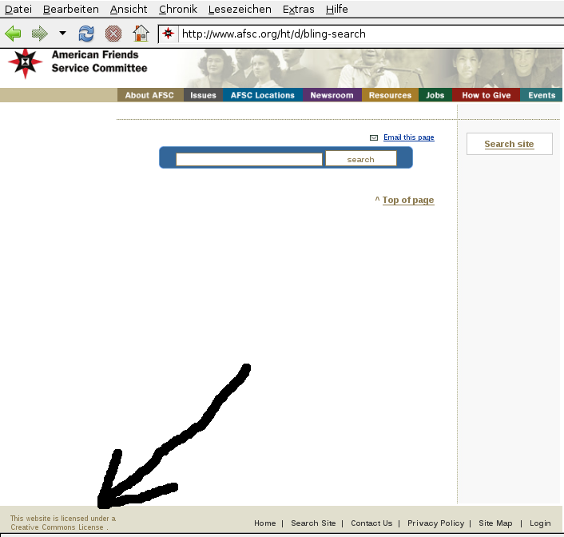
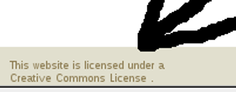

**Der Artikel stammt aus dem Archiv!** Die Formatierung kann beschädigt sein.

Geben ist seliger denn Nehmen!

Apostel 20,35: <i>**"Ich habe es euch allen gezeigt, dass man also arbeiten müsse und die Schwachen aufnehmen und gedenken an das Wort des HERRN Jesus, dass er gesagt hat: Geben ist seliger denn Nehmen!"**</i> Daran musste ich denken, als ich den Text im Impressum Punkt 4. "Urheber- und Kennzeichenrecht" von der Seite des GYM las:
<!--break-->
<i>**"Die Verantwortlichen sind bestrebt, [...] von ihm selbst erstellte Grafiken, Tondokumente, Videosequenzen und Texte zu nutzen oder auf lizenzfreie Grafiken, Tondokumente, Videosequenzen und Texte zurückzugreifen.
[...]
Das Copyright für alle Bestandteile dieser Internetseite liegt bei der Religiösen Gesellschaft der Freunde (Quäker) Deutsche Jahresversammlung e. V. [...]. Eine Vervielfältigung oder Verwendung von Texten, Grafiken, Tondokumente und Videosequenzen in anderen elektronischen oder gedruckten Publikationen ist ohne ausdrückliche schriftliche Zustimmung der Redaktion nicht gestattet." **</i> [1]

Ich muss sagen, das finde ich sehr einseitig. Für die Realisierung seiner Website verwendet das GYM <i>Joomla!</i> [2]. <i>Joomla!</i> steht unter der GNU/GPL-License. Das heißt, ihre Urheber räumen den Benutzern großzügige Rechte ein. <i>Joomla!</i> darf kostenlos weitergegeben werden, darf verändert werden und diese Veränderungen dürfen ebenfalls weiter gegeben werden. Es ist erlaubt, <i>Joomla!</i> kommerziell zu vertreiben oder kommerziellen Service dafür anzubieten. Diese Lizenz hat mittlerweile eine lange Geschichte und ist aus der Erfahrung vieler Softwareentwickler entstanden, dass Kooperation das wichtigste Element für Kreativität ist. Die Lizenz ist also auf Kooperation ausgelegt. Der Autor dieser Lizenz ist übrigens Richard Stallman [3]. Die GPL wird auch als <i>"Copyleft-Lizenz"</i> bezeichnet. Also eine klare Gegenposition zum "Copyright". Wikipedia erklärt hierzu <i>**"Das Copyleft erzwingt die Freiheit von Weiterbearbeitungen und Fortentwicklungen eines freien Ur-Werkes, um dadurch dessen unfreie Vereinnahmung zu verhindern."**</i> [4] Und genau das ist der Punkt! <i>**"»Freie Software« hat etwas mit Freiheit zu tun, nicht mit dem Preis. Um das Konzept zu verstehen, ist an »frei« wie in »freier Rede«, und nicht wie in »Freibier« zu denken."**</i> erläutert die <i>Free Software Foundation</i> auf ihrer Internetseite [5] (die übrigens von Richard Stallman gegründet wurde). Um noch mal klarzumachen, welcher Wert in der Arbeit hinter <i>Joomla!</i> steckt, ein paar Zahlen: In Joomla! stecken 186.000 Zeilen Code. Das sind ungefähr 47 Mannjahre (oder Fraujahre) Arbeit. Das entspricht geschätzten $ 2.603.000 Entwicklungskosten [6].

Aber auch bei den Inhalten hat sich das GYM eifrig an der Arbeit anderer bedient. Die folgenden Bilder, die auf der Seite des GYM benutzt werden, sind alle auf dem Wikipedia-Projekt zu finden (Bilder anklicken für mehr Informationen).

<table >
  <tr>
    <th>
[.jpg)](http://commons.wikimedia.org/wiki/File:Slave-Keepers_Lay(Alter_Fritz).jpg)
    </th>
    <th>

    </th>

  </tr>
  <tr>
    <th>

    </th>

    <th>
[_colored_(Alter_Fritz).jpg)](http://commons.wikimedia.org/wiki/File:Benjamin_Lay_(1681-1760)_colored_(Alter_Fritz).jpg)
    </th>
  </tr>
  <tr>
    <th>

    </th>
    <th>

    </th>
  </tr>
</table>

Die Arbeit von Wikipedia sollte nicht unterschätzt werden. An Wikipedia arbeiten mittlerweile hunderttausende Leute mit, die Millionen von Artikeln erstellen und pflegen in dutzenden von Sprachen. Alles unentgeltlich. Einfach aus Spaß mit anderen Menschen ihr Wissen zu teilen. Dazu kommt noch, dass viele Leute jedes Jahr Millionen von Euro an Wikipedia spenden für Server-Hardware, Strom, Personal, Rechtsstreits, usw.

Es ist völlig legal sich dort zu bedienen. Und es ist sogar gewollt. Aber in der Hoffnung, dass auch wieder etwas zurückfließt. Natürlich werden sich jetzt schon einige gedacht haben <i>**"...Der Olaf hat gut reden. Der verwendet doch selber Bilder von Wikipedia und verlinkt und zitiert es andauernd!"**</i> Ja, das ist richtig. Aber wer aufmerksam meine Artikel gelesen hat, dem wird aufgefallen sein, das ich meine Texte unter der "Creative Commons License" gestellt habe (wie auch diesen. Siehe Fußende) [7]. Das ist eine freie Lizenz und gestattet anderen, meine Texte frei zu benutzen und zu verändern. Selbst das GYM könnte völlig legal Teile meines Textes oder komplette Texte auf seiner Website verwenden. Fairer Umgang mit Ressourcen heißt für mich auch fairer Umgang mit Wissen. 

Ich sage dem GYM: Ihr macht denselben Fehler wie die Quäker, die ihre Sklaven nicht freilassen wollten. Ihr versklavt zwar keine Menschen, aber ihr versklavt Wissen und Informationen. **Kehrt um!** Ihr geht einen Irrweg. Jesus hat uns zurecht ermahnt, zu teilen und zu kooperieren. Auch ihr habt das Quäkertum nur geschenkt bekommen und nicht selbst erfunden. <i>**"Wenn ich weiter sehen konnte, so deshalb, weil ich auf den Schultern von Riesen stand."**</i> [8] Also rückt ein bisschen beiseite, das auch andere Platz auf den Riesen haben. Und wenn jemand Anstalten macht, auf eure Schultern zu steigen, dann seht es als Ehre an, dass jemand glaubt, von euren Schultern weiter sehen zu können!

Ach übrigens: <i>**The American Friends Service Committee**</i>[9] hat seine Website unter Creative Commons License gestellt. 

## Links/Quellen ##
<ul>
<li> [1] Das Impressum der Seite des <i>"Religiösen Gesellschaft der Freunde (Quäker) Deutsche Jahresversannlung e. V."</i> http://www.rgdf.de//index.php?option=com_content&task=view&id=39&Itemid=41 </li>
<li> [2] Wikipediaartikel zu dem CNS Joomla!: http://de.wikipedia.org/wiki/Joomla! </li>
<li> [3] Wikipedia zu Richard Stallman http://de.wikipedia.org/wiki/Richard_Stallman
<li> [4] Wikipediaartikel zu "Copyleft": http://de.wikipedia.org/wiki/Copyleft </li>
<li> [5] "Die Definition Freier Software", http://www.gnu.org/philosophy/free-sw.de.html </li>
<li> [6] Code Analyse von Joomla!: http://www.ohloh.net/p/joomla </li>
<li> [7] Meine unter der CC-Lizenz: http://www.the-independent-friend.de/?q=taxonomy/term/31 </li>
<li> [8] Bekannt durch einen Brief von Newton an Robert Hooke am 5. Februar 1675/76 http://de.wikiquote.org/wiki/Isaac_Newton </li>
<li> [9] Website des American Friends Service Committee: http://www.afsc.org </li>
</ul>

 Dieser Text ist unter einer <a rel="license" href="http://creativecommons.org/licenses/by-sa/3.0/de/">Creative Commons-Lizenz</a> lizenziert. **Und** unter der <a href="http://de.wikipedia.org/wiki/GFDL">GNU-Lizenz für freie Dokumentation</a> in der Version 1.2 vom November 2002 (abgekürzt GNU-FDL oder GFDL). Zitate und verlinkte Texte unterliegen den Urheberrecht der jeweiligen Autoren.
