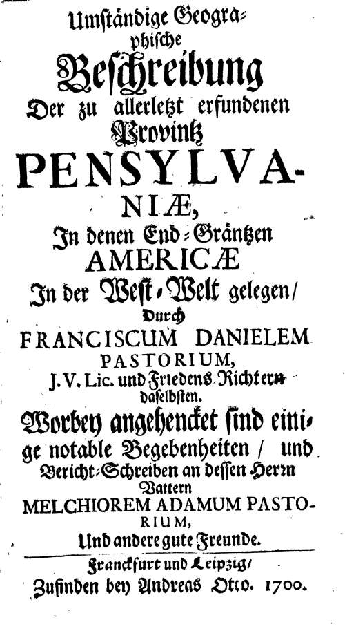

<b>Der Artikel stammt aus dem Archiv!</b> Die Formatierung kann beschädigt sein.

<b>Erstveröffentlichung: 2009-01-23 23:28</b>

Ein hoch interessanten Artikel [1] fand ich jetzt auf rp-online. Der Erste der auf dem Boden der heutigen USA schriftlich und öffentlich gegen die Sklaverei protestierte, war kein Quäker sondern der Mennonit: Franz Daniel Pastorius. Der Selbige stand aber im engen Kontakt zu den Quäkern. Im  Jahr 1683 konnte er 13 Krefelder Mennoniten und Quäkern von seiner Idee überzeugen, in die <i>Neue Welt</i> aus zuwandern, Ausschlaggebend war die dortige Religionsfreiheit.
<!--break-->
Am 18. April 1688 wurde im Haus des Krefelders Thones Kunders der erste öffentliche Protestbrief gegen die Sklaverei in Amerika verfasst. Die Unterzeichner waren Gerrit Hendricks, Dirck op den Graeff (Krefeld), Franz Daniel Pastorius und Abraham op den Graeff (Krefeld). Durch die theologische nähe und die gemeinsame geographische Herkunft waren die Grenzen zwischen Quäkern und Mennoniten sehr durchlässig (schon zu damaliger Zeit). Gut möglich das Quäker an der Erkältung beteiligt waren, aber das sie als solche nicht wahrgenommen wurden. Mennoniten und Quäker wurden oft von ihrem Umfeld undifferenziert wahrgenommen. Aber klar war auch, das zu dem Zeitpunkt wo die Krefelder in den heutigen US-Bundesstaat Pennsylvania ankamen, Quäker am Sklavenhandel beteiligt waren oder Sklavenbesitzer waren. Ob das auf die Krefelder Quäker ähnlich schockierende Wirkung hatte wie auf die Mennoniten wissen wir leider nicht. Gut möglich, das die Krefelder Quäker in der Zwickmühle wahren, einerseits von den in Pennsylvania etablierten Quäker anerkannt und unterstützt werden zu wollen, und anderseits ihrem Gewissen folgen zu wollen und sich den Protesten der Mennoniten an schließen zu wollen. 

<h2>[update:19.2.2009]</h2>
Claus Bernet machte mich darauf aufmerksam, das nach heutigem Stand der Kenntnis  Pastorius kein Mennonit sondern ein Quäker war. *Tärääähhh!!*. Er verweist auf <i>"Zeitzeichen". Evangelische Kommentare zu Religion und Gesellschaft, II, 9, 2001, Seite 57-59.</i>. 

Zudem ist mir jetzt eingefallen das Claus Bernet schon ausführlich auf das Thema eingegangen ist in dem Buch "400 Jahre Mennoniten in Krefeld", 2008, ISBN: 9783921881262, dort Seite 50 und 51, im Aufsatz "Quäker und Mennoniten". Ich zitiere in Auszügen:

<i><b>"Über diese Auswanderung entzündete sich eine heftige Diskusion. Es ging dabei um die Frage, welcher Denomination die Auswanderer zuzurechnen seien. Die Diskusion ist wissenschaftshistorisch sowohl für Mennoniten- wie auch für Quäkerforscher von Interesse [...]. Die Diskussion  eröffnete Christian Neff [...] mit dem Aufsatz 'Die Quäker in Kriegsheim bei Worms' (1911) [Dann folgte ein jahrelanger Schlagabtausch an dem sich beteiligen:  W.Hubben mit drei Aufsätzen, (1926, 1928, 1938), W. Hull und S.W. Pennypacker (1927), F. Nieper und D. Cattepoel (1937), W. Fellmann, W.Niepoth (1953) und abschließend Boecken (1982)] Die damalige Auseinandersetzungen haben die wissenschaftlichen Beziehungen beider Kirchen, die in Deutschland nur wenige gegenseitige Kontakte pflegen, leider nachhaltig gestört. Wissenschaftshistorisch ist zu bemerken, daß der Irrtum Hulls nicht zu korrigieren ist, erst jüngst wurden von renumierter Seite die Krefelder Auswanderer irrtümlich wieder als Mennoniten bezeichnet."</b></i>  

Nun ja. Zumindest an dieser Stelle wurde der Irrtum jetzt korrigiert.

<h2>[update:24.6.2009]</h2>
Ich habe entdeckt das es den Bericht von Franz Daniel Pastorius über die Kolonien in Nordamerika jetzt online zu lesen gibt. 
<ul>
<li><a href="http://gdz.sub.uni-goettingen.de/ru/dms/load/toc/">"Umständige geographische Beschreibung der zu allerletzt erfundenen Provintz Pensylvaniae, in denen End-gräntzen Americae in der West-Welt gelegen''</a> </li>
<li>Strukturtyp:Sammelwerk </li>
<li>Erscheinungsjahr:1700 </li>
<li>Gescannte Seiten:152 </li>
<li>PURL: http://resolver.sub.uni-goettingen.de/purl?PPN327571667 </li>
<li>PPN (digital):PPN327571667 </li>
<li>PPN (original):PPN140927816 </li>
</ul>

<b>Fußnoten</b>
<ul>
<li> <b>[1]</b> rp-online, "Krefelder Protest gegen Sklaverei", 23.01.2009, http://www.rp-online.de/public/article/krefeld/664357/Krefelder-Protest-gegen-Sklaverei.html </li>
</ul>
