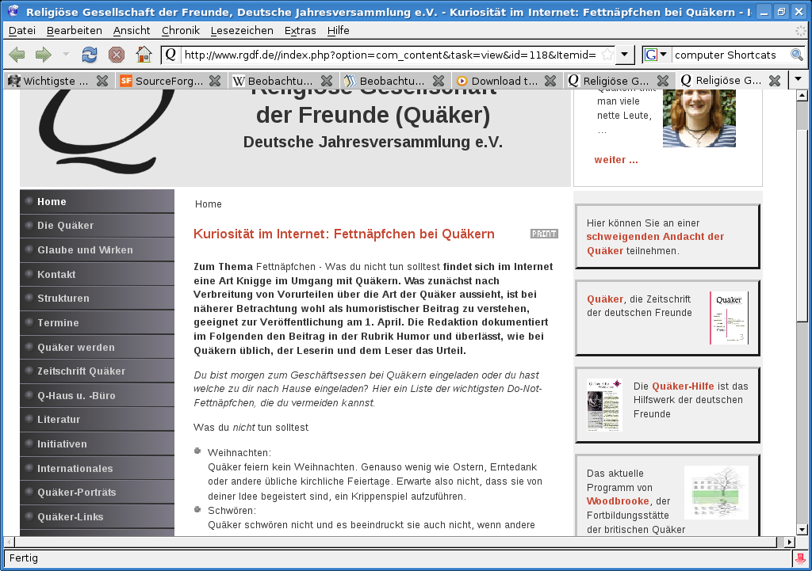

<b>Der Artikel stammt aus dem Archiv!</b> Die Formatierung kann beschädigt sein.

<b>Erstveröffentlichung: So, 12.04.2009 - 10:12 Uhr</b>
Am 1.April wollten die GYM-Redakteure offenbar mal witzig sein und landetet selber im Fettnäpfchen. Sie hatten ohne angaben von Quellen oder Autor - geschweige Lizenzangaben - einen Text von Wikibooks kopiert.
<!--break-->
Der Text stammt von der Seite Wikibooks [1] das ein Projekt - vergleichbar mit Wikipedia ist - wo Freie Lehrbücher geschrieben und veröffentlicht werden. Der von den GYM-Redakteuren verwendete Text stammt von dem Lehrbuch <a href="http://de.wikibooks.org/wiki/Einf%C3%BChrung_in_das_Qu%C3%A4kertum">"Einführung in das Quäkertum"</a> [2] und dort aus dem <a href="http://de.wikibooks.org/wiki/Einf%C3%BChrung_in_das_Qu%C3%A4kertum/_Fettn%C3%A4pfchen">Kapitel "Fettnäpfchen"</a> [3]. Das peinliche ist A) das sie schon sagen, das es von einer Seite im Internet stammt, aber nicht welche. Geschweige denn ein Link setzen. B) das sie das Urheberrecht nicht respektieren und die Lizenz unter der der Text steht. Das ist nämlich die <i>GNU-Lizenz für freie Dokumentation</i> [4]. Was es mit dieser Lizenz aufsich hat ist bestens dokumentiert ein kurzer Blick in Wikipedia [5] hätte genügt, um zu wissen, was man damit machen darf und was nicht. Übersetzung ins Deutsch findet sich im Netz zu Hauff. So z.B. diese: http://home.arcor.de/rybaczyk/licenses/fdl-1.3.de.html aus dem ich jetzt den wichtigsten Abschnitt zitiere:

<i><b>Sie dürfen das Dokument in beliebiger Form kopieren und verteilen, entweder kommerziell oder nicht kommerziell, vorausgesetzt, dass diese Lizenz, die Urheberrechtshinweise und der Lizenzhinweis mit den Worten, dass diese Lizenz auf das Dokument zutrifft, in allen Kopien wiedergegeben werden, und dass Sie keine anderen Bedingungen, welcher Art auch immer, zu jenen dieser Lizenz hinzufügen.</b></i>
(Das entstammt aus "2. Unveränderte Vervielfältigung")

Aber was tun die GYM-Redakteure? Sie knallen ihr <i>"© 2009 Religiöse Gesellschaft der Freunde, Deutsche Jahresversammlung e.V."</i> unter den Text. Eine ganz klare Lizenzverletzung. Gut, könnte man sage, nehmen wir es mal nicht so pingelig, wenn da nicht der folgende Satz fett gedruckt im Impressum zu lesen währe:

<i><b>Alle Bestandteile dieser Internetseite sind rechtlich geschützt. Sie dürfen ohne ausdrückliche schriftliche Zustimmung der Redaktion nicht, auch nicht auszugs- bzw. ausschnittsweise, verwendet werden. Die Nennung von Namen, Adressen, E-Mail-Anschriften, Telefonnummern u. s. w. erfolgt ausschließlich zu Zwecken der Information. Jede weitere Verwendung, insbesondere eine kommerzielle Verwendung, ist nicht gestattet.</b></i>[6]

...Ja, leck mich! Wir dreist kann man eigentlich sein?

Ich habe es schon einmal im Artikel <a href="http://www.the-independent-friend.de/?q=node/330">"Geben ist seliger denn Nehmen!"[7]</a> gesagt, und ich sage es noch mal:

Ihr macht denselben Fehler wie die Quäker, die ihre Sklaven nicht freilassen wollten. Ihr versklavt zwar keine Menschen, aber ihr versklavt Wissen und Informationen. Kehrt um! Ihr geht einen Irrweg. Jesus hat uns zurecht ermahnt, zu teilen und zu kooperieren.

## [update 14.4.2009 - 23:30 Uhr] ##

Offenbar haben die GYM-Redakteure ihren Fehler bemerkt und den Text mit der folgenden  Bemerkung  versehen:

<i>"(Dieser Text ist zu finden auf http://de.wikibooks.org/wiki/Einführung_in_das_Quäkertum/_Fettnäpfchen und steht unter GNU-Lizenz für freie Dokumentation. Das Dokument darf in beliebiger Form kopiert und verteilt werden, vorausgesetzt, dass diese Lizenz, die Urheberrechtshinweise und der Lizenzhinweis mit den Worten, dass diese Lizenz auf das Dokument zutrifft, in allen Kopien wiedergegeben werden, und dass Sie keine anderen Bedingungen, welcher Art auch immer, zu jenen dieser Lizenz hinzufügen.)"</i>

Verlinkt ist der Verweis zur Quelle zwar nicht und auch der komplette englische original Lizenztext nicht beigefügt oder verlinkt, aber immer hin, die Jungs (und Mädels) sind schon mal auf dem richtigen weg....

 Dieser Text ist unter einer <a rel="license" href="http://creativecommons.org/licenses/by-sa/3.0/de/">Creative Commons-Lizenz</a> lizenziert. <b>Und</b> unter der <a href="http://de.wikipedia.org/wiki/GFDL">GNU-Lizenz für freie Dokumentation</a> in der <a href="http://www.gnu.org/licenses/fdl-1.3.html">Version 1.3</a> vom November 2002 (abgekürzt GNU-FDL oder GFDL). Zitate und verlinkte Texte unterliegen den Urheberrecht der jeweiligen Autoren.

<b>Fussnoten</b>
<ul>
<li> <b>[1]</b> http://de.wikibooks.org/ </li>
<li> <b>[2]</b> Wikibooks Buch "Einführung in das Quäkertum": http://de.wikibooks.org/wiki/Einf%C3%BChrung_in_das_Qu%C3%A4kertum </li>
<li> <b>[3]</b> Kapitel Fettnäpfchen": http://de.wikibooks.org/wiki/Einf%C3%BChrung_in_das_Qu%C3%A4kertum/_Fettn%C3%A4pfchen </li>
<li> <b>[4]</b> Der Lizenztext bei Wikibooks: http://de.wikibooks.org/wiki/Wikibooks:GNU_Free_Documentation_License </li>
<li> <b>[5]</b> Wikipedia Artikel zur GFDL: http://de.wikipedia.org/wiki/GNU_Free_Documentation_License </li>
<li> <b>[6]</b> Das Impressum Stand vom 12.4.2009 - 10:00 Uhr: http://www.rgdf.de//index.php?option=com_content&task=view&id=39&Itemid=41 </li>
<li> <b>[7]</b> "Geben ist seliger denn Nehmen!",Sa, 13/12/2008 - 17:19, OlafRadicke, http://www.the-independent-friend.de/?q=node/330 </li>
</ul>
