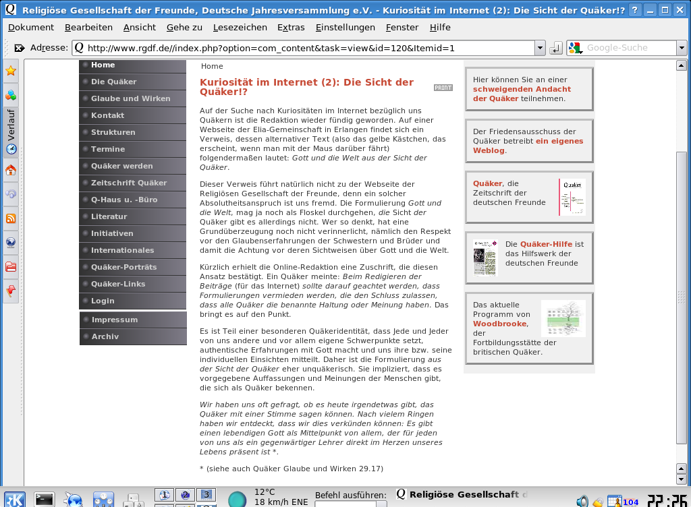

<b>Der Artikel stammt aus dem Archiv!</b> Die Formatierung kann beschädigt sein.

<b>Erstveröffentlichung: 19.04.2009 - 23:00</b>

Mit dem neusten Artikel <i>"Kuriosität im Internet (2): Die Sicht der Quäker!?"</i>  vom 18. April 2009 [1], machen sich die GYM-Redakteure wieder lächerlich. Zu dem Artikel möchte ich nur wenige Worte verlieren:
<!--break-->
<b>A)</b> Möge die GYM-Redagtion endlich lernen richtig zu Zitieren [2] und Quellenangaben zu machen. Bei einer Glaubensgemeinschaft mit ein solch hohen Anteil an Akademikern darf man das verlangen dürfen - denke ich. Ansonsten gibt es noch jede menge Anleitungen im Internet...<i>Google weiß alles!</i> ...Ein Bildschirmfoto (englisch Snapshot), währe z.B. auch eine Hilfreich gewesen[2].

Den folgenden Satz kann <b><i>so</i></b> niemand nachvollziehen:

<i>"Auf einer Webseite der Elia-Gemeinschaft in Erlangen findet sich ein Verweis, dessen alternativer Text (also das gelbe Kästchen, das erscheint, wenn man mit der Maus darüber fährt) folgendermaßen lautet: >>Gott und die Welt aus der Sicht der Quäker<<".</i>

<b>B)</b> Bevor der Autor anderen erklären möchte, wie sie Ihre Beiträge schreiben sollten, um den Eindruck zu vermeiden, für Alle oder generell zu spreche, würde ich doch mal mit mir selbst anfangen und den eigenen Namen unter den Artikel zu setzen, den ich "verbrochen" habe. Oder haben <b><i>wir</i></b> nicht den Arsch in der Hose, zu dem zu stehen, was wir schreiben?

Bei der schreienden Inkompetenz der GYM-Redakteure, könnte ich mir auch gut vorstellen, das daß was sie da gesehenen haben wollen, eine eingeblendete (Banner-)Werbung von dem Bucht von Sünne Juterczenka war, das den Titel "Über Gott und die Welt" trägt. ...Man weiß es nicht! Bei so wenig Informationen, ist das reines Kaffeesatzlesen.

<h2>[update 21.4.2009]</h2>

Ich hab mir noch mal die Mühe gemacht, die Website der ELIA-Gemeinde nach Inhalten ab zu suchen, die mit Quäkertum zu tun haben. Ergebnislos! Siehe Bild links (klicke drauf, zum vergrößern). Aber überprüft es gerne selber noch mal: http://www.elia-erlangen.de/

<h2>[update 6.5.2009]</h2>
 Ich habe noch mal kontakt aufgenommen mit dem Webmin von der ELIA-Gemeinde. Der wiederum nahm Kontakt mit dem Webmin von www.rgdf.de auf und teilte mir dann mit: <cite>"Herr Vollmer konnte mir weiterhelfen. Der Artikel ist tatsächlich korrekt: Im Blogroll von Peregrinatio stand wirklich dieser alternative Text für den Link auf Deine Homepage drin. Ich habe ihn jetzt mal in den Singular gesetzt, aber das klingt nicht so schön wie vorher."</cite> Hier im Bild sieht man, wo von die Rede war. So ist denn dieses Rätsel nun auch gelöst.

 Dieser Text ist unter einer <a rel="license" href="http://creativecommons.org/licenses/by-sa/3.0/de/">Creative Commons-Lizenz</a> lizenziert. <b>Und</b> unter der <a href="http://de.wikipedia.org/wiki/GFDL">GNU-Lizenz für freie Dokumentation</a> in der <a href="http://www.gnu.org/licenses/fdl-1.3.html">Version 1.3 </a> oder höher (abgekürzt GNU-FDL oder GFDL). Zitate und verlinkte Texte unterliegen den Urheberrecht der jeweiligen Autoren.

<b>Fußnoten</b>
<ul>
<li><b>[1]</b> RGdF, <i>"Kuriosität im Internet (2): Die Sicht der Quäker!?"</i>,  vom 18. April 2009, http://www.rgdf.de//index.php?option=com_content&task=view&id=120&Itemid=1</li>
<li><b>[2]</b> Der Snapshot links oben, ist übrigens ein "Bild-Zitat". Siehe: http://de.wikipedia.org/wiki/Bildzitat</li>
</ul>
