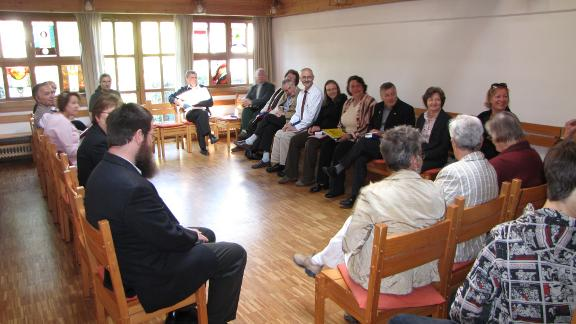

<b>Der Artikel stammt aus dem Archiv!</b> Die Formatierung kann beschädigt sein.

<b>Erstveröffentlichung: 4.5.2009 22:58:34</b>

Am Sonntag (3.5.200) ist für mich ein lang gehegter Wunsch in Erfüllung gegangen. Es trafen sich Münchner Mennoniten und Quäker zum gemeinsamen Gottesdienst. Schon in meiner Berliner Zeit (2006-2008)  hatte ich Kontakte zu Mennoniten und versuchte intensiv darauf hin zu arbeiten die beiden Gemeinden enger mit einander in Kontakt zu bringen. Es scheiterte aber an den Unwillen oder Desinteresse seitens der Berliner Quäker (muss man leider so ehrlich sagen). Seitens der Mennoniten - namentlich in der Person Martina Basso - hatte ich immer eine offene Tür und Ohr vorgefunden.
<!--break-->
In Sommer letzten Jahres zog ich nach München und sucht auch hier den Kontakt zu den Mennoniten. Wie es sich ergab, fand in diesem Frühjahr die Unabhängige Versammlung der Quäker (nicht der Deutschen Jahresversammlung angeschlossen) ihre neue Heimstätte in dem selben Gemeindehaus wie die Münchner Mennoniten. Es gab zu vor, von unserer Seite schon immer mal wieder Besuche bei den Mennoniten. So hatte ich bei dem Einzug in die neuen Räume, die Idee quasi eine "Einweihungsfeier" mit den Mennoniten zusammen zu machen. Hartmut Habeker von den Mennoniten zeigte sich sehr aufgeschlossen der Idee gegenüber. Nach einiger Beratung war man sich dann vom Ablauf her sehr schnell einig. Lustiger weise kam zwischenzeitlich die Frage auf, wer den wen einlädt und wer dem wem gegen über der Gast und der Gastgeber sei. Nach kurzer Beratung war man sich dann einig, das die Frage ohne Bedeutung war.

Zu dem gemeinsamen Gottesdienst kamen ca. <s>40</s> 30 Personen. Der überwiegende Teil Mennoniten. Was nicht weiter überraschend war, da die Mennonitische Gemeinde die Größere ist. Ich persönlich hätte mir noch ein bisschen mehr Beteiligung seitens der Quäker gewünscht. Aber vielleicht braucht das einfach noch Zeit. So waren nur vier Mitglieder und Besucher der Unabhängigen Quäkerversammlung anwesend. 

Auf meinen Wunsch hin, wurde die Bestuhlung etwas anders gestaltet, als es die Mennoniten von ihren Gottesdienst her gewohnt sind. Die Stühle wurden nicht - wie sonst - zur Stirnseite hin ausgerichtet und es gab auch kein Rednerpult. Stattdessen wurden die Stühle in Reihen gegenüber gestellt, so das sich die Gottesdiensbesucher einander gegenüber saßen. Dies ist die übliche Bestuhlung in Quäker-Versammlungshäusern. Hartmut übernahm die Moderation des Gottesdienstes.

Zunächst wurden drei Lieder und eine Losung der Mennoniten gesungen bzw. vorgetragen. Dann referierte ich über die gemeinsame Geschichte von Mennoniten und Quäkern. Den genauen Inhalt hier wieder zu geben, würde zu fiel Raum einnehmen. Der Inhalt war weitestgehend, der von dem Kapitel <a href="http://de.wikibooks.org/wiki/Einf%C3%BChrung_in_das_Qu%C3%A4kertum/_Mennonitische_Kontakte">"Mennonitische Kontakte"[1]</a> und <a href="http://de.wikibooks.org/wiki/Einf%C3%BChrung_in_das_Qu%C3%A4kertum/_Leiden_und_Erl%C3%B6sung">"Leiden und Erlösung"[2]</a> aus "Einführung in das Quäkertum". Ich hatte mir zwar ein paar Stichworte notiert aber noch nicht mal darauf zurückgegriffen, sondern völlig frei gesprochen. Da ich die beiden genannten Kapitel selber geschrieben hatte, viel mir das auch nicht weiter schwer. Ich hatte den Vortrag etwas anders Strukturiert und darauf verzichtet all zu viel Nahmen zu nennen oder Jahreszahlen, die sich e' kaum jemand merken kann. Ich habe nicht auf die Uhr gesehen, aber es waren wohl so ca. 20 Min. die ich sprach. 

Als Übergang erklärte ich dann den Ablauf einer Quäkerandacht und dessen theologischen Hintergrund um die Besucher auf den Teil der Gottesdienstes vor zu bereiten, der nach Quäker-Art ablaufen sollte. Einige Besucher wahren sichtlich erschrocken bis geschockt, als sie von mir erfuhren, das es in den nächsten 30 Min. kein Programm gäbe, sondern der Raum sei <i>"auf das Innere Licht zu warten"</i>. Also kein Gesang, keine Predigt und keine Lesung. Eckhard (von den Quäker) nahm die Irritationen zum Anlass, noch ein paar hilfreiche Empfehlungen für den Umgang mit Stille zu geben. Diese wurden sichtlich dankbar aufgenommen. In den 30 Min. gab es drei kurze spontane Beiträge und ansonsten lange Zeiten der Ruhe. Die Anspannung, die man vielen anfangs noch ansah, wichen im laufe der Zeit.

Wie üblich bei Quäkerandachten, wurde die Stille mit dem reichen der Hände beendet. Ich ermuntere die Anwesenden über ihre Erfahrungen mit der Stille zu sprechen. Viele thematisierten ihre Unsicherheit mit der Situation und ihre bewähltigungsstrategien. Viel konnten berichten, das es ihnen leichter viel die 30 Min. nichts zu tun, als sie selber von sich geglaubt hätten. Ein Teilnehmer äußerte seine Skepsis über den Sinn solcher Übungen und vermutete, das er bis in aller Ewigkeit so sitzen und warten könne ohne das ihm etwas erscheinen werde oder er tiefere Einsichten oder gar eine Offenbarung hätte. Für eine andere Besucherin war es wichtig, das sie auf Jesus Christus warten würde und das sie es bedenklich fände es als Meditation zu sehen. Viele Beiträge betonen das ihnen die Stille auf verschiedene Weisen sehr gut getan hätten. Die Erklärungen, worauf sie diese positive Wirkung zurückführen, war sehr unterschiedlich.

Dann fragte ich - weil mich das einfach interessierte - ob denn noch Fragen zum Vortrag aufgetaucht seien. Also Fragen zur Geschichte und Theologie. Hier kamen nun die verschiedensten Fragen, die z.T. in meinen Vortrag garnicht berührt wurden, aber alle berechtigt waren. So z.B. Fragen zu Heirat, Seelsorge, Aufnahmeverfahren, Bibel, Kindererziehung und andere Dinge mehr. Eckhard, Samar und Ich versuchten so gut wie möglich Antworten zu geben ohne zu sehr ins Detail zu gehen und die Zeit zu überspannen. Irgendwann mussten wir dann leider doch ein Schlussstrich ziehen, ob wohl es noch viele interessante Fragen gab und es Eckhard sichtlich auf der Seele brannte, noch etwas zum Gottesbild der Quäker zu sagen. 

Die Versammlung wurde dann mit einem gemeinsamen Mittagessen abgeschlossen. Jeder hatte etwas mitgebracht und es war reichlich da, so das jeder mehr als satt wurde. Später dachte ich noch bei mir: Echt schade das daß nicht überall funktioniert! Wenn nur jeder das beisteuert was er hat, haben wir alle noch genug, das alle satt werden und noch ein bisschen mehr. 

In nachhinein musste ich auch noch an Wolfgang Krauß und seinen Artikel „Wachsen aus den Wurzeln - Unsere Geschichte weiter erzählen“[4] denken. Ich <a href="http://www.the-independent-friend.de/?q=node/271">schrieb darüber schon in einen früheren Artikel</a>[3]. Ich glaube der Gottesdienst hätte im gefallen. 

<b>Hier geht es zur Abstimmung:</b> <a href="http://www.the-independent-friend.de/?q=node/474">"Was ist eure Position zu Mennonitisch-Quäkerischen Kontakten?"</a>

<h2>[update 5.5.2009]</h2>
Das Foto stammt von Christoph Schmutz aus der Mennonitengemeinde, der es mir freundlicherweise zur Verfügung stellte. Diese steht unter der gleichen Lizenz wie der Text (http://creativecommons.org/licenses/by-sa/3.0/de/).

<h2>[update 23.7.2009]</h2>
Ich wurde darauf hingewiesen, das dieser gemeinsame Gottesdienst, der erste historisch dokumentierte Gottesdiens war, den Mennoniten und Quäker gemeinsam begangen haben, in Deutschland. Wer hätte das gedacht? Schon ungewöhnlich bei der theologischen Nähe.  

<b>Fussnoten</b>
<ul>
<li> <b>[1]</b> http://de.wikibooks.org/wiki/Einf%C3%BChrung_in_das_Qu%C3%A4kertum/_Mennonitische_Kontakte </li>  
<li> <b>[2]</b> http://de.wikibooks.org/wiki/Einf%C3%BChrung_in_das_Qu%C3%A4kertum/_Leiden_und_Erl%C3%B6sung </li>  
<li> <b>[3]</b> "Wachsen aus den Wurzeln" - Überlegungen bei den Mennoniten [update23.9.08], Olaf Radicke, 15/09/2008, http://www.the-independent-friend.de/?q=node/271 </li>  
<li> <b>[4]</b> In der Verbandszeitung der Mennoniten 3/2008 (Juli-Oktober) Seiten 1 bis 4,   </li>

 Dieser Text ist unter einer <a rel="license" href="http://creativecommons.org/licenses/by-sa/3.0/de/">Creative Commons-Lizenz</a> lizenziert. <b>Und</b> unter der <a href="http://de.wikipedia.org/wiki/GFDL">GNU-Lizenz für freie Dokumentation</a> in der <a href="http://www.gnu.org/licenses/fdl-1.3.html">Version 1.3 </a> oder höher (abgekürzt GNU-FDL oder GFDL). Zitate und verlinkte Texte unterliegen den Urheberrecht der jeweiligen Autoren.
