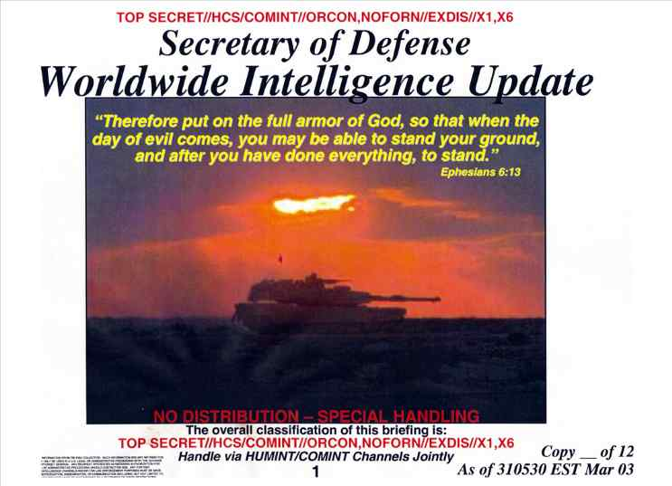

<b>Der Artikel stammt aus dem Archiv!</b> Die Formatierung kann beschädigt sein.

Ich lese regelmäßig den <a href="http://www.elia-gemeinschaft.de/wordpress/">Blog von Peter Aschoff[1]</a>. In dem <a href="Weblog von Peter Aschoff: http://www.elia-gemeinschaft.de/wordpress/">Artikel "Bibel pervers"[4]</a> weist er auf <a href="http://www.spiegel.de/fotostrecke/fotostrecke-42626.html#backToArticle=625640">Spiegel online [2]</a> hin, die ein paar PowerPoint Folien von Donald Rumsfeld zeigen.

Peter sinniert in seinem Blog in dem Zusammenhang darüber, ob es auch so was wie ein <cite>"black christianity"</cite> gibt, in Anlehnung an "Schwarze Magie". Das erinnert mich daran, das Katholische Länder von den Frühen (Quaker) Freunden "dark countries" genannt wurden. Deshalb, weil sich ihn ihren Augen der Geist der Katholiken völlig verfinstert hat. In Gegensatz natürlich zu den frühen Freunden, die für sich in Anspruch nahmen im Licht zu stehen.
<!--break-->
Der größte Vorwurf der Quäker den Katholiken gegenüber war die blutige Verfolgung von andersgläubigen, Ketzern und vermeidlichen Hexen. 

Bei W. Penn liest sich das in seinem "No Cross No Crown" so:
<ul>
<li> <cite>O des bejammernswehrten Zustands der vorgeblichen Christen! Die, anstatt daß sie, der Lehre Christi und seiner Apostel gemäß, "ihre Feinde lieben und Diejenigen, die ihnen fluchen, segnensollten," die Menschen lehren, unter dem Vorwand eines christlichen Eifers, einander auf die unmenschlichste Weise zu zerfleischen und umzubringen; die, anstatt daß sie bereit sein sollten, ihr eigenes Blut für das Zeugnis Jesu vergießen zu lassen, das Blut der Zeugen Jesu, als vorgeblicher Ketzer, vergießen.</cite> (in der Übersetzung von 1825 "Ohne Kreuz keine Krone" Seite 128) </li>
</ul>

Peter zeigte schon an einem Beispiel, wie Donald Rumsfeld die Zitate aus dem Zusammenhang gerissen hat und zum Gegenteil seiner Bedeutung pervertierte. Von mir auch noch mal ein Beispiel. So zitiert Donald Rumsfeld Epheser, 6:13 (Lutherübersetzung 1985):
<ul>
<li> <cite>Deshalb ergreift die Waffenrüstung Gottes, damit ihr an dem bösen Tag Widerstand leisten und alles überwinden und das Feld behalten könnt.</cite> </li>
</ul>
Klingt zunächst, als könnte man eine kriegerische gewalttätige Auseinandersetzung damit begründen. <b>Aber</b> wenn man den kompletten Zusammenhang liest, wird deutlich, das <b>genau das Gegenteil</b> damit gesagt wird. Hier der vollständige Absatz. Dann wird klar was die <i>"Waffenrüstung Gottes"</i> <b>wirklich</b> ist Epheser, 6:10-17 (Einheitsübersetzung):

<ul>
<li> <cite>10 Und schließlich: Werdet stark durch die Kraft und Macht des Herrn! 11 Zieht die Rüstung Gottes an, damit ihr den listigen Anschlägen des Teufels widerstehen könnt. 12 Denn wir haben nicht gegen Menschen aus Fleisch und Blut zu kämpfen, sondern gegen die Fürsten und Gewalten, gegen die Beherrscher dieser finsteren Welt, gegen die bösen Geister des himmlischen Bereichs. 13 Darum legt die Rüstung Gottes an, damit ihr am Tag des Unheils standhalten, alles vollbringen und den Kampf bestehen könnt. 14 Seid also standhaft: Gürtet euch mit Wahrheit, zieht als Panzer die Gerechtigkeit an 15 und als Schuhe die Bereitschaft, für das Evangelium vom Frieden zu kämpfen. 16 Vor allem greift zum Schild des Glaubens! Mit ihm könnt ihr alle feurigen Geschosse des Bösen auslöschen. 17 Nehmt den Helm des Heils und das Schwert des Geistes, das ist das Wort Gottes.</cite> </li>
</ul>

Hier wird nun glasklar das die Waffen Gottes <cite>"Wahrheit"</cite> und <cite>"Gerechtigkeit"</cite> sind und das für das <cite>"Evangelium vom Frieden"</cite> gekämpft wird. Und zwar nicht gegen Menschen, sondern gegen böse Geister!! Also keine (äußerlichen) Waffen und Gewalt. 

Um die Frage von Peter zu beantworten ob es ein <cite>"black christianity"</cite>: Nun, es gibt den biblischen Begriff des <cite>Antichristen</cite>[3] und Donald Rumsfeld ist auf alle Fälle ein <i>viel versprechender</i> Anwärter auf den Titel <cite>Antichrist</cite>!.

 Dieser Text ist unter einer <a rel="license" href="http://creativecommons.org/licenses/by-sa/3.0/de/">Creative Commons-Lizenz</a> lizenziert. <b>Und</b> unter der <a href="http://de.wikipedia.org/wiki/GFDL">GNU-Lizenz für freie Dokumentation</a> in der <a href="http://www.gnu.org/licenses/fdl-1.3.html">Version 1.3 </a> oder höher (abgekürzt GNU-FDL oder GFDL). Zitate und verlinkte Texte unterliegen den Urheberrecht der jeweiligen Autoren.

<b>Fussnoten</b>
<ul>
<li> <b>[1]</b> Weblog von Peter Aschoff: http://www.elia-gemeinschaft.de/wordpress/ </li>
<li> <b>[4]</b> http://www.elia-gemeinschaft.de/wordpress/2009/05/20/peters-gedanken/bibel-pervers </li>
<li> <b>[2]</b> spiegel.de, Rumsfelds Irak-Memos: "Lass dir nicht grauen", 19.05.2009, http://www.spiegel.de/fotostrecke/fotostrecke-42626.html#backToArticle=625640 </li>
<li> <b>[3]</b> Seite „Antichrist“. In: Wikipedia, Die freie Enzyklopädie. Bearbeitungsstand: 15. Mai 2009, 22:10 UTC. URL: http://de.wikipedia.org/w/index.php?title=Antichrist&oldid=60104126 (Abgerufen: 20. Mai 2009, 08:54 UTC) </li>
</ul>
