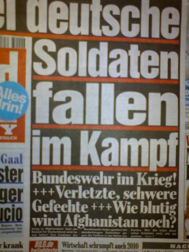

Bei der Parole <i>"Wer uns angreift, wird bekämpft"</i>, <s>der</s> die jetzt vom Verteidigungsminister Jung ausgegeben wurde, möchte man sich doch erinnert fühlen, an den Satz <i>"Seit 5.45 Uhr wird jetzt zurückgeschossen!"</i> von Adolf Hitler anlässlich des Überfalls auf Polen. 

Also da Afghanistan noch nicht zu den "Neuen Bundesländern" gehört (noch nicht mal zur EU) weiß ich nicht, wer sich hier von wem angegriffen fühlen darf. Ich meine, die wenigsten Touristen fahren doch in den Urlaubsgebieten mit ihren Panzern durch die Gegend. Oder?
<!--break-->
Und angesichts solcher reißerischen Meldungen in der Tagespresse - wie im Bild oben zu sehen - fühlt man sich wieder an Aeschylus (bzw. Rudyard Kipling) erinnert: <i>"Die Wahrheit ist das erste Opfer des Krieges."</i> Die Soldaten sind nicht direkt <i>im Kampf gefallen</i>, sondern <i>ins Wasser sind sie gefallen</i>, wo sie ersoffen sind. 

 Dieser Text ist unter einer <a rel="license" href="http://creativecommons.org/licenses/by-sa/3.0/de/">Creative Commons-Lizenz</a> lizenziert. **Und** unter der <a href="http://de.wikipedia.org/wiki/GFDL">GNU-Lizenz für freie Dokumentation</a> in der <a href="http://www.gnu.org/licenses/fdl-1.3.html">Version 1.3 </a> oder höher (abgekürzt GNU-FDL oder GFDL). Zitate und verlinkte Texte unterliegen den Urheberrecht der jeweiligen Autoren.
