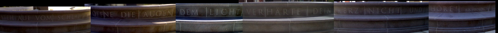

**Der Artikel stammt aus dem Archiv!** Die Formatierung kann beschädigt sein.

Hier in München, gibt es einen Brunnen mit der Inschrift:

"Steh auf vom Schlaf, öffne deine Augen dem Licht, verhärte dein Herz nicht und höre!"

Vielleicht kennt ja jemand den Autor...
<!--break-->

