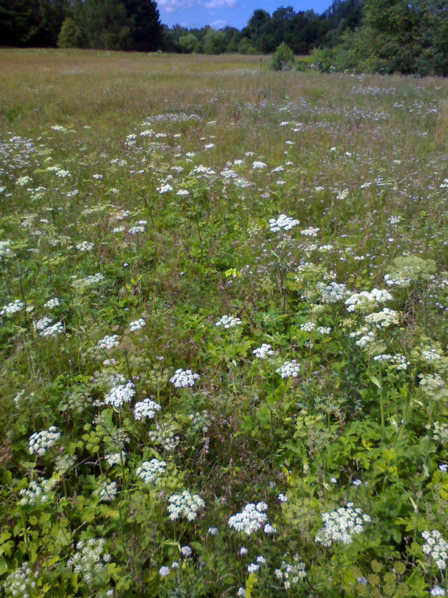

<b>Der Artikel stammt aus dem Archiv!</b> Die Formatierung kann beschädigt sein.

Ich werde immer mal wieder skeptisch gefragt wie es mir in München gefallen würde. Die Antwort ist: ''Gut - wirklich Gut!''. Wenn ich die Frage von Bayern/Münchner gestellt bekomme, wird immer erwartet, das ich sage, die Stadt sei - im Vergleich zu Berlin - (zu) klein. Wenn ich die Frage von Berlinern gestellt bekomme, wird immer erwartet, das ich sage "München sei spiessiger" als Berlin. Empfinde ich aber nicht so.
<!--break-->
Ich hab kaum was mit Spiessern in München zu tun. Und in Berlin - ob Prenzelber, X-Berg oder Friedrichshein - gibt es auch jede menge Spiesser. Äusserlich geben sie sich liberal und alternativ. Aber spätestens wenn dann die eigene Familie gegründet wird, bricht sich die Spissigkeit der "Söhne" und "Töchter" dann gnadenlos Bahn. Dann sitzt nämlich "Sie" am Buddelkasten, mit dem sau teuren Kinderwagen (der nicht aus zweiter Hand von Ebay ersteigert wurde) und schürfen ihren latemaciato, aus dem Strassen-Cafe neben an. 

Nein, man muss wahrlich nicht in München wohnen um ein Spiesser zu sein. Der andere Punkt ist, das Berliner den Münchnern vorwerfen ''overdressed'' zu sein. Nun, der Vorwurf könnte auch darauf hindeuten, das der Betrachter mit seinem Urteil, dem Äusseren mehr Bedeutung zugesteht, als es tatsächlich sein Gegenüber tut.

Ich meine, ist es nicht allgemein bekannt, das Deutsche als die schlechtes gekleideten Europäer gälten im Ausland? München liegt näher an Italien, als Berlin. Alles ist relativ. Die Berliner vergleichen sich mit ihren Nachtbar, wie Mecklenburg-Vorpommern, das ja mittlerweile fast entsidelt ist. Für die verbliebenen Rentner, die dort noch 50% ihres Kleiderschrankes mit VEB-Erzeugnissen gefüllt haben, mag Berlin bestimmt auch ''overdressed'' wirken. 

Aber losgelöst von den Menschen. München hat einfach Lebensqualität. Angefangen von den Öffentlichen Verkehrsmittel, in denen sich stressfreier fahren lässt, weil man nicht Spisrutenlaufen muss zwischen, Bettlern, Zeitungsverkäufern, Musikern und was Weiss ich noch alles für Knallköpfen. Weiter mit den Öffentlichen Gerten, die nicht übersät mit Hundescheiße, Zigarettenkippen und zerbrochenen Bierflaschen sind. Oder die Kinderspielplätze, die tatsächlich als solche benutzt werden können und werden. Im Gegensatz zu Berlin, wo sie tagsüber als Hundsportanlage und nachts als Gang-Treffpunkt oder Fixerstube missbraucht werden.

Das Pro und Kontra könnte man noch seitenlang ausführen. Letztlich ist es subjektiv, wo man sich wohl und zu hause fühlt. In Berlin fühle ich mich seid 1989 nicht mehr zu hause. Die Stadt in der ich geboren wurde, die gibt es heute nicht mehr. Ich bin Migrant im eigenen Lande, wenn man so will. Das ist ein bisschen wie in dem Film <a href="http://de.wikipedia.org/wiki/Terminal_(Film)">Terminal</a>

Gut es gibt auch Nachteile In München. Die will ich nicht verschweigen. Zum einen die sittenwidrig hohen Mieten. Die Fahradfeindlichkeit. Die schwachsinnige Verkehrsplanung des Öffentlichen Persohnennahrverkers, der einen fast immer zwing einen Umweg über das Stadtzentrum zu fahren. Die - für Berliner Verhältnisse - utopischen Gastronomie Preise (in der Regel fast doppelt so hoch, wie in Berlin). 

Die Bilder in diesem Artikel sind Eindrücke vom Münchner Waldfriedhof, den ich sehr schön und interessant finde. Aber es gibt hunderte andere wunderschöne Plätze in München. Und Hunderte Dinge die ich noch nicht entdeckt habe. Ach so, und wer glaubt, München sei traditionell konservativ und Monachistisch-Autoritär. Das Stimmt nicht! Es sein nur daran erinnert, das München Rot ist, das es eine <a href="http://de.wikipedia.org/wiki/M%C3%BCnchner_R%C3%A4terepublik">Münchner Räterepublik</a> gab, das hier die <a href="http://de.wikipedia.org/wiki/Geschwister_Scholl">Geschwister Scholl</a> wirkten und das hier in München, der "vielversprechenste" Attentatsversuch aus zivilen Kreisen (von <a href="http://de.wikipedia.org/wiki/Georg_Elser#Anschlag">Georg Elser</a> )auf Hitler verübt wurde...

 Dieser Text (und die Bilder) ist unter einer <a rel="license" href="http://creativecommons.org/licenses/by-sa/3.0/de/">Creative Commons-Lizenz</a> lizenziert. <b>Und</b> unter der <a href="http://de.wikipedia.org/wiki/GFDL">GNU-Lizenz für freie Dokumentation</a> in der <a href="http://www.gnu.org/licenses/fdl-1.3.html">Version 1.3 </a> oder höher (abgekürzt GNU-FDL oder GFDL). Zitate und verlinkte Texte unterliegen den Urheberrecht der jeweiligen Autoren.

 
 
