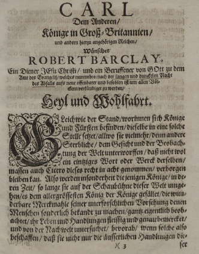

<b>Der Artikel stammt aus dem Archiv!</b> Die Formatierung kann beschädigt sein.

Das Hauptwerk von  Robert Barclay, die "Apologie" ist jetzt als <a href="http://resolver.sub.uni-goettingen.de/purl?PPN603374549">PDF-Download</a> zu haben und auch mit "Online-Reader" steht sie jetzt zur Verfügung.
<!--break-->
Damit steht dem deutschsprachigen Leser endlich wieder ein Werk zur Verfügung, das sich auf hohen Niveau mit fundamentalen theologischen Fragen beschäftigt. Wer sich mit früher Quäkergeschichte beschäftigt, der kommt um dieses Buch nicht herum.  

Wer mehr zu Robert Barclay wissen möchte, lese bitte den <a href="http://de.wikipedia.org/w/index.php?title=Robert_Barclay_(Qu%C3%A4ker)">Wikipedia-Artikel</a> über ihn.

 Dieser Text  ist unter einer <a rel="license" href="http://creativecommons.org/licenses/by-sa/3.0/de/">Creative Commons-Lizenz</a> lizenziert. <b>Und</b> unter der <a href="http://de.wikipedia.org/wiki/GFDL">GNU-Lizenz für freie Dokumentation</a> in der <a href="http://www.gnu.org/licenses/fdl-1.3.html">Version 1.3 </a> oder höher (abgekürzt GNU-FDL oder GFDL). Zitate und verlinkte Texte unterliegen den Urheberrecht der jeweiligen Autoren.
