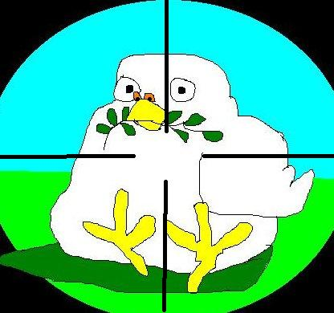

**Der Artikel stammt aus dem Archiv!** Die Formatierung kann beschädigt sein.

Seid Heute ist auf dem <a href="http://friedenszeugnis.twoday.net/">Weblog des Friedensausschuss</a> der <a href="http://friedenszeugnis.twoday.net/files/FriedensausschussQuaekerJahresbericht2009/">Arbeitsbericht als PDF </a> zu finden. Das der Friedensausschuss offenbar in letzter Zeit so inaktiv war, wurde gleich der Bericht für 2008 und 2009 zusammengefasst.
<!--break-->
Wirklich spannendes ist nicht zu finden in dem Bericht. Der Friedensausschuss hat sich in zwei Jahren vier mal getroffen. Wo von die 3/4 der Treffen von anderen Organisationen ausgerichtet war. Konkret:

<ul>
<li>21. Sept. in Heidelberg mit dem Kommunikationsausschuss zu 350 Jahre Friedenszeugnis</li>
<li>30. Januar in Heidelberg - Church and Peace</li>
<li>25.-26. April in Bad - ZentralstelleKDV und mit der Quäker-Hilfe</li>
<li>18. Juli in Jannishausen - Versöhnungsbund</li>
</ul>

Ansonsten wurden - laut Bericht - wieder viele Arbeitspapiere und Konzepte erstellt; Ermutigungen zu Aktivitäten ausgesprochen; Es wurden zahlreichen Gruppen und Personen die Unterstützung zugesichert; Und Kontakte geknüpft mit Gruppen, die so aktiv sind, wie man selber gerne sein wollte... Letzteres sind meine Worte und der Eindruck den das Papier auf mich macht.

Unter 4. wird dann noch mal der Weblog selber angesprochen <i>" Das Weblog (friedenszeugnis.twoday.net) wurde reaktiviert und mit neuen Informationen bestückt.
"</i>. ...Na-ja. 9 Beiträge in zwei Jahren. Davon das meiste nur <i>copy&paste</i> (also kein eigener Content). Irgend wie nicht so der Hammer muss ich sagen. Zum Vergleich: Auf The-Independent-Friend.de sind im gleichen Zeitraum 300 Artikel veröffentlicht worden!

</ul>

  Dieser Text ist unter einer <a rel="license" href="http://creativecommons.org/licenses/by-sa/3.0/de/">Creative Commons-Lizenz</a> lizenziert. **Und** unter der <a href="http://de.wikipedia.org/wiki/GFDL">GNU-Lizenz für freie Dokumentation</a> in der Version 1.2 vom November 2002 (abgekürzt GNU-FDL oder GFDL). Zitate und verlinkte Texte unterliegen den Urheberrecht der jeweiligen Autoren.
