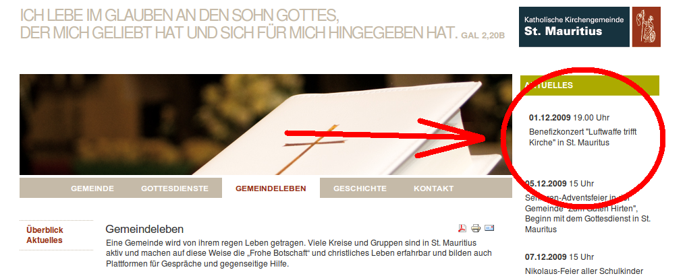

**Der Artikel stammt aus dem Archiv!** Die Formatierung kann beschädigt sein.

**Ersteferöffentlichung: Fr, 06/11/2009 - 09:38**

In witziger bis zynischer Artikel auf <a href="">Indymedia</a> [1] macht mich auf eine groteske Veranstaltung aufmerksam: In einer Berliner Kirche hat der Pfarrer (und ehemalige "Militärseelsorger") mehrere Militärkapellen eingeladen, bei ihm in der Kirche auf zu spielen.
<!--break-->
Der Title Slogen "Luftwaffe trifft Kirche", stammt nicht von Kritikern, sondern ist von dem Veranstalter! Was (mir) zeigt, wie unreflektiert da mit Militär umgegangen wird. Ich hab mir dazu extra noch mal die Website der <a href="http://www.st-mauritius-berlin.de/index.php?option=com_content&view=article&id=13&Itemid=5">St.-Mauritius-Gemeinde angesehen</a>[2]. Das Interview der <a href="http://www.jungewelt.de/2009/12-01/049.php">"Jungen Welt"</a>[3] konnte ich leider nicht finden.

## Fussnoten ##
<ul>
<li>**[1]** indymedia,  "Luftwaffe traf Kirche – Protest in Berlin", Jesus!,   01.12.2009 22:32, http://de.indymedia.org/2009/12/267708.shtml </li>
<li>**[2]** Veranstaltungshinweis, "01.12.2009 19.00 Uhr Benefizkonzert 'Luftwaffe trifft Kirche' in St. Mauritus", http://www.st-mauritius-berlin.de/index.php?option=com_content&view=article&id=13&Itemid=5 </li>
<li>**[3]** "Junge Welt", 01.12.2009, Inland, Seite 4, »Luftwaffe trifft Kirche«, Von Frank Brendle, http://www.jungewelt.de/2009/12-01/049.php </li>
</ul>

  Dieser Text ist unter einer <a rel="license" href="http://creativecommons.org/licenses/by-sa/3.0/de/">Creative Commons-Lizenz</a> lizenziert. **Und** unter der <a href="http://de.wikipedia.org/wiki/GFDL">GNU-Lizenz für freie Dokumentation</a> in der Version 1.2 vom November 2002 (abgekürzt GNU-FDL oder GFDL). Zitate und verlinkte Texte unterliegen den Urheberrecht der jeweiligen Autoren.
