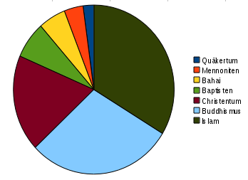

**Der Artikel stammt aus dem Archiv!** Die Formatierung kann beschädigt sein.

Ich habe mich mal mit der Statistik von Wikipedia beschäftigt. Genauer: Mit der Anzahl von Aufrufen von Artikeln die mit Quäkertum zu tun hat. Dazu habe ich ein Tool benutzt was hier zu finden ist: http://stats.grok.se/

Zunächst wollte ich wissen wie oft nach "Quäkertum" gesucht wurde verglichen mit ähnlichen Artikeln.
<!--break-->
<PRE>
**Artikel**			**Hits p.M. 11/2009**
Quäkertum		5.590
Mennoniten		9.993
Bahai			14.343
Baptisten		18.412
Christentum		48.255
Buddhismus		76.415
Islam			87.892
</PRE>

Wie zusehen ist wird ungefähr doppelt so oft nach Mennoniten und drei mal so oft nach Bahai gesucht. In der oberen Graphik, ist das Verhältnis noch mal als Tortendiagramm dargestellt. Die beiden Größten Stücke sind "Islam" und "Buddhismus" und dann erst kommt "Christentum". "Quäkertum" ist kaum noch zu sehen.

Als nächstes wollte ich wissen, wie die Artikel, die sich mit Quakertum beschäftigen, untereinander verglichen verteilt sind:

<PRE>
**Artikel**						**Hits p.M. 11/2009**
Quäkertum					5.590
Germantown					2.492
Oxfam						2.290
Shaker (Religion)				1.116
Religiöser Sozialismus				914
Levellers					649
Portal:Quäkertum				407
Geschichte des Quäkertums			392
Quäkerzeugnis					337
Quäkergebräuche					332
Zeugnis (Religion)				294
Quäkertheologie					269
Lockende Versuchung				257
Deutsche_Jahresversammlung			242
Quäkerorganisationen				177
Friedenskirche (Konfession)			151
Rest Home Projekt				119
Seekers (religiöse Bewegung)			100
Kategorie:Quäker				96
Ekklesiologie (Quäkertum)			93
Quäkerspeisung					92
Quäkerbüro					90
Quäkerhaus					87
Kategorie:Quäkertum				83
Friedensthal					71
Friends World Committee for Consultation	53
Friends General Conference			49
</PRE>

Es gibt gerade mal vier Artikel die es in den vierstelligen Bereich schaffen. Artikel über Internationale Quakerorganisationen sind weit abgeschlagen. Kennt keiner. Interessiert keinen. Würde ich sagen. Der Artikel über die Deutsche Jahresversammlung hält sich auf schwachen Niveau im Mittelfeld. Zum Vergleich: <i>the-independent-friend.de</i> hat so zwischen 1.200 uns 2.400 Besuche p.M.(von 500 bis 800 unterschiedlichen Besuchern). Interessant finde ich auch, das die Kategorie: "Quäkertum" und "Quäker" so selten aufgerufen werden. Also für Querverbindungen interessiert sich offenbar auch kaum jemand. Der Artikel "Germantown" ist in englischsprachigen Wikipedia übrigens kaum gefragt (er ist dort gerade mal 883 aufgerufen worden). Wogegen "Oxfam" sogar 21.298 mal in der englischen Version aufgerufen wurde. Das englische Pendant zu dem Artikel "Quäkertum" ist übrigens "Religious Society of Friends" und dieser wurde 45.688 mal aufgerufen. 

Jetzt zu den Artikeln die sich mit Quakerpersönlichkeiten beschäftigen. Da gibt es mittlerweile doch eine ganze menge, wie man fest stellen kann:

<PRE>
**Artikel**				**Hits p.M. 11/2009**
James Turrell			2.799
Herbert C. Hoover		2.772
William Penn			1.457
Susan B. Anthony		918
Mary Dyer			686
Johns Hopkins			460
Arthur Stanley Eddington	449
Franz Daniel Pastorius		304
Smedley D. Butler		277
George Fox			269
Elizabeth Fry			269
Alfons Paquet			224
Elisabeth Abegg			207
Gerrard Winstanley		201
Thomas Hodgkin			199
Emil Fuchs			185
John Cadbury			180
Nathanael Greene		179
Elisabeth Rotten		169
John Greenleaf Whittier		157
Paul Oestreicher		151
Benjamin Lay			138
Heinz Kappes			118
Richard Karl Ullmann		111
John Woolman			103
Abraham Isacks op den Graeff	98
Robert Barclay (Quäker)		97
Jennifer Miller			93
John Lilburne			92
Margaret Fell			87
Hannah Lightfoot		82
Muriel_Duckworth		71
Hertha Kraus			62
Pierre Ceresole			60
Anna Sabine Halle		56
James Nayler			50
Elizabeth Hanson		48
James Finlayson (Industrieller)	40
Ernst Schwarcz			34
Rufus Jones			33
</PRE>

Und auch hier wieder die eine oder andere Überraschung für mich. Das z.B. <i>James Turrell</i> noch vor <i>Herbert C. Hoover</i> zu finden ist, hätte ich nicht gedacht! <i>William Penn</i> ist zwar auf platz drei, aber mit gerade mal ein bisschen mehr als die Hälfte der Aufrufe, von Platz 1 und 2. Mit <i>Susan B. Anthony</i> haben wir auch gleich schon eine Frau, und zudem Pionierin der US-amerikanischen Frauenrechtsbewegung! Nicht Schlecht!! Und gleich da hinter, die nächste Frau: <i>Mary Dyer</i>. Eine der letzte religiöse Märtyrerin Nordamerikas. Oh-ha! Auf Platz 8 kommt schon der erste deutsche Quäker: <i>Franz Daniel Pastorius</i>. Und erst auf Platz 10 kommt mit <i>George Fox</i> einer der Gründerväter. <i>Rufus Jones</i>, auf Platz 40 kennt offenbar keine Sau in Deutschland. Na-ja. Ganz ehrlich: ich finde seine literarischen Ergüsse auch stinkend langweilig. Ich fühle mich immer an das Möchtegern-gelehrtentum eine Thomas Mann erinnert. In der englischsprachigen Wikipedia wurde <i>Rufus Jones</i> aber tatsächlich 647 mal aufgerufen! Aber das ist nichts zu <i>William Penn</i> in der englischsprachigen Version, der nämlich 30.574 mal aufgerufen wurde.

So, genug der Zahlenspiele!

  Dieser Text ist unter einer <a rel="license" href="http://creativecommons.org/licenses/by-sa/3.0/de/">Creative Commons-Lizenz</a> lizenziert. **Und** unter der <a href="http://de.wikipedia.org/wiki/GFDL">GNU-Lizenz für freie Dokumentation</a> in der Version 1.2 vom November 2002 (abgekürzt GNU-FDL oder GFDL). Zitate und verlinkte Texte unterliegen den Urheberrecht der jeweiligen Autoren.
