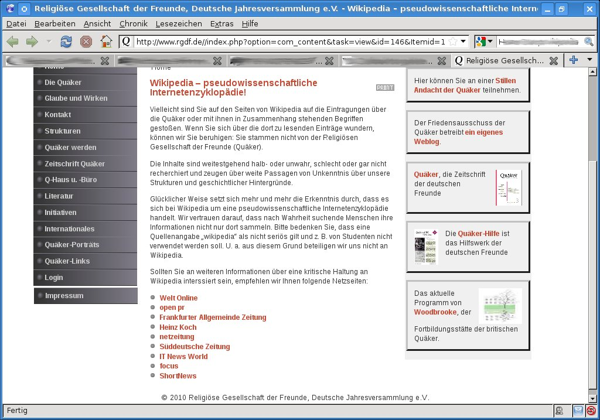

<b>Der Artikel stammt aus dem Archiv!</b> Die Formatierung kann beschädigt sein.

<b>Erstfer&ouml;ffentlichung: Mi, 10/03/2010 - 21:33</b>
Ich vermute mal am 8.3.2010 wurde der Artikel <i><a href="http://www.rgdf.de//index.php?option=com_content&amp;task=view&amp;id=146&amp;Itemid=1">Wikipedia &ndash; pseudowissenschaftliche Internetenzyklop&auml;die! </a></i> auf www.rgdf.de ver&ouml;ffentlicht. Aber es steht <b>wieder mal</b> kein Datum dabei (Wann lernen die GYM-Redakteure das endlich?). Und nat&uuml;rlich fehlt auch wieder der Name des Autors. Naja, was soll man von Kryporquaker auch erwarten!
<!--break-->
Der Artikel ist wieder so peinlich, wo ich wirklich froh bin kein Vereinsquaker zu sein.  Wenn so was anonym, ohne Datum und widerspruchslos auf der offiziellen Seite der Jahresversammlung stehen bleibt, w&uuml;rde ich als Mitglied vor Scham im Boden versinken wollen! Das man erf&auml;hrt wer diesen Bl&ouml;dsinn verzapft ist ja wohl das mindeste! Bei einer der Artikel (FAZ) die zu einer Untermauern der eigenen Position angef&uuml;hrt wird hei&szlig;t es: <a href="http://www.faz.net/s/RubCF3AEB154CE64960822FA5429A182360/Doc~E8178EF3F813C4ECA8D94A420E18EF040~ATpl~Ecommon~Scontent.html"><i>&quot;Solange seine Beitr&auml;ge anonym bleiben, fehlt die wissenschaftlich unerl&auml;ssliche Bedingung eindeutiger Autorschaft.&quot;</i></a>. Ja, dann macht es doch mal vor, liebe GYM-Redaktion!

Der Hauptkritikpunkt am den Artikel ist aber, das die GYM-Autoren aber nicht sagen, was den nun konkret falsch ist in den Wikipedia-Artikeln und was sie unternommen haben um die Fehler zu beseitigen. So sind das alles nur wieder neue Nebelkerzen! Nehmen wir zum Beispiel den Artikel <a href="http://de.wikipedia.org/wiki/Deutsche_Jahresversammlung">&quot;Deutsche Jahresversammlung&quot;</a>. In der aktuellen Version vom 4. M&auml;rz 2010, 01:57 UTC, hat der Artikel 52 Einzelnachweise. Sich da hinzustellen und zu behaupten der Artikel (oder andere) h&auml;tten schwere M&auml;ngel, ohne konkret nur eine Stelle zu nennen, geschweige den auch nur einen Beleg daf&uuml;r zu liefern, ist armselig!
Bevor ich auf die Angef&uuml;hrten und verlinkten Artikel eingehe, die von den GYM-Autoren angef&uuml;hrt wird, verweise ich erst mal auf eigene Belege, das die Darstellung der GYM-Autoren nicht zutreffend ist.
Hier ist erstens ein Belegt daf&uuml;r, das Vandalismus innerhalb von zum Teil Sekunden, gel&ouml;scht wird:
http://de.wikipedia.org/w/index.php?title=Qu%C3%A4kertum&amp;curid=4090804&amp;diff=71646169&amp;oldid=71646159
&nbsp;
In einem Heise-Artikel von 01.09.2006 gingen die Autoren Karin Wehn und Martin Welker der Frafe nach: <a href="http://www.heise.de/tp/r4/artikel/23/23435/1.html">&quot;Wikipedia: Quelle f&uuml;r wissenschaftliche Arbeiten?&quot;</a>
Das Wikipedia bei Gerichten schon ein sehr hohes Ansehen hat, dokumentiert der Artikel <a href="http://de.wikipedia.org/wiki/Wikipedia:Wikipedia_als_Quelle_f%C3%BCr_Gerichte">&quot;Wikipedia als Quelle f&uuml;r Gerichte&quot;</a> in dem auf hunderte Gerichtsurteile mit Verweisen auf Wikipedia aufgelistet sind.
Jetzt zu den Angef&uuml;hrten Links der GYM-Redakteure: Erst mal f&auml;llt auf das die meisten Artikel &auml;lteren Datums sind. Die meisten sind fast ein halbes Jahrzehnt alt. In den letzten Jahren hat sich bei Wikipedia im Bezug auf Qualit&auml;t viel getan. Es wird viel mehr darauf geachtet, das Artikel belegt werden, mit seri&ouml;sen Quellen (was auch bei den meisten Artikeln zu Quakertum der Fall ist). Zweitens, wurden so genannte &quot;gesichtete Versionen&quot; eingef&uuml;hrt. Das hei&szlig;: Es gibt eine ungepr&uuml;fte &quot;Entwickler Version&quot; und eine von mehreren Sichtern gepr&uuml;fte &quot;stabile Version&quot;. Der meiste Vandalismus schafft es heute &uuml;berhaupt nicht mehr in die stabilen Versionen. So jetzt zum Einzeln...
<b>Link Nr. 1</b>: Die Welt - Online, <a href="http://www.welt.de/webwelt/article2743585/Warum-Heilmanns-Wikipedia-Kritik-berechtigt-ist.html">&quot;Warum Heilmanns Wikipedia-Kritik berechtigt ist&quot;</a>, Von Helge Denker, 18. November 2008, 14:20 Uhr. Anlass des Artikels war das der Linken-Politikers Lutz Heilmann, die Website des deutschen Wikipedia-Vereins per gerichtlicher Verf&uuml;gung sperren lies. Ich kann mich daran noch genau erinnern. Und ich war damals dar&uuml;ber schon emp&ouml;rt. Als enttarnter Stasi-Spitzel ist Lutz Heilmann nicht gerade eine &quot;Sympartiefigur&quot;, aber es ist v&ouml;llig inakzeptabel, wegen seinem kleinen Privatkrig eine komplette Enzyklop&auml;die abschalten lassen zu wollen. Das hat auch Lutz Heilmann dann eingesehen und die Rechtsmittel zur&uuml;ckgezogen. Der von Helge Denker geforderte publizistische Standard des &quot;Recht auf Gegendarstellung&quot; ist bei einer Enzyklop&auml;die nat&uuml;rlich Quatsch. Bei anderen Lexika wie Mayer oder Brockhaus gibt es das nat&uuml;rlich auch nicht! Der Tipp <i>&quot;Vor allem Infos ohne Quellenangaben sind daher mit Vorsicht zu genie&szlig;en und sollten durch weitere Recherche &uuml;berpr&uuml;ft werden.&quot;</i> ist nat&uuml;rlich absolut richtig. Aber bei 52 Einzelnachweise ist das wohl kaum der Fall. Da sollten sich die GYM-Redakteure mal lieber an die eigene Nase fassen!
<b>Link Nr. 2</b>: openPR, <a href="http://www.openpr.de/news/397781/Alternativmedizin-Massive-Kritik-an-Wikipedia.html">&quot;Alternativmedizin: Massive Kritik an Wikipedia&quot;</a>, Pressemitteilung von: Neuraltherapie.Blog, 15.02.2010 - 08:39. Hier hei&szlig;t es: <i>&quot;Wikipedia-Artikel zum Thema Alternativmedizin und Komplement&auml;rmedizin sind mit gro&szlig;er Vorsicht zu genie&szlig;en. Dies ist das Fazit einer Recherche des Hamburger Arztes Dr. med. Hans Barop und des Journalisten Claus Fritzsche.&quot;</i> Ja, die Artikel sind (berechtigter weise) sehr kritisch in Wikipedia. Da Hans Barop sein Geld mit solcherlei Alternativmedizin verdient, ist ihm das nat&uuml;rlich ein Dorn im Auge. Die Wirksamkeit solcher Therapien ist schwer oder gar nicht nachweislich. Und dies wird auch mit Einzelnachweisen belegt. Das sich die die Deutsch Jahresversammlung mein, sich mit Aktivisten aus dem Alternativmedizinisch-Esoterischen Bereich solidarisieren zu m&uuml;ssen, zeigt mir, das die esoterische Str&ouml;mung im GYM noch sehr pr&auml;sent ist. Also scheint es den &quot;Arbeitskreis Esoterik&quot; auf dem in dem Wikipediaartikel &quot;Deutsche Jahresversammlung&quot; hingewiesen wird (Fussnote: &quot;Der Qu&auml;ker&quot;, 69, 6, 1995, S.154) noch zu geben. Ich habe nichts gegen Esotherik, aber bitte stellt es nicht als Naturwissenschaft dar, weil dann ist es n&auml;mlich das, was ihr Wikipedia vorwerft: Pseudowissenschaft.
<b>Link Nr. 3</b>: FAZ, <a href="http://www.faz.net/s/RubCF3AEB154CE64960822FA5429A182360/Doc~E8178EF3F813C4ECA8D94A420E18EF040~ATpl~Ecommon~Scontent.html">&quot;Die Entwurzelung des Wissens&quot;</a>, Thomas Thiel, 16.08.2007, Nr. 189 / Seite 36. Hier lesen wir <i>&quot;Die hier betriebene Demokratisierung der Wahrheitsfindung ist dem wissenschaftlichen Verstand, der dem esoterischen Expertengedanken verpflichtet ist, verd&auml;chtig&quot;</i>. Das ist falsch. In Wikipedia wird nicht &uuml;ber &quot;richtig&quot; und &quot;falsch&quot; demokratisch abgestimmt. Der Autor hat Wikipedia offensichtlich nicht verstanden. Es werden Meinungsbildner erstellt und Derjenige der seine Position am besten belegen kann, setzt sich durch. Weiter hei&szlig;t es: <i>&quot;Wikipedia sei als Einstieg tauglich, nicht aber als zitierf&auml;higer Beleg, zumal sich eine Seite schnell &auml;ndern k&ouml;nne. &quot;</i> Auch das ist falsch. Es gibt so genannte &quot;Permanenter Link&quot;. Der Autor hat offensichtlich keine Ahnung von Wikipedia, oder er bezieht sich auf eine v&ouml;llig veraltete Version.
<b>Link Nr. 4</b>: psychophysik, <a href="http://www.psychophysik.com/html/ak03-gwup11-wikipedia.html">&quot;Wikipedia und weltanschauliche K&auml;mpfe: Ein Erfahrungsbericht von Heinz Koch...&quot;</a>, 2005. Der Artikel ist f&uuml;r mich nicht mehr nachvollziehbar. Wenn ich mir den Artikel <a href="http://de.wikipedia.org/w/index.php?title=Hom%C3%B6opathie&amp;oldid=71597307">&quot;Hom&ouml;opathie&quot;</a> auf Wikipedia anschaue, scheint er mir sehr vern&uuml;nftig zu sein. Und mit 82 Einzelnachweisen inhaltlich &uuml;berpr&uuml;fbar.
<b>Link Nr. 5</b>: netzeitung, <a href="http://www.netzeitung.de/internet/454939.html">Kritik an Wikipedia zum Jubil&auml;um&quot;</a>, 23.11.2006, Bla-bla ohne Substanz.
<b>Link Nr. 6</b>: S&uuml;ddeutschen Zeitung. <a href="http://www.sueddeutsche.de/kultur/839/408614/text/">&quot;Im Daunenfederngest&ouml;ber&quot;</a>, Von Alex R&uuml;hle, 03.11.2006, 17:41. In dem Artikel wird deutlich, das das noch die Zeit war, als es noch keine &quot;gesichteten Versionen&quot; gab. Seid dem ist die Qualit&auml;t aber wirklich besser geworden.
<b>Link Nr. 7</b>: IT-News World, <a href="http://www.it-news-world.de/news_723/Netlife:+%E2%80%9AUnlesbarer+Mist%E2%80%99+bei+Wikipedia?">&quot;Netlife: &sbquo;Unlesbarer Mist&rsquo; bei Wikipedia?&quot;</a>, von Alfred Kr&uuml;ger, 19.10.2005. Der Artikel ist auch Stein alt. Und er zeigt er, das Wikipedia lernf&auml;hig ist.
<b>Link Nr. 8</b>: focus, <a href="http://www.focus.de/digital/internet/internet_aid_115628.html">&quot;Internet: Wikipedia-Gr&uuml;nder plant Konkurrenz&quot;</a>, Torsten Kleinz, 15.09.2006, 16:22. ...Der Artikel ist auch Stein alt.
&nbsp;
<b>Link Nr. 9</b>: shortnews, <a href="http://www.shortnews.de/id/584331/Brockhaus-uebt-Kritik-an-Wikipedia-die-freie-Enzyklopaedie-sei-nicht-verlaesslich">&quot;Brockhaus &uuml;bt Kritik an Wikipedia - die freie Enzyklop&auml;die sei nicht verl&auml;sslich&quot;</a>, 05.08.05 15:41 Uhr,  Quelle: <a href="http://www.shortnews.de/goto.cfm?id=584331&amp;link=http%3A%2F%2Fwww%2Eheise%2Ede%2Fnewsticker%2Fmeldung%2F62531">www.heise.de</a> ...Der Artikel ist auch Stein alt. Brockhaus ist unmittelbar Konkurrent. Das die Wikipedia schei&szlig;e finden ist klar. Der Original Artikel auf Heise ist &uuml;brigens ausf&uuml;hrlicher.
## [update 2010-03-14] ##
Also wenn mir die Statistik der Zugriffe auf die Wikipedia-Artikel ansehe....
<ul>
    <li>http://stats.grok.se/de/201003/Qu%C3%A4kerb%C3%BCro</li>
    <li>http://stats.grok.se/de/201003/Qu%C3%A4ker</li>
    <li>http://stats.grok.se/de/201003/Qu%C3%A4kertum
    <ul>
        ...habe ich den Eindruck, es interessiert keine Sau, was die <i>Deutsche Jahresversammlung</i> von Wikipedia h&auml;lt. Weil sonst m&uuml;sste ja ein signifikanter Anstieg der Zugriffe zu beobachten sein nach dem Artikel. Oder die Website der <i>Deutsche Jahresversammlung</i> hat so wenig Leser, das es einfach nicht ins Gewicht f&auml;llt.
        
         
        Dieser Text ist unter einer <a rel="license" href="http://creativecommons.org/licenses/by-sa/3.0/de/">Creative Commons-Lizenz</a> lizenziert. <b>Und</b> unter der <a href="http://de.wikipedia.org/wiki/GFDL">GNU-Lizenz f&uuml;r freie Dokumentation</a> in der Version 1.2 vom November 2002 (abgek&uuml;rzt GNU-FDL oder GFDL). Zitate und verlinkte Texte unterliegen den Urheberrecht der jeweiligen Autoren.</ul>
        </li>
    </ul>
