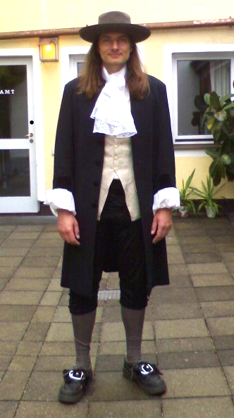
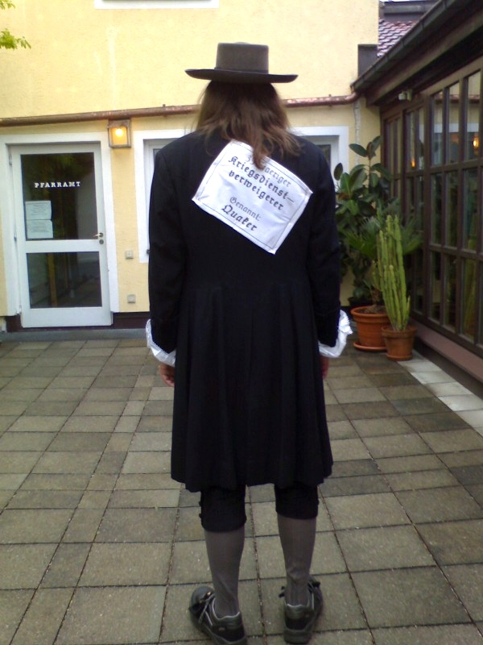
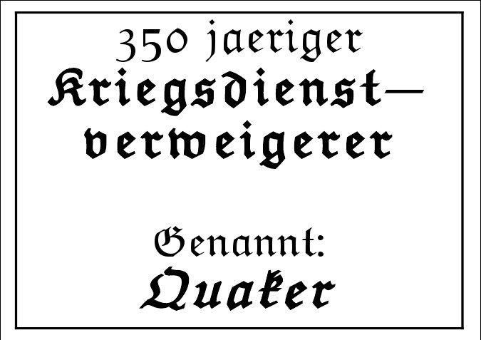

**Der Artikel stammt aus dem Archiv!** Die Formatierung kann beschädigt sein.

F&uuml;r mich ging der Tag schon fr&uuml;h um 8 Uhr los. Ich war bei den Mennoiten in der Simeonsgemeinde zum Fr&uuml;hst&uuml;ck und zu deren Gottesdienst. Ich habe eine mutige Predigt geh&ouml;rt, von deren Predigerin Anna Janzen. Sie zeigte auf, dass das fr&uuml;he Christentum, bevor es Staatsreligion wurde, sehr pluralistisch war. Gerade dass es mehr als nur ein Evangelium gibt, wertete sie als Indiz f&uuml;r diesen Pluralismus. Mutig fand ich die Aussage von ihr, dass sie Paulus als intolerant empfindet und nicht im Einklang mit dem Geist des Evangeliums. 
<!--break-->
Ich vermute mal, dass die Predigt nicht von ungef&auml;hr kam und dass es auch unter den Mennoniten immer wieder und vielleicht auch gerade sehr aktuell, ein Ringen um die eigene Identit&auml;t und den Stellenwert der Bibel und der Autorit&auml;t der man ihr zugesteht gibt. Ich selber bin ja als Quaker nur (mehr oder weniger h&auml;ufiger) Gast dort. Verschiedenen Andeutungen veranlassen mich aber zu der Spekulation, dass es im Vorfeld des &Ouml;KT 2010 es scheinbar Meinungsverschiedenheiten unter den Mennoniten gab, wie man sich auf dem &Ouml;KT pr&auml;sentieren wolle.

Das Thema Mennoiten begegnete mir dann sp&auml;ter in der Fu&szlig;g&auml;ngerzone noch mal. Ich unterhielt mich mit einem &Ouml;KT-Besucher &uuml;ber die verschiedenen Fl&uuml;gel des Quakertums. Als ich die Besonderheiten des evangelikalen Quakertum erl&auml;uterte, machte mich mein Gespr&auml;chspartner darauf aufmerksam, das sich die evangelikalen Quaker dann scheinbar den Mennoniten sehr stark angen&auml;hert h&auml;tten. Dar&uuml;ber kam ich dann ins stocken. Und tats&auml;chlich, bei n&auml;herer &Uuml;berlegung musste ich ihm tats&auml;chlich recht geben. Man h&auml;tte noch einwenden k&ouml;nnen, das Quaker mit den Mennoniten das Friedenszeugnis, das ablehnen des Eds, und wenn man an die Amischen denk, in gewisser Hinsicht auch die Einfachheit gemeinsam haben, aber das die Gleichheit nicht gegeben sei, da die Mennoniten gerade mal erst seid 100 Jahren Frauen predigen lassen. Aber wenn man Fair ist, muss man auch sehen das Organisationen der evangelikalen Quaker wie das FUM (Friends United Meeting) homosexuelle Mitglieder diskriminieren, in dem sie Sie von &Auml;mtern ausschlie&szlig;en. Also ist es bei den evangelikalen auch nicht so weit her mit der Gleichheit.

Aber solche Gespr&auml;che waren er selten. Meistens baten mich Touristen, sich mit mir fotografieren zu lassen zu d&uuml;rfen. Ich hatte ungef&auml;hr 80 Flyer in  der Tasche. Und von denen hatte ich gerade mal vielleicht 6 Verteilt. Also ich empfand die Stimmung in der Innenstadt lahm. Mag am Wetter gelegen haben, am Wochentag, Vatertag-Kapfs&auml;ufer oder den Mi&szlig;brauchsskandal... Wo bei ich den Eindruck hatte, die Katholiken waren noch klar die Mehrzahl. Aber es waren wirklich absurde Szenen. Fast &uuml;berall wo ich vorbei kam, waren riesige B&uuml;hnen zu sehen mit kleinen Gr&uuml;ppchen Zuschauer davor. Was wirklich gut angenommen wurde und ein begeistertes Publikum hatte, waren das Kinderprogramm. Die kleinen Zwerge waren so vertieft in ihren Spiel oder beim zuschauen des Kinder-Programms, das sie selbst von so einer ungew&ouml;hnlichen Erscheinung wie mir, kaum Notiz nahmen. Ganz anders, wie eine Autofahrerin die auf ein mal vor mir stand und sich so derma&szlig;en erschreckte, das ich dachte, die kipp jetzt gleich hinten &uuml;ber.
Ach ja, und dann waren da noch die &uuml;blichen penetrant-missionarischen Gruppen, ohne hier konkret einzelne Namen zu nennen. Die standen ohne Schirm im Regen und wahren kaum nass. Die m&uuml;ssen wirklich in halbstundentakt durch rotiert sein. Die waren echt dominant zwischen Stachus und Mariehenplatz. Selbst Scientology stand vor dem Kino &quot;Math&auml;ser Filmpalast&quot;.
Das Wetter war wirklich ungem&uuml;tlich, aber wenn strahlender Sonnenschein gewesen w&auml;re, w&auml;re ich h&ouml;chstwahrscheinlich den Hitzetot in meinen Klamotten gestorben. Aber so, war es f&uuml;r mich noch relativ angenehm. Die Weste war etwas eng, die Hose rutschte, die Tasche mit den Flyer (die ich eigentlich gar nicht brauchte) war schwer und meine Socken musste ich mit Klebeband festkleben, mit sie nicht runter rutschten. Also &quot;Bequem&quot; ist was anderes...
Als ich dann viertel vor - wie geplant - zu Quaker-Andacht des GYM eintraf (das war in einem &quot;Turmhaus&quot; - also &quot;Kirche&quot; - der Protestanten, unweit des Messegel&auml;nde), war ich ziemlich kaputt. Schwer zu sagen, wie viele Besucher da waren. Ich w&uuml;rde mal sch&auml;tzen 60 bis 90? Der &Auml;lteste des Bezirks des GYM bot mir an, Flyer verteilen zu k&ouml;nnen. Ich vermute mal, er meinte die Flyer der Unabh&auml;ngigen Quaker M&uuml;nchen. Sehr gro&szlig;herzig. Allein mit einem Stuhl war ich mehr als gl&uuml;cklich. Der Stuhl war schei&szlig;e: Hart, wackelig und nicht zum aufrechten Sitzen geeignet. Aber es war ein Stuhl!
Mein &Auml;u&szlig;eres verfehlte seine Wirkung nicht. Die Mitglieder des GYM blieben aber steif. Offenbar in banger Erwartung was von mir wohl noch kommen m&ouml;ge. Es wurde nur kurz zu Anfang der Andacht, das Wort von den GYMs an die die Besucher gerichtet, in dem sie mit &quot;Sie&quot; angesprochen und begr&uuml;&szlig;t wurden; kurz die &quot;Heldentaten&quot; der anglomamerikanischen Quaker erw&auml;hnt wurden und die deutsche Quaker-Hilfe; dann wurde gesagt, das die &quot;Stille(-Andacht)&quot; 45 Min. dauern w&uuml;rde und &quot;T&uuml;rsteher&quot; niemanden mehr nach 15 Min. rein lasen w&uuml;rden und das doch bitte alle auf ihre vier Buchstaben sitzenbleiben sollen. Es wurde nicht erkl&auml;rt warum es keine Liturgie und keine Predigt gibt. Es wurde weder das Inndere Licht noch die vier Zeugnisse erkl&auml;rt. Noch sonst irgend etwas. Das sollte wohl wieder der <i>Heilige Geist</i> und das <i>Schweigen</i> richten... Aber wo noch drauf hingewiesen wurde war, das wenn man schon Spr&auml;chen entscheiden w&uuml;rde, man dann bitte nur kurze Reden solle. Wieder keine Erkl&auml;rung warum und was &quot;kurz&quot; hei&szlig;... Statt &quot;T&uuml;rsteher&quot; h&auml;tte ich die korekte Bezeichung &quot;Overseers&quot; (&quot;Aufseher&quot;) bevorzugt.
Es kamen dann doch einige Redebeit&auml;ge (hier, in nicht chronologischer Reihenfolge...). Die Meisten kamen von GYM-Mitgliedern. Der eine erz&auml;hlte irgend eine Anekdote die er mal gelesen hatte und mit getragener Stimme; Einer musste wieder mit seiner F&uuml;nf-Ton-Fl&ouml;te trillern; Eine - offensichtlich Nicht-Quakerin - gab den abgedroschenen Johannes 14,6 &quot;Ich bin der Weg und die Wahrheit und das Leben; niemand kommt zum Vater denn ... Bla-bla...&quot; zum besten um dann eine Minute sp&auml;ter auf zu springen und raus zu gehen; Dann gab es noch ein Redebeitrag, in der sich ein GYM-Mitglied fast schon entschuldigte, das die &quot;Stille Andacht&quot; so unstill ist; Dann outete sich noch ein Brite aus London, als Quaker und sagte, das der Geist von George Fox immer in der Andacht vertreten sei und das es ihn besonders freue, das heute mal - quasi in personeller Vertretung - in echt anwesend sei. Damit meinte er mich. Zu dem war er angenehm &uuml;berrascht, ob der vielen Besucher des Meetings.
Ich selber sprach zu den Besuchern, weil ich mich gedr&auml;ngt f&uuml;hlte, und erkl&auml;rte ihnen, das ich schon einige Predigten an dem Tag geh&ouml;rt h&auml;tte. Das es f&uuml;r mich aber wichtiger sei, was die Stimme in mir zu meiner Situation zu predigen hat. Ich versucht zu erkl&auml;ren, das diese innere Stimme nicht immer das predigt, was man gerne h&ouml;ren m&ouml;chte. Das man sich aber dem zu stellen h&auml;tte. Man k&ouml;nne die Kirche, die Konfession und den Prediger wechseln, aber vor der <i>Inneren Stimme</i> k&ouml;nne man nicht fliehen. Und wenn man sich dieser inneren Stimme stellte, und man eine Aufgabe &uuml;bertragen bekommt - die wir Quaker &quot;Anliegen&quot; nennen - die zu gro&szlig; ist, um sie alleine zu bew&auml;ltigen, dann teile ich das meiner Versammlung, meinen Glaubensgeschwistern mit. Wenn diese Anliegen dann von den Anderen gepr&uuml;ft wird und einen Widerhall erzeugt, dann entstehen solche wunderbaren Dinge wie die Beteiligung an der Sklavenbefreigung und die Hilfprojekte die in der Einleitung zu Andacht schon genannt wurden. Samar, der auch gekommen war, meinte sp&auml;ter, es gab Beschwerden das ich - am Anfang - zu leise gesprochen habe und das ich, mit zwei Minuten Redezeit, am Limit des akzeptablen war.
Gegen ende des Meetings h&ouml;rten wir noch - unfreiwillig aber &quot;and&auml;chtig&quot; - dem Telefonat eines Helfers im Nebenraum zu, der besser zu verstehen war, als das knarren unserer St&uuml;hle. Auch so war die Ger&auml;uschkulisse - na sagen wir mal - &quot;anspruchsvoll&quot;. Ich glaube es w&auml;re konsequenter und publikumswirksamer gewesen, die Andacht mitten auf dem Hauptbahnhof abzuhalten. Aber ich vermute da zu w&uuml;rde dann den b&uuml;rgerlichen Quakertum der Arsch in der Hose fehlen. Leider! Nein, da entschuldigt man sich noch lieber f&uuml;r die Wortbeitr&auml;ge Andere. Oh-man!!
Nach der Andacht gab es dann noch &quot;Fotoshooting&quot;, Smalltalk, H&auml;ndesch&uuml;tteln und Rausschmiss, weil die n&auml;chste Gruppe den Raum schon Brauchte.. Ich war w&auml;hrend der Andacht wieder zu Kr&auml;ften gekommen und hatte nur noch einen Gedanken: Raus aus den Klamotten!

 
Dieser Text ist unter einer <a href="http://creativecommons.org/licenses/by-sa/3.0/de/" rel="license">Creative Commons-Lizenz</a> lizenziert. **Und** unter der <a href="http://de.wikipedia.org/wiki/GFDL">GNU-Lizenz f&uuml;r freie Dokumentation</a> in der Version 1.2 vom November 2002 (abgek&uuml;rzt GNU-FDL oder GFDL). Zitate und verlinkte Texte unterliegen den Urheberrecht der jeweiligen Autoren.
