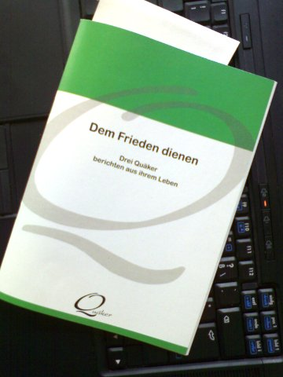

<b>Der Artikel stammt aus dem Archiv!</b> Die Formatierung kann beschädigt sein.

Mir wurde eine Ausgabe des B&uuml;chlein - oder sollte man bei 28 Seiten doch besser von &quot;Brosch&uuml;re&quot; reden(?) - &quot;Dem Frieden dienen&quot; zu gesand. Ich vermute mal, in der Hoffnung das ich eine Rezension schreibe. Ich muss sagen ich tat mich schwer. Ich habe es auch nur Quer gelesen und es hat mich so gelangweilt, das ich es wahrscheinlich nie vollst&auml;ndig gelesen haben werden. Da ich daf&uuml;r aber nichts bezahlt habe, m&ouml;chte ich aber der gef&uuml;hlten moralischen Verpflichtung nachkommen, eine Rezension zu schreiben.
<!--break-->
Erster Eindruck: &quot;Noch ein keines langweiliges H&auml;ftchen.&quot; Das Cover ist zwar etwas bunter, als die &uuml;blichen Publikationen des GYM (German Yearly Meeting) aber trotzdem nichts was von Hocker haut. Ich hab es mal einer Nichtquakerin gezeigt und gefragt was es auf sie f&uuml;r ein Eindruck macht. Antwort: Sieht aus wie eine Info-Brosch&uuml;re einer Umweltorganisation.
Gut, rasseln wir ersmal kurz die Fakten runter:
<dl>
    <dt>Seiten</dt>
    <dd>28</dd>
    <dt>Verlag</dt>
    <dd>Religi&ouml;se Gesellsch. d. Freunde (Qu&auml;ker)</dd>
    <dt>Auflage</dt>
    <dd>1. (1. Februar 2010)</dd>
    <dt>ISBN-10</dt>
    <dd>3929696452</dd>
    <dt>ISBN-13</dt>
    <dd>978-3929696455</dd>
    <dt>Einband</dt>
    <dd>Schwarz-wei&szlig;, Cover zweifarbig, Klammerheftung</dd>
    <dt>Preis</dt>
    <dd>-unbekannt-</dd>
</dl>
Wie mit allen Druckerzeugnisessen des GYM, ist der Text nicht im Buchhandel erh&auml;ltlich. Deutsch Quaker wollen offensichtlich nicht gelesen werden. Anders kann ich es mir nicht erkl&auml;ren. Nun, bei diesem Heft entgeht der Menschheit auch nicht wirklich viel. Es besteht aus drei Texten von denen zwei schon vorher ver&ouml;ffentlicht wurden. Neu ist lediglich der Text von und &uuml;ber Roswitha Jarman. Selbige wohnt seit 1956 nicht mehr in Deutschland. Ist also auch nicht Mitglied des GYM. Auch die anderen beiden Autoren (Daniel O. Snyder und Jean Zaru) sind nicht Mitglieder des GYM. So l&auml;sst es bei mir den faden Beigeschmack zur&uuml;ck, das sich das GYM wieder mal mit fremden Federn schm&uuml;cken will.
Das H&auml;ftchen hat noch nicht mal ein Inhaltsverzeichnis, was bei 28 Seiten aber verkraft bar ist. Das Vorwort stammt von dem <i>Literraturausschuss des GYM</i>. Darin wird geschrieben, das George Fox pers&ouml;nlich das Friedenszeugnis dem K&ouml;nig Charls II. &uuml;bergeben h&auml;tte. Das ist mir neu. Ich habe dazu keine weiteren Informationen finden k&ouml;nnen, aber vielleicht hat der Literraturausschuss tats&auml;chlich Recht. Tija, und damit hat es sich auch schon mit den Beitr&auml;gen der Deutsch Quaker in diesen B&uuml;chlein.
Durch den Beitrag von Roswitha Jarman habe ich mich noch einiger ma&szlig;en vollst&auml;ndig durch gequ&auml;lt. Unter der &Uuml;berschrift <em>&quot;Die spirituellen Wurzeln der Friedensarbeit&quot;</em> schildert sie im ersten Teil theologische Grundhaltung im zweiten Teil schreibt sie &uuml;ber ihre Projekte. Wer hofft im ersten Teil noch etwas &quot;typisch quakerisches&quot; zu finden, wird entt&auml;uscht werden. Sie beruft sich nicht auf Quakert-Traditionen, -Theologie oder -&Uuml;berzeugungen, sondern zitiert Adam Curle, Meister Eckhart, Bischof Riah Abu El-Assal und Martin Buber. Nicht das ich nicht glauben w&uuml;rde, Menschen mit anderen Konfessionen h&auml;tten uns nicht zu sagen - auf keinen Fall! Aber hat das Quakertum uns und den Anderen Nichts mehr zu sagen? Gibt es nichts mehr woraus ein Quaker bei seinen eigenen Wurzeln sch&ouml;pfen kann? Ja, warum nenne und bin ich dann noch Quaker, frage ich mich da?

 
Dieser Text ist unter einer <a rel="license" href="http://creativecommons.org/licenses/by-sa/3.0/de/">Creative Commons-Lizenz</a> lizenziert. <b>Und</b> unter der <a href="http://de.wikipedia.org/wiki/GFDL">GNU-Lizenz f&uuml;r freie Dokumentation</a> in der Version 1.2 vom November 2002 (abgek&uuml;rzt GNU-FDL oder GFDL). Zitate und verlinkte Texte unterliegen den Urheberrecht der jeweiligen Autoren.
