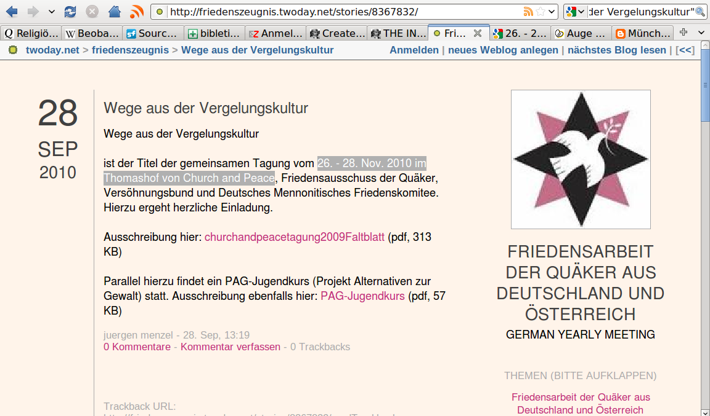

<b>Der Artikel stammt aus dem Archiv!</b> Die Formatierung kann beschädigt sein.

Nach langer Zeit der Funkstille ist der Weblog des Friedensausschuss wieder zum Leben erwacht. Nach mal zur Erinnerung: Das GYM und mit ihr der Friedensausschuss feiert das 350 j&auml;hrige Jubeleum des historischen Friedszeugnis. Der Eintrag von dem ich hier berichte, ist der zweite in diesem Jahr!! Wenn der n&auml;chste Eintrag auch wieder 8 Monate auf sich warten l&auml;sst, wird es wohl bei zwei Eintr&auml;gen f&uuml;r dieses Jahr bleiben.
<!--break-->
Im gleichen Zeitraum sind auf www.rgdf.de 6 Artikel und auf www.the-independent-friend.de 113 Artikel erschienen. F&uuml;r den www.the-independent-friend.de schreiben der Zeit zwei Autoren. Das http://friedenszeugnis.twoday.net/ sollte ungef&auml;hr ein halbes Dutzend Mitglieder und damit potenzielle Autoren haben. Die www.rgdf.de gar um 200 potenzielle Autoren. Ich glaube da fragt sich jetzt doch der Eine oder Andere <i>&quot;...was l&auml;uft hier falsch?&quot;</i>
Aber auch inhaltlich bin ich etwas - nun sagen wir - verwundert. Der letzte Eintrag z.B. auf http://friedenszeugnis.twoday.net/stories/8367832/ da hei&szlig;t es Zitat: <i>&quot;'Wege aus der Vergelungskultur' - ist der Titel der gemeinsamen Tagung vom 26. - 28. Nov. 2010 im Thomashof von Church and Peace, Friedensausschuss der Qu&auml;ker, Vers&ouml;hnungsbund und Deutsches Mennonitisches Friedenskomitee.&quot;</i> und dann wird auf einen PDF-Flyer von 2008 verlinkt (Kopie siehe Anhang). Und selbst wenn das Datum ein Irrtum war, werden die Quaker als Ausrichter &uuml;berhaupt nicht genannt.
Nach einiger kriminalistischen Arbeit habe ich herausgefunden das der richtige Titel lautet &quot;Auge um Auge? Zahn um Zahn? Wege aus der Vergeltungskultur&quot;. Mehr Infos unter:
http://gewaltueberwinden.org/de/news-events/events/events-container/article/1327/auge-um-auge-zahn-um-zah.html

 
Dieser Text ist unter einer <a rel="license" href="http://creativecommons.org/licenses/by-sa/3.0/de/">Creative Commons-Lizenz</a> lizenziert. <b>Und</b> unter der <a href="http://de.wikipedia.org/wiki/GFDL">GNU-Lizenz f&uuml;r freie Dokumentation</a> in der Version 1.2 vom November 2002 (abgek&uuml;rzt GNU-FDL oder GFDL). Zitate und verlinkte Texte unterliegen den Urheberrecht der jeweiligen Autoren.
