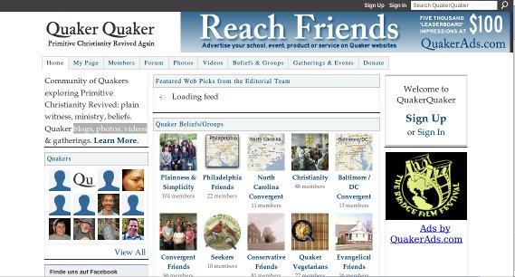

**Der Artikel stammt aus dem Archiv!** Die Formatierung kann beschädigt sein.

Ich hab k&uuml;rzlich eine Quaker Community Portal entdeckt: <a href="http://www.quakerquaker.org/">http://www.quakerquaker.org/</a>  
Da kann man sich ein eigenen Account anlegen und Bloggen, Fotos hoch laden, Veranstaltungen ank&uuml;ndigen, Gruppen Gr&uuml;nden, sich an Diskusionsforen beteiligen und Videos hoch laden und anschauen. Quasi das &quot;Facebook der Quaker&quot;.
