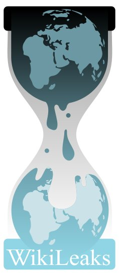

<b>Der Artikel stammt aus dem Archiv!</b> Die Formatierung kann beschädigt sein.

Gelegentlich kaufe ich auch mal bei Amazon ein. Bisher war ich zufrieden. Es wurde p&uuml;nktlich geliefert, die Preise sind - denke ich - Okay, und wenn ich mal ein Problem hatte, wurde ich kulant behandelt.  Aber das Verhalten bei WikiLeaks (<a href="http://www.spiegel.de/netzwelt/netzpolitik/0,1518,732355,00.html">Spiegel-Artikel zum Thema</a>) fand ich falsch. Und das habe ich jetzt auch Amazon geschrieben:
<!--break-->
<blockquote>
<ul>
    <li><em>Ich wollte ihnen mitteilen, das ich es inakzeptabel finde, das Amazon WikiLeaks die Nutzung seiner Server verweigert. Die Verbrecher sind immer noch die, die die Verbrechen begehen und nicht die, die dar&uuml;ber berichten!</em></li>
</ul>
</blockquote>
Whistleblower ist ja auch ein gro&szlig;es Thema der letzten <i>Qu&auml;ker</i>-Ausgabe gewesen (Siehe Artikel <a href="http://www.the-independent-friend.de/?q=node/684">Kommentar zu &quot;Qu&auml;ker&quot;-Ausgabe Sep./Okt. 2010</a>). Ich denke es gibt einige Beispiele in der Quaker-Geschichte, wo Quaker ungeachtet der Konsequenzen die Wahrheit ausgesprochen haben. Und so sollte auch WikiLeaks unsere Solidarit&auml;t bekommen.
