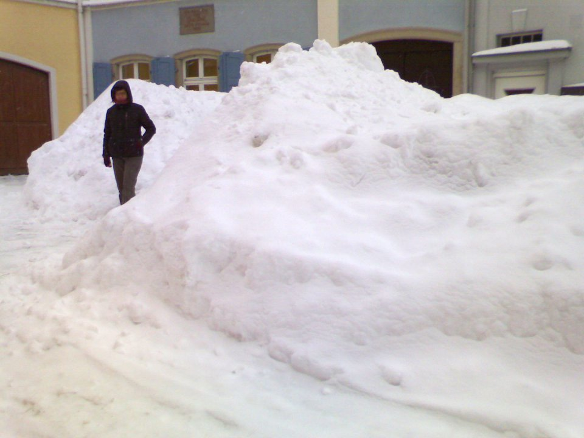

<b>Der Artikel stammt aus dem Archiv!</b> Die Formatierung kann beschädigt sein.

Ich muss gestehen, die Winterverh&auml;ltnisse falsch eingesch&auml;tzt zu haben. Plan war, einen Mietwagen zu nehmen, das ganze Gep&auml;ck rein zu werfen und nach Berlin zu fahren. Um 18 Uhr haben wir den Wagen von Flughafen abgeholt. Dort haben wir auch noch in dem einzigen offenen Restaurant zu Abend gegessen. Dann fuhren wir nach Hause, die Sachen reinzuwerfen. Um 21 Uhr waren wir auf der Autobahn Richtung Berlin.
<!--break-->
&nbsp;

Bis ca. 23 Uhr ging es auch einigerma&szlig;en. Wenig Verkehr und m&auml;&szlig;iger Schneefall. Aber dann wurde es doch immer  heftiger. Wir hatten bis Dato eine Durchschnittsgeschwindigkeit von 50 h/km. Also sind wir sehr langsam gefahren. Trotz dem vorsichtigem Fahren hatten wir eine kritische Situation, wo wir uns einmal um die eigene Achse gedreht haben. Gl&uuml;cklicherweise hatten wir die gesamte drei- oder vier-spurige Autobahn (so genau konnte man das bei dem Schnee nicht mehr sagen)  f&uuml;r uns alleine und konnten den Wagen &bdquo;einfach austrudeln&ldquo; lassen.

&nbsp;

Zwei Stunden sp&auml;ter hatten wir das n&auml;chste Problem: Es stank auf einmal stark nach verkohltem Plastik. Wir fuhren sofort recht ran. Diverse Leuchten waren im Display zu sehen. Ich stellte das Warndreieck auf  und konsultierte das Handbuch, das ungl&uuml;cklicherweise kein Index hatte. In der Zwischenzeit telefonierte meine Begleiterin mit der Autovermietung. Nach ein bisschen Lesen und Fummeln hatte ich die Motorhaube auf und den &Ouml;lstand gefunden. Da ich null Ahnung von Autos habe, half das auch nicht wirklich weiter.

&nbsp;

Also f&uuml;hren wir zum n&auml;chsten Parkplatz und warten &uuml;ber eine Stunde auf den Pannendienst. In der Zeit reflektierten wir unsere Situation und witzelten &uuml;ber unser Pech. Der Schnee fiel immer dichter und meine Begleiterin meinte mit gespielt theatralischer Katastrophenfilm-Stimme: <em>&bdquo;...Wir werden alle  umkommen!&ldquo;</em> und ich erwiderte <em>&bdquo;...Genau! Harmagedon beginnt in einem liegengebliebenen japanischen Kleinwagen auf der A9.&ldquo;</em> und nach kurzem Nachdenken f&uuml;gte ich noch hinzu <em>&bdquo;...Aber ich hab mir Harmagedon irgendwir w&auml;rmer vorgestellt.&ldquo;</em>

&nbsp;

Wir wurden dann in eine Werkstatt in eine kleines Dorf in der N&auml;he von Hof geschleppt. Wir erfuhren, dass die Werkstatt Montag erst wieder auf hat und wurden dann um 5h30 mit ein Taxi in ein Hotel in Hof gebracht. Das Taxi hatte extreme Schwierigkeiten die H&uuml;gel rauf zu kommen, weil die Bundesstrassen nicht ger&auml;umt waren. Zum Teil sind wir mit 20 km/h gefahren.

&nbsp;

So, jetzt sitzen wir gerade in Hof in einem Hotel mit 70er Jahre-Flair und warten auf den Ersatzwagen aus Zittau. Eigendeich sollte uns ein Taxi nach Zittau bringen. Nur haben die Taxis auf Grund der Witterung den Betrieb eingestellt. Wir haben die Zeit der Zwangspause in Hof genutzt um auszuschlafen, zu fr&uuml;hst&uuml;cken, spazieren zu gehen und lecker Kuchenen zu essen. Und die haben hier echt noch &bdquo;Friedenspreise&ldquo;. F&uuml;r den Kuchen h&auml;tten wir in M&uuml;nchen mal locker das doppelte gezahlt. Echt erstaunlich, wie man sich an die Preise in M&uuml;nchen so gew&ouml;hnt... Auf dem Bild ist meine <em>Fahrerin</em> zwischen den Schneemassen zu sehen, w&auml;hrend unserem gemeinsamen Spaziergang durch die Innenstadt von Hof. Also: &quot;Mans-&quot; bzw. &quot;Frauhoch&quot; der Schnee!!
&nbsp;

  
Dieser Text ist unter einer <a rel="license" href="http://creativecommons.org/licenses/by-sa/3.0/de/">Creative Commons-Lizenz</a> lizenziert. <b>Und</b> unter der <a href="http://de.wikipedia.org/wiki/GFDL">GNU-Lizenz f&uuml;r freie Dokumentation</a> in der Version 1.2 vom November 2002 (abgek&uuml;rzt GNU-FDL oder GFDL). Zitate und verlinkte Texte unterliegen den Urheberrecht der jeweiligen Autoren.
