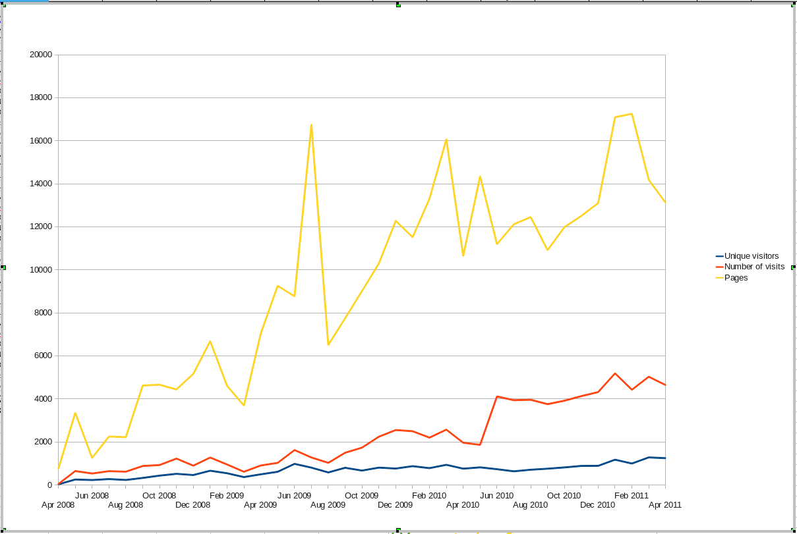

<b>Der Artikel stammt aus dem Archiv!</b> Die Formatierung kann beschädigt sein.

Einige interessiert bestimmt die Besucherzahlentwicklung auf <em>THE INDEPENDENT FRIEND</em>. Nun, gleich vorab: Sie ist spektakul&auml;r. Zu beobachten ist, das die Anzahl der (unterschiedlichen) Besucher nur sehr langsam w&auml;chst. Was sich aber deutlich ge&auml;ndert hat, ist das Besucher jetzt z.T. die Seite mehrmals am Tag ansteuern. Und das der einzelne Besucher mehr Artikel liest bei seinem Besuch.
<!--break-->
Also zusammengefasst: Mit knap &uuml;ber 1.200 Besuchern pro Monat fristet  <em>THE INDEPENDENT FRIEND</em> weiter ein Nischendasein, wird aber von seinen Besuchern zusehends intensiver genutzt.

<i><i> 
Dieser Text ist unter einer <a rel="license" href="http://creativecommons.org/licenses/by-sa/3.0/de/">Creative Commons-Lizenz</a> lizenziert. <b>Und</b> unter der <a href="http://de.wikipedia.org/wiki/GFDL">GNU-Lizenz f&uuml;r freie Dokumentation</a> in der Version 1.2 vom November 2002 (abgek&uuml;rzt GNU-FDL oder GFDL). Zitate und verlinkte Texte unterliegen den Urheberrecht der jeweiligen Autoren.</i></i>
