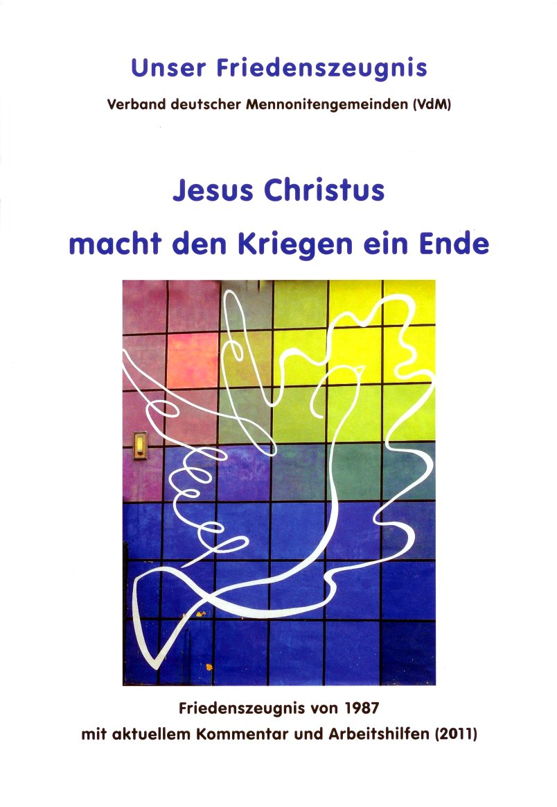

**Der Artikel stammt aus dem Archiv!** Die Formatierung kann beschädigt sein.

Letzten Sonntag (15.5.2011) bei dem Mennoniten-Gottesdienst machte mich J&uuml;rgen Moser auf ein Projekt aufmerksam, an dem er mitwirkt. Einige Mennoniten hatten das Bed&uuml;rfnis, sich intensiv mit ihrem &quot;Friedenszeugnis von 1987&quot; auseinanderzusetzten -urspr&uuml;nglich mit der Aufgabenstellung es zu &uuml;berarbeiten. Herausgekommen ist ein Arbeitsheft zum Friedenszeugnis f&uuml;r die Gemeindearbeit, welches auch als <a href="http://mennonitisch.de/fileadmin/downloads/Ressourcen/Friedenszeugnis_Jesus_macht_den_Kriegen_ein_Ende-web.pdf">PDF heruntergeladen</a> werden kann (http://mennonitisch.de/positionen.html).

<!--break-->
Da die Quaker und die Mennoniten das Friedenszeugnis theologisch verbindet, und die Quaker erst letztes Jahr mit mehr oder weniger Tam-tam ihr 350-J&auml;hriges gefeiert haben, dachte ich mir, es sei ganz interessant sich auch mal damit zu befassen.   In diesem Artikel hier, werde ich das in zwei Abschnitte tun:  In einem Teil mit allgemeinen &Uuml;berlegungen und einen zweiten Teil, in dem ich inhaltlich auf einzelne Abschnitte eingehe. Mein Artikel soll nicht als N&ouml;rgelei verstanden werden, denn ich finde den Ansatz gut und denke hier h&auml;tten die Quaker noch ein interessantes Bet&auml;tigungsfeld. Mit meinen Anmerkungen m&ouml;chte ich das Projekt der Mennoniten aktiv unterst&uuml;tzen und die Quaker dazu anregen, sich Gedanken dar&uuml;ber zu machen, ob sie nicht auch mal ein Arbeitsbuch f&uuml;r die Gemeindearbeit auf die Beine stellen sollten. Ich meine, wenn das GYM traditionell  schon schwer &quot;belastet ist&quot; mit vielen P&auml;dagogen unter seinen Mitgliedern...

## Allgemeine Bemerkungen ##

Fange ich mit den Kleinigkeiten an: Das Lackpapier liegt mir unangenehm in der Hand. Auf das strahlende Wei&szlig; k&ouml;nnte ich gut verzichten. Meine Randbemerkungen mit dem Kugelschreiber sind durchgeschlagen und die Farbe vom Textmaker trocknete nur langsam auf dem Papier.

Ich denke es ist sehr wichtig, dass ein Arbeitsbuch ergebnisoffen ist. Dieses Gef&uuml;hl hatte ich nicht immer. Klare Aussagen zu machen und eindeutige Standpunkte zu vertreten ist okay. Allerdings nicht wenn ich dem Leser eine Frage stelle oder ein Arbeisauftrag erteile. Ich empfand viele Fragen und Aufgaben als manipulativ und suggestiv. Das wird bei den Lesern Widerst&auml;nde wecken.

Mir ist nicht ganz klar welche Zielgruppe die Autoren haben. Mennoniten oder Nichtmennoniten; Konvertiten oder <i>Hineingeborene</i>; Junge oder &Auml;ltere... Wenn es eine gibt, sollte dies in der Einleitung/Vorwort erw&auml;hnt werden. Auf dem Heftr&uuml;cken sollte auch in ein-zwei Abs&auml;tzen umrissen werden, f&uuml;r wen und wozu das Heft gedacht ist.

Was mir zu kurz kam, war die spirituelle Bedeutung des Friedenzeugnis. &Uuml;ber weite Strecken war mir die Auseinandersetzung zu plakativ und von zu sehr von Aktionismus gepr&auml;gt. Der passive erduldende Pazifismus kam erst weiter hinten zu Wort. Und leider nur angerissen und als Zitate l&auml;ngst vergangener Zeiten. Hier w&auml;re es - denke ich - wichtig tiefer zu gehen. Mit einer Regenbogenfahne am Ostermasch teil zu nehmen, ist etwas anderes, als Totalverweigerer ins Gef&auml;ngnis zu gehen. Das Friedenszeugnis ist kein &quot;Wohlf&uuml;hl-Evangelum&quot;! An einigen Stellen wird das auch angedeutet. Das geht heutzutage nicht sehr konform mit unserer Wellnesskultur. Ein Evangelium der Entbehrung und Selbstbeschr&auml;nkung steht im Kontrast zur &Uuml;berflussgesellschaft und der Ausrichtung auf Selbstverwirklichung. Die zentrale Frage, die viele besch&auml;ftigen wird, ist wie soll aus Leiden Erl&ouml;sung werden? Die christliche Sicht und Antwort darauf ist Vielen abhanden gekommen und muss neu gefunden werden.

Ein anderer Aspekt, der nur andeutungsweise im hinteren Teil thematisiert wurde, ist dass das Friedenszeugnis von den Mennoniten nicht immer hochgehalten wurde, und das die Mennoniten w&auml;hrend der NS-Zeit auf breiter &quot;Front&quot; ihr Friedenszeugnis und ihre Theologie verraten haben. Umso wichtiger ist es - aus meiner Sicht - die heutigen Mennoniten zu fragen: Zu welchen Opfern bist du bereit, wenn es wieder &quot;hart auf hart&quot; kommt? Ist dein Friedenszeugnis wirklich belastbar? Oder dient es nur der Profilierung?

Es gibt bestimmt auch Mennoniten die zum Thema &quot;Leid&quot; und &quot;Gewalt&quot; andere Positonen vertreten. Ich w&uuml;rde mir w&uuml;nschen, dass beide Positionen - gerne auch als unvereinbare Gegens&auml;tze - nebeneinander im Heft stehen. Ich denke diese Spannung muss man als Autoren aushalten k&ouml;nnen, und dem Leser &quot;zumuten&quot;. Nur so kommen die verschiedenen Fl&uuml;gel und Str&ouml;mungen im Mennonitentum mit einander ins Gespr&auml;ch und entwickeln sich weiter.

Da (mir) nicht ganz klar ist, an den das Arbeitsheft adressiert ist, ich aber davon ausgehe dass es keine studierten Theologen sind, w&uuml;rde ich anregen noch ein Glossar einzuf&uuml;gen. Begriffe wie &quot;eschatologische Perspektive&quot; werden h&ouml;chstwahrscheinlich sonst nicht verstanden.

Wenn die Autoren ihr Werk f&uuml;r reif genug halten, schlage ich vor, sie sollten das Heft auf alle F&auml;lle mit ISBN versehen und &uuml;ber den Buchhandel und Amazon anbieten. Denn ein Aspekt warauch der missionarische Auftrag, dem sich die Autoren offensichtlich verpflichtet f&uuml;hlen. Daher sollte das Heft einer breiten Leserschaft zug&auml;nglich gemacht werden!

Hier zu noch eine Anmerkung zur Medialen-Form: In dem Heft werden immer wieder Links empfohlen. Hier w&auml;re es eine gro&szlig;e Hilfe f&uuml;r den Leser eine begleitende Website einzurichten, &uuml;ber die der Leser bequem die Link-Listen zu den einzelnen Kapiteln finden kann, und erg&auml;nzendes Material, das wegen seines Umfangs nicht im Heft abgedruckt werden konnte. Ich denke da z.B. an den Verweis auf Seite 50 auf das 20 seitige Dokument &quot;Richte unsere F&uuml;&szlig;e auf den Weg des Friedens&quot;. Und es sollte dar&uuml;ber nachgedacht werden, ob die Weiterentwicklung nicht &ouml;ffentlich auf dieser Website geschehen sollte. Das w&uuml;rde den Austausch mit und unter den Autoren f&ouml;rdern und die gemeinsame Arbeit an Texten vereinfachen. Das dass funktionieren kann, hat das <a href="http://www.volxbibel.de/">Volxbibel-Projekt</a> gezeigt!

Hierzu m&uuml;sste und sollte man noch mal &uuml;berlegen unter welcher Lizenz man das Projekt stellt. Hier zu kann man sich bestimmt auch Anregungen von den Volxbibel-Projekt holen. In dem Heft habe ich gesehen, das schon ein Bild verwendet wurde, was unter der <a href="http://de.creativecommons.org/">Creativ Commons Lizenz</a> steht (Seite 35). Leider wurde - vermutlich aus Unwissenheit - das Bild nicht Lizenz-Komfort verwendet. Es h&auml;tte erw&auml;hnt werden m&uuml;ssen, welche Rechte dem Leser/Benutzer einger&auml;umt werden, und der Lizenztext abgedruckt werden m&uuml;ssen. Oder es h&auml;tte zumindest eine Quelle genannt werden m&uuml;ssen, wo der Lizenz-Text zu finden ist.</a>

## Hinweis ##

Meine bisherigen Kommentare zum Heft sind hier zu finden:
<ul>
<li><a href="http://www.the-independent-friend.de/?q=node/740">Teil I</a></li>
<li><a href="http://www.the-independent-friend.de/?q=node/743">Teil II</a></li>
<li><a href="http://www.the-independent-friend.de/?q=node/745">Teil III</a></li>
<li><a href="http://www.the-independent-friend.de/?q=node/747">Teil IV</a></li>
<li><a href="http://www.the-independent-friend.de/?q=node/748">Teil V</a></li>
</ul>
Das besprochene Heft selbst gibt es als PDF zu herunterladen: <a href="http://mennonitisch.de/fileadmin/downloads/Ressourcen/Friedenszeugnis_Jesus_macht_den_Kriegen_ein_Ende-web.pdf">Download</a>.

 
Dieser Text ist unter einer <a href="http://creativecommons.org/licenses/by-sa/3.0/de/" rel="license">Creative Commons-Lizenz</a> lizenziert. **Und** unter der <a href="http://de.wikipedia.org/wiki/GFDL">GNU-Lizenz f&uuml;r freie Dokumentation</a> in der Version 1.2 vom November 2002 (abgek&uuml;rzt GNU-FDL oder GFDL). Zitate und verlinkte Texte unterliegen den Urheberrecht der jeweiligen Autoren.
