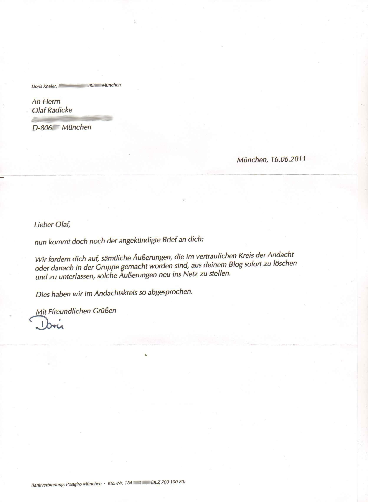

**Der Artikel stammt aus dem Archiv!** Die Formatierung kann beschädigt sein.

Heute bekam ich Post von den M&uuml;nchner GYM-Quakern. <strike>Er</strike> Sie bezieht sich <strike>offenbar</strike> immer noch <strike>um</strike> auf die Querelen von vor sechs Wochen. Nachzulesen in den Artikeln <a href="http://www.the-independent-friend.de/?q=node/736">&quot;Die GYM-Quaker laden mich wieder mal zum 'Gespr&auml;ch' vor&quot;(Di, 03/05/2011)</a> und <a href="http://www.the-independent-friend.de/?q=node/727">&quot;...Da muss ich mal dr&uuml;ber nach denken&quot;(So, 17/04/2011)</a>. Hauptproblem war, dass ich nicht wusste, was denn nun eigentlich das Problem ist.
<!--break-->
Ich schlug ihnen vor, sich erst mal untereinander zu beraten und dann noch mal ihre Kritik auszuformulieren. Nun schreibt mir Doris Knaier aus M&uuml;nchen vom 16.06.2011:
<blockquote style="background: none repeat scroll 0% 0% rgb(244, 244, 255); border: 2px solid rgb(153, 153, 153);" width="80%;"> <i>Lieber Olaf,</i>  <i>nun kommt doch noch der angek&uuml;ndigte Brief an dich:</i>  <i>Wir fordern dich auf, s&auml;mtliche &Auml;u&szlig;erungen, die im vertraulichen Kreis der Andacht oder danach in der Gruppe gemacht worden sind, aus deinen Blog sofort zu l&ouml;schen und zu unterlassen, solche &Auml;u&szlig;erungen neu ins Netz zu stellen.</i>  <i>Dies haben wir im Andachtskreis so abgesprochen.</i>  <i>Mit Ffreundlichen Gr&uuml;&szlig;en</i>  <i>Doris</i> </blockquote>
&nbsp;
Hmm, ich sehe immer noch nicht, was jetzt das Problem ist! Was sollen das f&uuml;r <i>Vertraulichkeiten</i> gewesen sein? Es wurde in dem Artikel nicht ein einziger Name genannt! Warum darf man nicht von seinen Erlebnissen bei dem Besuch einer Quaker-Versammlung berichten? Es ist eine &ouml;ffentliche Veranstaltung, f&uuml;r die an verschiedenen Stellen des Internet geworben wird:
<ul>
    <li><a href="http://www.monacomedia.de/muenchenwiki/index.php/Qu%C3%A4ker_-_Religi%C3%B6se_Gesellschaft_der_Freunde">Im M&uuml;nchen-Wiki</a></li>
    <li><a href="http://www.muenchen.de/Stadtleben/Glaube_Kirche/Gottesdienste_Messen/270928/Gottesdienste_in_Muenchen.html">Auf der Seite der Stadt M&uuml;nchen</a></li>
    <li><a href="http://www.rgdf.de//index.php?option=com_content&amp;task=blogsection&amp;id=13&amp;Itemid=62">Auf der Seite der Deutschen Jahresversammlung</a></li>
    <li><a href="http://munichquakers.blogspot.com/">In ihrem Weblog</a></li>
    <li>auf www.muenchen-quaeker.de</li>
    <li>auf www.munich-quakers.de</li>
    <li>auf www.quaeker-muenchen.de</li>
</ul>
&nbsp;
Warum also darf nicht von Quaker-Versammlungen des GYM berichtet werden? Ist das ein Geheimbund? Oder sind das Psycho-Sitzungen wie das <a href="http://de.wikipedia.org/wiki/Auditing_%28Scientology%29#Auditing">Auditing</a>. bei Scientology? Oder habe ich in einem Quaker-Gruppen-Beichtstuhl gesessen, ohne es zu bemerken? Ich vermisse jegliche Argumente in dem Brief. F&uuml;r sechs Wochen Beratung sind die paar Zeilen eine echt magere Ausbeute! Also da muss schon ein bisschen mehr kommen. So einfach verzichte ich nicht auf mein Grundrecht. Hier noch mal GG Art 5 I. Abs.:
&nbsp;
<ul>
    <li><i>Jeder hat das Recht, seine Meinung in Wort, Schrift und Bild frei zu &auml;u&szlig;ern und zu verbreiten und sich aus allgemein zug&auml;nglichen Quellen ungehindert zu unterrichten. Die Pressefreiheit und die Freiheit der Berichterstattung durch Rundfunk und Film werden gew&auml;hrleistet. Eine Zensur findet nicht statt.</i></li>
</ul>
&nbsp;

 
Dieser Text ist unter einer <a rel="license" href="http://creativecommons.org/licenses/by-sa/3.0/de/">Creative Commons-Lizenz</a> lizenziert. **Und** unter der <a href="http://de.wikipedia.org/wiki/GFDL">GNU-Lizenz f&uuml;r freie Dokumentation</a> in der Version 1.2 vom November 2002 (abgek&uuml;rzt GNU-FDL oder GFDL). Zitate und verlinkte Texte unterliegen den Urheberrecht der jeweiligen Autoren.
