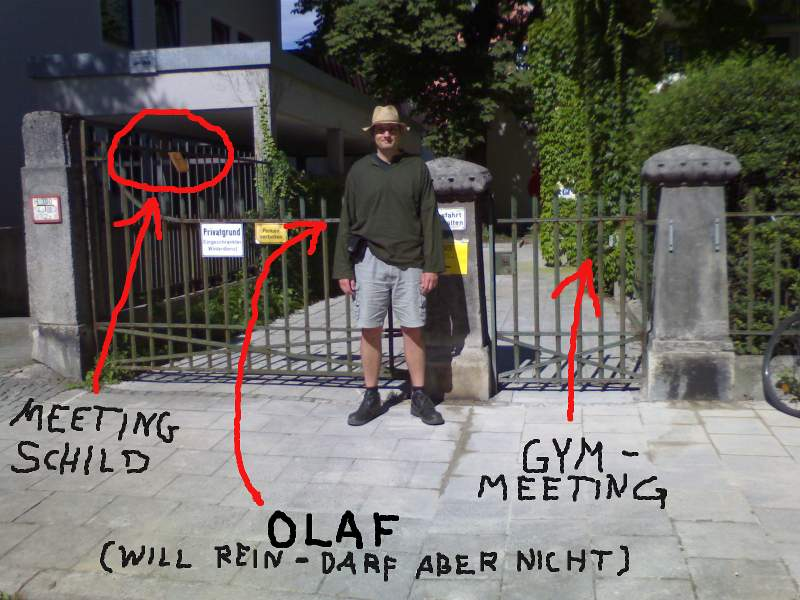

<b>Der Artikel stammt aus dem Archiv!</b> Die Formatierung kann beschädigt sein.

Ich frage mich: was ist das f&uuml;r eine panische Angst vor Transparenz und &Ouml;ffentlichkeit? Heute war ich noch mal bei den GYM-Quakern, um sie besser verstehen zu k&ouml;nnen. Mir wurde weiterhin die Teilnahme am <i>meeing for worship</i> verweigert. Ich bat einen Quaker-Freund mitzukommen, um den GYM-Quakern ins Gewissen zu reden, damit sie sich f&uuml;r einen Dialog &ouml;ffnen. Mit seiner Hilfe gelang es zumindest einer GYM-Quakerin ein paar Aussagen aus der Nase zu ziehen. Es war ihrer &Uuml;berzeugung (und sie nahm in Anspruch auch im Namen der gesamten Gruppe zu sprechen), dass Versammlungen keine &ouml;ffentliche Veranstaltungen seien, und auf keinen Fall Dinge in die &Ouml;ffentlichkeit getragen werden d&uuml;rften. Losgel&ouml;st davon ob Namen genannt w&uuml;rden oder nicht. Egal um welche Themen bzw. Inhalte es gehe.

<!--break-->

Leider konnte oder wollte die GYM-Quakerin nicht begr&uuml;nden, warum eine Quaker-Andacht ihrer Ansicht nach einen <i>&quot;gesch&uuml;tzen Raum der Verschwiegenheit&quot;</i> br&auml;uchte. Nur mal so als Beispiel: mir ist es v&ouml;llig klar, warum eine Selbshilfegruppe wie die der Anonymen Alkoholiker einen <i>&quot;gesch&uuml;tzen Raum der Verschwiegenheit&quot;</i> braucht um zu funktionieren. Aber eine &quot;normale&quot; Glaubensgemeinschaft? Und ich spreche hier nicht von seelsorgerischen Gespr&auml;chen! Die waren nie Thema meiner Artikel im Blog. Ich habe lediglich von den &ouml;ffentlichen Gottesdiensten berichtet. Aus meinen Artikeln wird ja noch nicht einmal ersichtlich, wer zur Quaker-Andacht geht und wer dort irgendeine Meinung vertritt. Es ging immer nur um ganz generelle Dinge. Es konnte sich also niemand pers&ouml;nlich angegriffen oder <i>&quot;geoutet&quot;</i> gef&uuml;hlt haben. Namen habe ich nur genannt, wenn mir die betreffende Person geschrieben hat, der Inhalt formaler Natur war und ich ihn zitiert habe. Schlie&szlig;lich ging es um meinen Ausschluss. Wenn man ein solches Gesch&uuml;tz rausholt, nenne ich auch &quot;Ross und Reiter&quot; - so fern mir bekannt. Ich denke, wer einen Ausschluss f&uuml;r gerechtfertigt h&auml;lt, sollte auch offen dazu stehen und sich nicht feige hinter einer anoymen Gruppe verstecken.

Die Quaker sind aktuell in Deutschland nun wirklich keine verfolgte Minderheit, wo ein Besuch der Quaker-Versammlung eine Gefahr darstellen w&uuml;rde. Weder f&uuml;r den Besucher noch f&uuml;r die Glaubensgemeinschaft. Das GYM beteiligt sich an der Arbeitsgemeinschaft Christlicher Kirchen. Will also als Glaubensgemeinschaft auch wahrgenommen werden. Das GYM ist regelm&auml;&szlig;ig bei diversen Kirchentagen pr&auml;sent. Bei GYM-Versammlungen handelt es sich vom Charakter her, auch nicht um eine s.g. <a href="http://de.wikipedia.org/wiki/Hauskirche">Hauskirche</a> oder <a href="http://de.wikipedia.org/wiki/Hauskreis">Hauskreis</a>.

Also woher kommt diese Betonung des Privaten im GYM? Vielleicht ist es ein <i>b&uuml;rgerlich-behagliches Wohnzimmer-Quakertum</i>, das hier in Deutschland zelebriert wird. Ganz in der Tradition des <a href="http://de.wikipedia.org/wiki/Literarischer_Salon">Biedermeier-Salons</a> und des b&uuml;rgerlichen R&uuml;ckzugs ins Private. Quasi ein Salons-Quakertum?

Wenn man sich die Tageb&uuml;cher von George Fox durchliest, muss man zu dem Schluss kommen, dass er Religion <b>nicht</b> als <i>&quot;Privatangelegenheit&quot;</i> verstand. Er gibt in seinen Tageb&uuml;chern sehr detaillierte Einblicke in seine theologischen Dispute. Und im Gegensatz zu mir, nennt er auch den vollen Nahmen, seiner Kontrahenten. Er trat regelm&auml;&szlig;ig in Gemeinden und vor Predigern auf, bei denen er nicht erw&uuml;nscht war. Umgekehrt ertrug er es, wenn seine Versammlungen gest&ouml;rt wurden, oder er bei der Predigt und seinen Ansprachen h&ouml;hnisch kommentiert wurde. Er hielt nicht nur Versammlungen in Privath&auml;usern ab, sondern auch auf dem offenen Feld, vor Kirchen und M&auml;rkten. Die Salon-Kultur der deutschen Kryptoquaker d&uuml;rfte auf George Fox und seine <i>&quot;fr&uuml;hen Freunde&quot;</i> einen sehr befremdlichen Eindruck machen. H&ouml;chst wahrscheinlich h&auml;tte er sie als <a href="http://en.wikipedia.org/wiki/Ranter"><i>&quot;Rander&quot;</i></a> bezeichnet.

Gl&uuml;cklicherweise leben wir ja nicht mehr in einer Diktatur wie dem <i>&quot;Dritten Reich&quot;</i> oder der DDR. W&auml;re dem so, w&uuml;rde ich mir auch sehr genau &uuml;berlegen was ich &uuml;ber meine Andachtsbesuche schreibe. Vielleicht ist das Deutssprachige Quakertum immer noch in einem posttraumatischen Zustand? Vielleicht w&auml;hnen sich die Ewig-gestrigen GYM-Quaker tats&auml;chlich immer noch in der Verfolgung? Sollte dem so sein, w&auml;re es sehr ungesund sich auch noch immer wieder in seinen - ungerechtfertigten - &Auml;ngsten gegenseitig zu best&auml;rken. Es ist v&ouml;llig klar, dass eine so stark ausgepr&auml;gte &Ouml;ffentlichkeits-Phobie in ein Kryptoquakertum m&uuml;nden muss.

Das tragische bei diesem pathologischen Verh&auml;ltnis zu &Ouml;ffentlichkeit und dem daraus resutierendem Kryptoquakertum ist, dass der <i>&quot;Schutz&quot;</i> den die Krypthoquaker so sehns&uuml;chtig suchen, ein Selbstbetrug ist. Eine Gemeinschaft die sich versteckt und wegduckt, wird dem Einzelnen - wenn es hart auf hart kommt - kein Schutz oder Unterst&uuml;tzung bieten! Das zeigt ein Blick in die Geschichte! Die Quaker die zur Nazizeit mutig Widerstand leisteten, und &ouml;ffentlich Zeugnis ablegten, waren weitestgehend auf sich allein gestellt. Es war nicht so, dass sich das GYM sch&uuml;tzend vor seine Mitglieder gestellt h&auml;tte. Es wurde kein gemeinschaftliches &ouml;ffentliches Zeugnis abgegeben. Es war die <i>&quot;Privatangelegenheit&quot;</i> eines Jeden Einzelnen, sich den Nazis in den Weg zu stellen. Sehr wohl gab es nicht wenige, die es taten und gro&szlig;en Mut bewiesen, aber sie haben keine formale oder &ouml;ffentliche Unterst&uuml;tzung ihrer Glaubensgemeinschaft bekommen. Und ich gehe fest davon aus, dass es heute auch nicht anders w&auml;re.   Also nur mal hypothetisch angenommen: eine Gruppe wie die Taliban w&uuml;rde in Deutschland eine Gewaltherrschaft errichten und Quaker dazu zwingen B&auml;rte zu tragen (gut das machen sie heute schon) und zum Islam zu konvertieren. Ich glaube nicht, dass sich das GYM geschlossen mit allen Konsequenzen dagegen st&auml;mmen w&uuml;rde. H&ouml;chst wahrscheinlich liefe es so ab, dass man heimlich zur Quakerandacht schleichen w&uuml;rde, und wer von den Taliban ins Gef&auml;ngnis geworfen w&uuml;rde oder gesteinigt, br&auml;uchte nicht zu hoffen, das dass GYM &ouml;ffentlich Protest dagegen erheben w&uuml;rde

Sicher, alles rein hypothetisch! Ich stelle aber fest, dass das was den Kryptoquaker ein Gef&uuml;hl von Sicherheit zu geben scheint, f&uuml;r mich nur Luftschl&ouml;&szlig;er sind.

 
Dieser Text ist unter einer <a href="http://creativecommons.org/licenses/by-sa/3.0/de/" rel="license">Creative Commons-Lizenz</a> lizenziert. <b>Und</b> unter der <a href="http://de.wikipedia.org/wiki/GFDL">GNU-Lizenz f&uuml;r freie Dokumentation</a> in der Version 1.2 vom November 2002 (abgek&uuml;rzt GNU-FDL oder GFDL). Zitate und verlinkte Texte unterliegen den Urheberrecht der jeweiligen Autoren.

