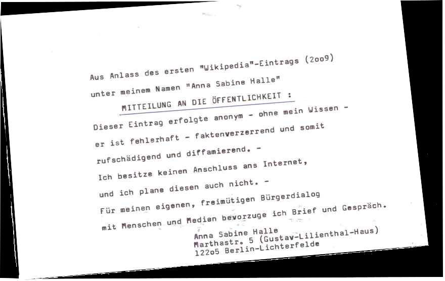

<b>Der Artikel stammt aus dem Archiv!</b> Die Formatierung kann beschädigt sein.

Also ich muss zugeben, ich bekomme nur noch selten Briefe die mit der Schreibmaschine geschrieben wurden. So wie diesen hier von Anna Sabine Halle. Irgendwie hat das was aus einer l&auml;ngst vergangenen Zeit. Gut die Absenderin ist hoch betagt und ihr Anliegen passt wunderbar dazu.

Ja, weil der Frau soviel daran gelegen ist, sich der &Ouml;ffentlichkeit zu erkl&auml;ren, bin ich gerne bereit, das hier zu ver&ouml;ffentlichen. Allein, der Text wirft mehr Fragen auf, als er beantwortet. Mir ist z.B. nicht klar was an dem <a href="http://de.wikipedia.org/wiki/Anna_Sabine_Halle">Wikipedia-Artikel &uuml;ber sie</a> falsch ist. Zudem bezieht sie sich ja offenbar auf eine Version die zwei Jahre alt ist.

Zwischen den Zeilen meine ich herauszulesen, dass sie nicht&nbsp; in die Welt des Internets will, sondern, dass die Welt des Internets bitte sch&ouml;n zu ihn nach Hause kommen m&ouml;ge (Brief und Gespr&auml;ch). Ich f&uuml;rchte, das wird so nicht funktionieren.  Obwohl, wenn sie die Leute &uuml;ber Facebook zu einer Quaker-Partie zu sich nach Hause einl&auml;d, vielleicht... <a href="http://www.morgenpost.de/vermischtes/article1712996/Facebook-Party-Polizeieinsatz-kostet-115-000-Euro.html">kommen dann auch 2000 Teilnehmer.</a> Aber ich glaube das ist auch nicht das was sie wollte!

Tija, Wie kann man &auml;ltere Menschen einbinden in gesellschaftlich-sozialen Dingen, die das Internet nicht mehr verstehen k&ouml;nnen oder wollen? Gerade bei einer Gemeinschaft wie die Quakern in Deutschland, die keine oder sehr selten, eine lebendige Gemeinde vor Ort haben? Also auch nicht sekund&auml;r &uuml;ber Andere mit Informationen versorgt werden k&ouml;nnen.

 
Dieser Text ist unter einer <a rel="license" href="http://creativecommons.org/licenses/by-sa/3.0/de/">Creative Commons-Lizenz</a> lizenziert. <b>Und</b> unter der <a href="http://de.wikipedia.org/wiki/GFDL">GNU-Lizenz f&uuml;r freie Dokumentation</a> in der Version 1.2 vom November 2002 (abgek&uuml;rzt GNU-FDL oder GFDL). Zitate und verlinkte Texte unterliegen den Urheberrecht der jeweiligen Autoren.
