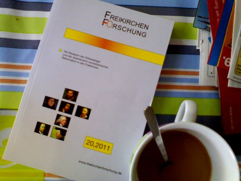

<b>Der Artikel stammt aus dem Archiv!</b> Die Formatierung kann beschädigt sein.

In einem <a href="http://www.rgdf.de//index.php?option=com_content&amp;task=view&amp;id=171&amp;Itemid=33">Blogeintrag</a> des GYMs, unter dem Titel &quot;Qu&auml;kertum und Luthertum&quot; wurde berichtet von einem Beitrag von Claus Bernet  in einer Publikation Freikirchenforschung, 20,2011, ISBN 978-3-934109-12-4. Mich hat es interessiert und deshalb habe ich es mir bestellt.

Die Bestellung war etwas abenteuerlich. Das Buch ist - unverst&auml;ndlicherweise - nicht direkt &uuml;ber den Buchhandel wie z.B. Amazon bestellbar. Der Verlag hat auch kein gescheiten Online-Shop. Das Online-Formular was man da ausf&uuml;llt, hat keine Plausibilit&auml;ts&uuml;berpr&uuml;fung. Somit wird nicht gepr&uuml;ft, ob man versehentlich zu wenig oder Unsinn eintippt. Den Rechnungsbetrag muss man auch selber ausrechnen und auch dieser wird nicht auf Richtigkeit gepr&uuml;ft. In meinem Fall hatte ich die Stra&szlig;e vergessen ein zu tippen. Ein paar Tage sp&auml;ter meldete sich dann bei mir eine Frau, mit Privat-Email-Adresse von GMX. In der Mail gab Sie sich auch nicht als Verlagsmitarbeiterin zu erkennen. Die Mail hatte keine Fu&szlig;zeile mit Funktionsbezeichnung. Da ich nicht so oft im Internet bestelle, konnte ich dann die Nachfrage zu Bestellung zuordnen. Und ein paar Tage sp&auml;ter lag das Buch im Briefkasten.

Mir hat der Artikel sehr gut gefallen! &Uuml;ber die Jahre hat sich Claus jetzt ein sehr fl&uuml;ssigen und souver&auml;nen Schreibstiel erarbeitet. Die Texte sind auch f&uuml;r Laien unangestrengt gut zu lesen. Ich konnte doch einiges - f&uuml;r mich - Neues auch entdecken und lernen. So der &Uuml;berblick &uuml;ber die Entwicklung des Quakertums in 19. und 20. Jahrhundert. Die Aussage zu dem Buch auf der GYM-Seite: <i>&quot;Quietismus und Evangelikalismus-Phase bei den Qu&auml;kern.&quot;</i> ist nat&uuml;rlich Unfug. Und es l&auml;sst sich <i>SO</i> auch nicht im Text finden. Eine Epoche die sich <i>&quot;Evangelikalismus-Phase&quot;</i> gibt es nicht. Es gibt einen Evangelikalen Fl&uuml;gel im Quakertum, aber der war keine Phase, sondern ist immer &quot;Ph&auml;nomen&quot;, auch wenn das einige vielleicht nicht wahr haben wollen. Wie es zu dieser Spielart des Quakertums kam, zeigt Claus in seinem Text sehr verst&auml;ndlich und wehrtungsfrei auf.

Im dem Text werden aber in erster Linie, die beiden - jeweiligen - Gr&uuml;nder Fox und Luther gegen&uuml;bergestellt. An Hand ihrer ihrer Biographie und ihres Wirkens, ohne sich in Details zu verlieren. Bei der Gegen&uuml;berstellung der Glaubenss&auml;tze, beschr&auml;nkt sich Claus auf die wenigen, wo Quaker und Lutheraner gegenseitig Bezug aufeinander genommen haben. Und das scheint recht recht wenig gewesen zu sein. Aus au&szlig;er acht gelassen wurde, sind die Dokumente, in denen auf die Theologie des jeweils anderen Bezug genommen wird, ohne den Namen des Gegners zu nennen. Ich denke da zum Beispiel an die Fox-Tageb&uuml;cher, wo ausf&uuml;hrlich auf die Pr&auml;destinationslehre der Calvinisten eingegangen wird, ohne diese Namentlich zu nennen. Im hinteren Text geht Claus auf die theologischen Verbindungen der beiden Konfessionen in der j&uuml;ngeren Geschichte in Deutschland ein. Ohne hier selber Stellung zu beziehen.

 
Dieser Text ist unter einer <a href="http://creativecommons.org/licenses/by-sa/3.0/de/" rel="license">Creative Commons-Lizenz</a> lizenziert. <b>Und</b> unter der <a href="http://de.wikipedia.org/wiki/GFDL">GNU-Lizenz f&uuml;r freie Dokumentation</a> in der Version 1.2 vom November 2002 (abgek&uuml;rzt GNU-FDL oder GFDL). Zitate und verlinkte Texte unterliegen den Urheberrecht der jeweiligen Autoren.
