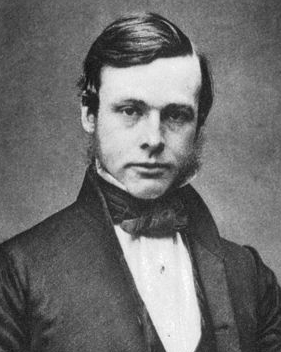

<b>Der Artikel stammt aus dem Archiv!</b> Die Formatierung kann beschädigt sein.

In der Jungewelt ist ein Artikel &uuml;ber den Quaker und Arzt Joseph Lister zu finden. Er ist der  Begr&uuml;nder der antiseptischen Chirurgie. Den Artikel findet ihr hier: Jungewelt, Ausgabe 09.02.2012, Rubrik &quot;Wissenschaft &amp; Umwelt&quot; ,  Seite 15, Autor: Christoph Horst, Titel &quot;Finger in die Wunde&quot;, URL: http://www.jungewelt.de/2012/02-09/026.php
<!--break-->

