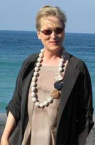

**Der Artikel stammt aus dem Archiv!** Die Formatierung kann beschädigt sein.

Claus Bernet schreibt in seinem Blog-Beitrag vom 11.2.12 (Titel: <a href="http://quaekernachrichten.blogspot.com/2012/02/pauseich-bin-dann-mal-weg.html">&quot;Pause.&quot;</a>):
<blockquote> W&auml;hrend der Berlinale gibt es keine neuen Blogeintr&auml;ge...au&szlig;er wenn ich einen Qu&auml;kerfilm entdecke oder Meryl Streep zum Qu&auml;kertum &uuml;bertritt.</blockquote>
Ob das eine Anspielung darauf ist, das <a href="http://de.wikipedia.org/w/index.php?title=Meryl_Streep&amp;oldid=99066522">Meryl Streep</a>  eine Verwandte von <a href="">William Penn</a> ist?
<!--break-->
William Penn, dem Quaker, Autor und Gr&uuml;nder von Pennsylvania. Oder war das nur Zufall bei Claus? F&uuml;hr ein verstecktes <i><a href="http://de.wikipedia.org/wiki/Easter_Egg">Easter Egg</a></i> ist es ja eigendlich noch zu fr&uuml;h.
&nbsp;
