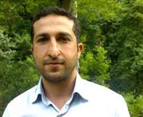

**Der Artikel stammt aus dem Archiv!** Die Formatierung kann beschädigt sein.

Durch einen Artikel von <a href="http://www.jesus.de/blickpunkt/detailansicht/ansicht/183887kampagnen-verhinderten-bislang-hinrichtung-youcef-nadarkhanis.html">jesus.de</a> bin ich auf das Schicksal von Youcef Nadarkhani aufmerksam geworden. Youcef sitzt im Iran im Gef&auml;ngnis wo er auf die Hinrichtung wartet. Sein einzigstes Verbrechen war, vom Islam zum Christentum zu konvertieren.
<!--break-->
Was Youcef bisher vor der Vollstreckung bewahrt hat, war wahrscheinlich die Aufmerksamkeit die die Welt&ouml;ffentlichkeit auf den Fall gelegt hat. Jeder von uns kann ein Teil dieser Aufmerksamkeit sein und den Druck verst&auml;rken. Ich glaube nicht, das ich an dieser Stell erkl&auml;ren muss, warum die universellen Menschenrechte richtig und wichtig sind. Und das davon auch nicht die Religionsfreiheit ausgenommen werden darf. Das Recht auf Religionsfreiheit ist nicht kulturell relativierbar oder eine &quot;subjektive Wahrheit&quot; die man zuerst zerreden und dann wegdiskutieren kann. Nein!
Jede Religion - oder fast jede - hat den Anspruch, die allein seligmachende zu sein. Okay, kein Problem, solange sie nicht das Lebensrecht Anderer oder deren unver&auml;u&szlig;erlichen Menschenrechte in Frage stellt, oder gar verneint! Das ist f&uuml;r mich eine Grenze die nicht verhandelbar ist. Egal ob sie rassistisch, religi&ouml;s oder turbokapitalistisch begr&uuml;ndet wird (den f&uuml;r nicht wenige ist Geld auch eine Religion.).
Es gibt viele M&ouml;glichkeit die Aufmerksamkeit auf diesen Fall zu erh&ouml;hen: Schreibt E-Mails an Politiker, schiebt in euren Blgs, geht zur Mahnwache (z.B. <a href="http://www.igfm.de/Mahnwache-fuer-Pastor-Youcef-Nadarkhani-in-Muenchen.3092.0.html">am&nbsp;13. M&auml;rz 2012 in M&uuml;nchen</a>) oder twitter, oder beteiligt euch an der <a href="http://openpetition.de/petition/online/freiheit-fuer-iranischen-pastor-youcef-nadarkhani">Unterschrifteinsammlung</a>...
  
 
Dieser Text ist unter einer <a href="http://creativecommons.org/licenses/by-sa/3.0/de/" rel="license">Creative Commons-Lizenz</a> lizenziert. **Und** unter der <a href="http://de.wikipedia.org/wiki/GFDL">GNU-Lizenz f&uuml;r freie Dokumentation</a> in der Version 1.2 vom November 2002 (abgek&uuml;rzt GNU-FDL oder GFDL). Zitate und verlinkte Texte unterliegen den Urheberrecht der jeweiligen Autoren.
