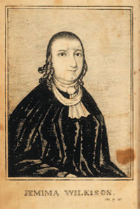

<b>Der Artikel stammt aus dem Archiv!</b> Die Formatierung kann beschädigt sein.

<i>Der Westen</i> beschäftigt sich in dem Artikel <a href="http://www.derwesten.de/reise/jerusalem-ein-name-fuer-viele-staedte-id6529925.html">"Jerusalem - Ein Name für viele Städte"</a> am 10.04.2012 mit der Frage wo man noch Stadte mit dem Namen "" finden kann.
<!--break-->
Unter anderem kommen sie auf eine Stadt zu sprechen die von der Quakerin <a href="http://en.wikipedia.org/wiki/Jemima_Wilkinson"> Jemina Wilkinson</a> gegründet wurde. Und zwar Jerusalem in New York in den USA. Wilkinson war auch  Frauenrechtlerin und predigte die  totale sexuelle Abstinenz.  Ihr Siedlerhaus aus dem späten 18. Jahrhundert kann übrigens noch besichtigt werden. Heute hat  Jerusalem 4469 Einwoner.

Anmerkung: Das Bild entstammt dem Wikipedia-Projekt: http://commons.wikimedia.org/wiki/File:Jemima_Wilkinson.jpg
