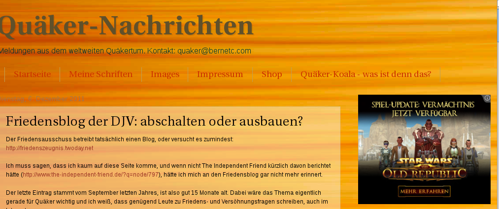
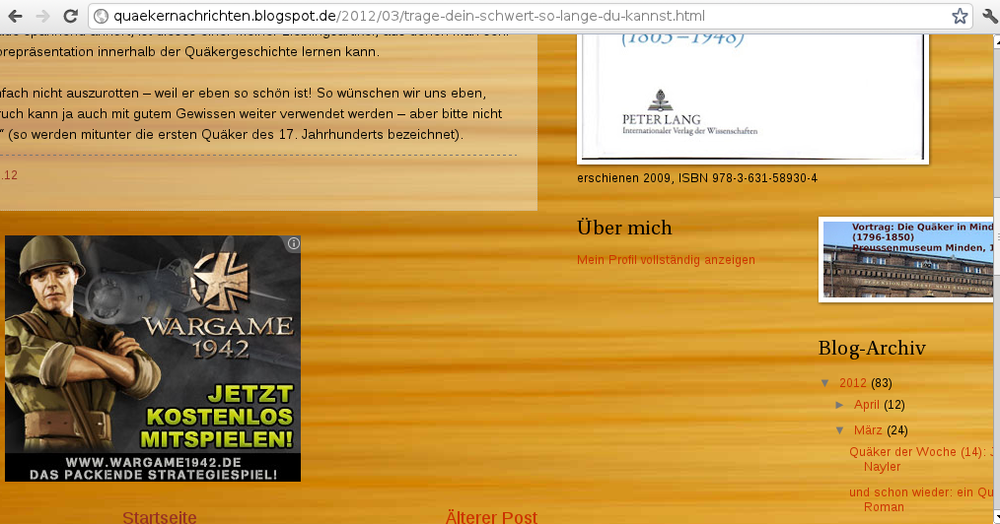

<b>Der Artikel stammt aus dem Archiv!</b> Die Formatierung kann beschädigt sein.

<b>Erstveröffentlichung: 15.04.2012</b>

Claus Bernet plädiert in seinem Blog-Artikel <i><a href="http://quaekernachrichten.blogspot.de/2012/04/zeitschrift-quaker-vorteile-einer.html#more">"Zeitschrift 'Quäker': Vorteile einer Onlineausgabe"</a></i> vom 14.4.2012 dafür die Gemeinde-Zeitung als Online-Publikation weiter zu führen. Im Grunde gebe ich ihm Recht. Die Pro-Argumente die er auflistet sind aber zum Teil undifferenziert oder auch etwas unfair. Im einzelnen:
<!--break-->
<ul>
  <li><i>"1. Höhere Erreichbarkeit und Öffentlichkeit. [...]"</i>: Definitiv Ja!
  </li>
  <li><i>"2. Umweltschutz [...]"</i>: Websites (Server), Netzwerke und PC verbrauchen Strom. Wo der herkommt wissen wir nicht. Papier ist ein Nachwachsender Rohstoff. Der in der CO2-Bilanz neutral ist. Allerdings wir auch Energie bei der Herstellung und dem Transport verbrauch. Das müsste man sich im Detail ansehen. Was unter dem Strich Umweltschonender ist.
  </li>
  <li><i>"3. Beiträge erscheinen zeitnah und aktuell,"</i>: Glaube ich nicht! Das ist nur zweitrangig eine frage der Technik. Sie z.B. http://friedenszeugnis.twoday.net oder http://rgdf.de . Da geht garnix. Monate lange Funkstille. 
  </li>
  <li><i>"4. Fehler oder Ungenauigkeiten können in Sekunden korrigiert werden [...]"</i>: Als Legastheniker... wie könnte ich da eine andere Meinung haben?
  </li>
  <li><i>"5. Eine Onlineausgabe kann durch Volltextsuche schnell zu einem wertvollen Archiv werden. [...]"</i>: Setzt voraus, das die Suchfunktion auch gescheit ist. Da bin ich mit meiner eigenen Website nur mäßig zufrieden. Und auch in dem Blog von Claus finde ich manche Sachen einfach nicht mehr wieder...
  </li>
  <li><i>"6. Durch Nutzeranalyse könnten die Redakteure sogar herausfinden, was Leser häufig abfragen [...]"</i>: Ich glaube zwar nicht, das es jemanden gibt, der diese Analysen machen kann, aber vom Prinzip stimme ich zu. Claus vergisst nur, das er die Technik seines eigenen Blogs nicht selber pflegen muss, und nicht weiß, was das an Wissen und Erfahrung braucht, weil es Andere für ihn tun.
  </li>
  <li><i>"7. Abbildungen könnten endlich farbig gebracht werden."</i>: Nicht nur das! Sie könnten auch in unterschiedlichen Auflösungen angeboten werden. Und wenn sie unter der richtigen Lizenz veröffentlicht werden, auch Nacharbeitet werden (Farbkorrekturen unsw.)
  </li>
  <li><i>"8. Kostenersparnis, was für die DJV doch wirklich ein Argument sein sollte: Bezahlung für den Redakteur kann vollständig entfallen [...]"</i>: Da irrt Claus! Dir wartung und Pflege einer Website ist mindestens so aufwendig und technisch anspruchsvoll wie die Erstellung eines Printmediums. Eigentlich muss man sogar ein 24/7-Bereitschaftsdienst einrichten. Die Seite muss pausenlos überwacht werden. Autoren müssen freigeschaltet, betreut und ggf. auch mal gesperrt werden. Recht erteilt und Inhalte gepflegt werden. Software-Updates eingespielt und Sicherheitslöcher gestopft werden. Fehlerreports von Benutzen müssen bearbeitet werden. Und so weit, und so weiter... 
  </li>

Gerade Punkt (8.) zeigt auf, das es ressourcenschonender wäre die besehenen Websites zusammenzuführen um den Aufwand zu reduzieren. Oder man macht es wie Claus und nimmt ein Umsonst-Dienst in Anspruch. Allerdings muss man dann auch damit Leben, das auf seiner Seite Werbung für komische Dinge gemacht wird. So z.B. Potenzmittel, Hellseher oder für gewalttätige Starwars- und Krieg-Spiele, wie bei Claus (Sie Bilder unten).
 

 
 

 
<h2>[update 18.4.2012]</h2>

Hier noch ein interessanter Artikel der mir zu dem Thema recht passend erscheint: <a href="http://www.spiegel.de/netzwelt/web/0,1518,827995,00.html"><i>"Euer Internet ist nur geborgt"</i></a> Eine Kolumne von Sascha Lobo auf spiegel.de

 
Dieser Text ist unter einer <a rel="license" href="http://creativecommons.org/licenses/by-sa/3.0/de/">Creative Commons-Lizenz</a> lizenziert. <b>Und</b> unter der <a href="http://de.wikipedia.org/wiki/GFDL">GNU-Lizenz f&uuml;r freie Dokumentation</a> in der Version 1.2 vom November 2002 (abgek&uuml;rzt GNU-FDL oder GFDL). Zitate und verlinkte Texte unterliegen den Urheberrecht der jeweiligen Autoren.
