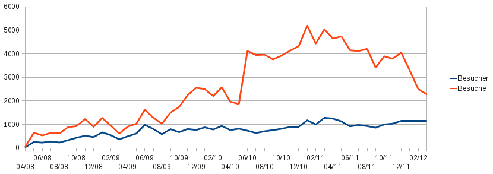

<b>Der Artikel stammt aus dem Archiv!</b> Die Formatierung kann beschädigt sein.

Ich habe wieder mal eine statistische Auswertung über den gesamten Zweitraum des Bestehen dieser Website gemacht. Ergebnis ist, das die Leserschaft der Seite nicht mehr weiter wächst. Die Besuchszahlen sind seid ca. einen Jahr kontinuierlich zurückgegangen. Das heißt, THE INDEPENDENT FRIEND hat zwar nicht weniger Leser, aber die Leser besuchen die Seite seltener. Vermutlich auch, weil die Kontroversen um meine Person abgenommen haben.

Ich werte das dahingehend, das jetzt quasi mit ca. 1200 (unterschiedlichen) Besuchern pro Monat eine "Marktsättigung" erreicht ist. Also alle Leute die sich für Quaker interessieren und Artikel auf deutsch lesen wollen, haben den THE INDEPENDENT FRIEND entdeckt und lesen ihn regelmäßig. Wenn man mal 100 Besucher abzieht, die den Block lesen wegen mir und nicht wegen Quakertum, bleiben gut 1000 Leute übrig, Ich vermute mal der Blog von <a href="http://quaekernachrichten.blogspot.de">Claus Bernet</a> oder dem der <a href="http://quaekerberlin.wordpress.com">Berliner Versammlung</a> kommen auch nicht auf mehr. 

1000 Leute, das ist echt erschreckend. Aber nicht wirklich verwunderlich! Was ist den schon spannendes zu vernehmen in Deutschland von Quakern? Das ein zigste wo mit sie sich beschäftigen, scheint Sie selbst zu sein. Sowohl die Berliner Versammlung, als auch die Seite http://rgdf.de des GYM und natürlich das <a href="http://unserbuch.wikispaces.com/">Buchprojekt "Unser Buch"</a> beschäftigen sich im Grunde doch nur noch damit, in der Vergangenheit zu wühlen und sich selbst zu zitieren! Damit lockt man niemanden hinter dem Ofen vor...

Ich könnte jetzt darüber nachdenken, mein Themenkreis zu erweitern um damit meine Leserschaft zu erweitern. Das werde ich aber nicht tun, weil der Blog kein Selbstzweck ist. Abgesehen davon, glaube ich nicht das das hilft. Wenn ich mich Themen zuwende, die viele Andere schon beackern, verliert der Blog ein Stück weit auch ein "Alleinstellungsmerkmal". Ich buhle dann also um die Leser anderer. Nein. Ich sehe den einzigen Zweck dieser Seite, den Untergang des Quakertums in Deutschland zu dokumentieren...

 
Dieser Text ist unter einer <a rel="license" href="http://creativecommons.org/licenses/by-sa/3.0/de/">Creative Commons-Lizenz</a> lizenziert. <b>Und</b> unter der <a href="http://de.wikipedia.org/wiki/GFDL">GNU-Lizenz f&uuml;r freie Dokumentation</a> in der Version 1.2 vom November 2002 (abgek&uuml;rzt GNU-FDL oder GFDL). Zitate und verlinkte Texte unterliegen den Urheberrecht der jeweiligen Autoren.

