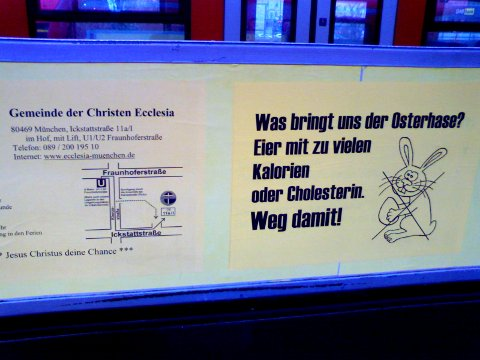

<b>Der Artikel stammt aus dem Archiv!</b> Die Formatierung kann beschädigt sein.

Kürzlich habe ich zwei Lustige Plakate auf dem Weg zur Arbeit gesehen. Plakat Nr. 1 Zeigt das in einige christlichen Gemeinden nicht der <i>Osterhase</i> kommt, sondern der <i>Osterhasser</i> kommt.

 Auf Plakat Nr. 2 verstieg sich die <a href="http://de.wikipedia.org/wiki/GEMA">GEMA</a> Zu der Aussage: <b><i>Ohne Komponisten können wir nicht mit Gott singen.</i></b> Klingt ja fast so, als sei Gott auf Komponisten angewiesen. Ich erinnere an Math. 3,8+9: <i>"Bringet nun der Buße würdige Frucht;  und denket nicht bei euch selbst zu sagen: Wir haben Abraham zum Vater; denn ich sage euch, daß Gott dem Abraham aus diesen Steinen Kinder zu erwecken vermag."</i> Ja, dann wird er wohl auch keine Probleme haben, Komponisten hervorzubringen. Ich fürchte die GEMA kann lange warten, bis sie von Gott Geld sieht!
<!--break-->
 Die Komponisten, die niemanden gestatten vor, für oder mit Gott zu singen, die nicht vorher Geld dafür bezahlt haben, erinnere ich an die Geschichte mit Kain und Abel (Gen 4,1–16). Es ist der erste Schritt in die Katastrophe, sein Opfer mit dem der Anderen zu vergleichen, und anderen die (vermeintliche oder tatsächliche) Zuneigung von Gott zu neiden. Eigentlich müsste man aus Provokation und Protest erst recht öffentlich Kirchenlieder singen. Würde ich fast machen, wenn ich <s>Singen mehr mögen und können würde</s> besser singen könnte.

 
Dieser Text ist unter einer <a rel="license" href="http://creativecommons.org/licenses/by-sa/3.0/de/">Creative Commons-Lizenz</a> lizenziert. <b>Und</b> unter der <a href="http://de.wikipedia.org/wiki/GFDL">GNU-Lizenz f&uuml;r freie Dokumentation</a> in der Version 1.2 vom November 2002 (abgek&uuml;rzt GNU-FDL oder GFDL). Zitate und verlinkte Texte unterliegen den Urheberrecht der jeweiligen Autoren.
