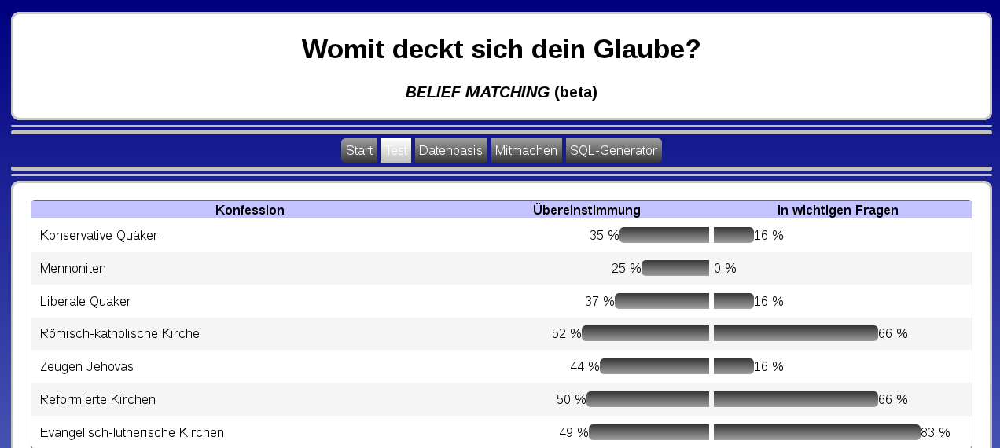

<b>Der Artikel stammt aus dem Archiv!</b> Die Formatierung kann beschädigt sein.

Seit ein paar Wochen arbeite ich an einem Projekt, das ich erst mal den Arbeitstitel <a href="http://konfessionsvergleich.the-independent-friend.de/"><i>"BELIEF MATCHING"</i></a> gegeben habe. Es handelt sich um eine Webapplikation, mit der Besucher herausfinden können soll, welche Konfession am besten zu seiner Überzeugung passt. Inspiriert ist das Projekt von dem <a href="http://www.beliefnet.com/Entertainment/Quizzes/BeliefOMatic.aspx">Belief-O-Matic</a> (einer eingetragenen Marke).
<!--break-->
Die Arbeit steht noch ziemlich am Anfang. Derzeit sind noch recht wenig Konfessionen eingespeichert, die abgeglichen werden können. Aber das kannst du ändern! Auf der Seite ist ein Formular, mit dem du deine Konfession beschreiben kannst. Dieses generiert aus deinen Antworten die Datensätze für die Datenbank. Diese kannst du mir per Mail zuschicken, mit ich sie dem Projekt hinzufügen kann. 

Die Datensätze können nicht direkt über die Website gespeichert werden. Grund ist: das ich da vorher noch mal drüber schauen möchte und ggf. Rückfragen stellen möchte. Möglicherweise fehlen dir auch wichtige Fragen, um eine Konfession beschreiben zu können. Dann nimm Kontakt zu mir auf und mache Vorschläge: briefkasten@olaf-radicke.de 

