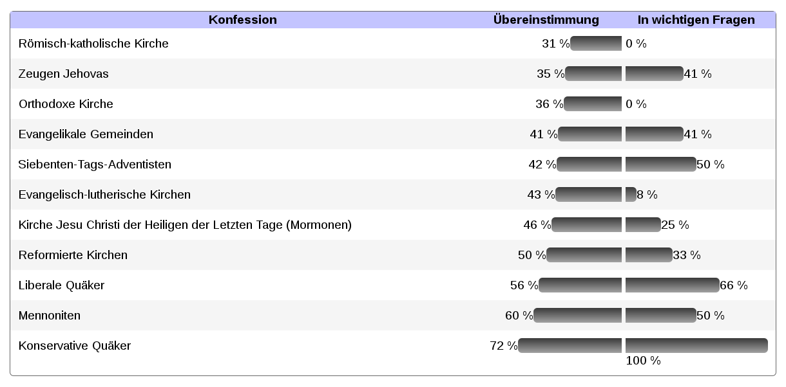

**Der Artikel stammt aus dem Archiv!** Die Formatierung kann beschädigt sein.

Ich habe die letzten Tage weiter an dem Projekt <i>BELIEF MATCHING</i>. Es sind aktuell nun die Datensätze von 11 Konfessionen hinterlegt. Ich habe noch ein wenig an den Design gefeilt. Bei der Ausgabe des Testergebnisses werden jetzt die Konfessionen nach der an Zahl Punkte aufsteigend sortiert. Im Bild ist das Ergebnis zusehen, wenn ich den Test mache. Neu ist auch noch eine neue (Sub-)Domain für das Projekt: http://konfessionsvergleich.the-independent-friend.de/ 
<!--break-->
Ich hab in den letzten Tagen auch versucht zu verschiedenen Konfessionen Kontakt aufzunehmen um mehr und zuverlässigere Daten  in der Datenbank hinterlegen zu können. Bei den Evangelikalen, den Katholiken und den Alt-Katholiken habe ich das über verschiedene Foren getan. Die Neuapostolischen habe ich angemail, aber (noch) keine Antwort erhalten. Von den Mormonen wollte sich noch jemand bei mir melden. 

Alles in Allem bisher eine spannende Arbeit. Es ist echt verblüffend, an was andere so z.T. glauben. Also da habe ich die letzten Tage wieder viel dazugelernt! Und ich werde wohl auch noch in Zukunft viel lernen. Denn  es fehlen noch sehr fiele Konfessionen in dem Test.  

