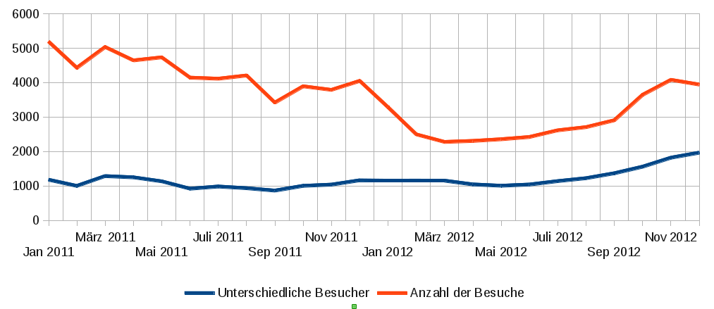
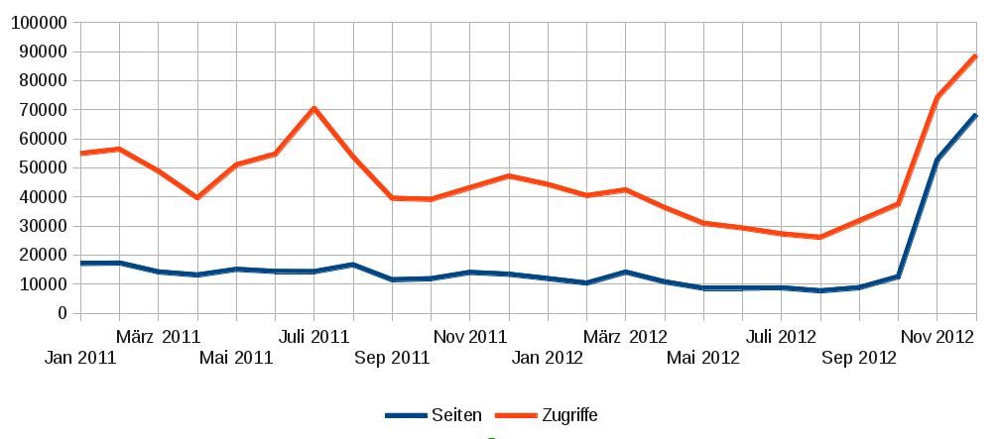

<b>Der Artikel stammt aus dem Archiv!</b> Die Formatirung kann beschädigt sein.

Für mich ist mit 2012 ein überaus ereignisreiches Jahr zu Ende gegangen. Herausragendstes Ereignis war ohne Zweifel die Abschlussprüfung bei der IHK. Da habe ich eine von fünf Prüfungen vermasselt und musste sie im Winter wiederholen. Somit habe ich jetzt den dritten Beruf in meinem Leben gelernt und kann mich jetzt "Fachinformatiker für Anwendungsentwicklung" nennen.

Aufgrund der intensiven Vorbereitungen auf die IHK-Prüfung sind einige Sachen liegen geblieben. So hat mein Weblog zum Beispiel darunter gelitten. Das sah man auch zwischenzeitlich an den Besucherzahlen. Die hatten im Sommer ein Tiefstand. Die hohen Besucherzahlen waren natürlich auch ein stückweit den Kontroversen mit dem GYM geschuldet.

<!--break-->

Wie man aber auch der Statistik entnehmen kann, war die Anzahl der unterschiedlichen Besucher im Sommer konstant. Der einzelne Besucher las aber weniger Artikel, was nicht verwunderlich ist, wenn es keine neuen Artikel gibt. Gegen Ende des Jahres gehen die Zahlen aber erstaunlicherweise wieder hoch. Bzw. wächst auf einmal wieder die Anzahl der unterschiedlichen Besucher. Den Grund sehe ich darin, dass ich neuerdings Leser aus dem mennonitischen Umfeld habe. Da es bedeutend mehr Mennoniten als Quäker gibt, ist das in meinem Blog sofort zu spüren, auch wenn es relativ wenige Mennoniten sind.

Zu den erfreulichen Ereignissen, gehörte eine wunderbare Reise an den Gardasee, die leider viel zu kurz war. Weniger erfreulich war, dass mein Netbook genau dann kaput ging, als ich gerade an dem Abschlussprojekt gearbeitet habe. Die Techniker von Conrad Elektronik waren so unfähig das Problem zügig zu analysieren und zu beseitigen, dass ich Reparatur nicht abwarten konnte und mir ein neues Gerät kaufte.

Aber ein ungleich schwererer Verlust war der Tod eines langjährigen guten Freundes. Die Beerdigung fiel auch noch mit meiner IHK-Prüfung zusammen, so dass ich nicht zur Beisetzung fahren konnte. Ein Abschied der mir wesentlich leichter fiel, war der von meiner Bank. Schon seit vielen Jahren wollte ich Bank wechseln, scheute aber die Mühen und Ungewissheiten. Es war auch mit einiger Arbeit verbunden, aber ich bin froh, das ich es jetzt durchgezogen habe.

Bei manchen Dingen muss man aktiv werden, andere Dinge muss man es auf sich zu kommen lassen. Dazu zählt eindeutig mein Umzug. Ich bin jetzt mit meiner Freundin zusammengezogen. Wer München kennt, weiß was es hier heiß, sich wohntechnisch zu verändern. Entweder braucht man viel Glück oder viel Geld. Aber an besten beides!! In unseren Fall hatten wir wenig Geld und viel Glück.

Zu den Veränderungen die auch nicht in meiner Macht stehen, gehört der Wechsel meiner Kollegen. Drei sind gegangen und sieben sind hinzugekommen. Ich bin vom Großraumbüro in ein zweier Büro gewandert und arbeite mit meinem eigenen PC, den ich einrichten kann wie ich will. Und das wohl wichtigste: seid dem Sommer arbeite ich nur noch 32h/Wo. und habe wieder Zeit für Projekte.

In Laufe der Letzten Monate hat sich meine Beziehung zur Mennoniten-Gemeinde weiter vertieft und gefestigt. Seit dem Herbst gibt es nun wieder eine <a href="http://www.the-independent-friend.de/?q=Stille_Andacht_in_Muenchen">Quäkerandacht die öffentlich ist</a> und für alle zugänglich. Das freut mich natürlich besonders!

Was steht an für 2013? Auf alle Fälle will ich mich in das Thema Webprogrammierung einarbeiten. Aber auch angefangene Buch-Projekte möchte ich zu Ende bringen. Spirituell will ich die Quäkerandacht bei den Mennoniten ausbauen und etablieren. Ich hoffe aber auch darüber hinaus mich bei den Mennoniten mehr einbringen zu können. Ich wurde schon gefragt, ob ich den Gottesdienst mal leiten wollte. Das entgegengebrachte Vertrauen ist natürlich sehr schmeichelhaft. Ich weiß nur nicht, wie ich in einem Gottesdienst andere zum Singen auffordern soll, wenn ich selber nicht singe, weil ich das im Gottesdienst für <s>sinnlos</s>nicht heilsrelevant halte.. Aber wer weiß, vielleicht finde ich 2013 noch eine Antwort zu der Frage und dann leite ich auch mal einen Gotti.
 

