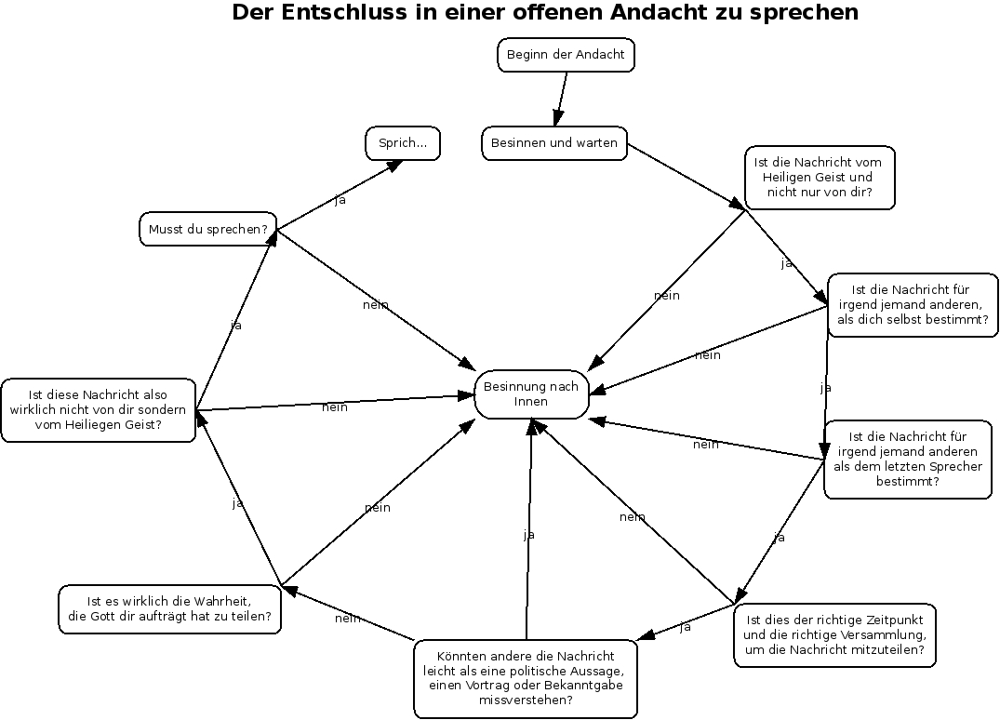

<b>Der Artikel stammt aus dem Archiv!</b> Die Formatierung kann beschädigt sein.

<b>Erstveröffentlichung: 18-01-2013</b>

Irgendwie scheint das Thema gerade in der Luft zu liegen. Vor gut zwei Wochen sprach mich jemand in der Quäkerandacht an, ob ich nicht mal erklären könnte, wie das mit dem Sprechen in der Andacht so funktioniert. Gerade auch weil es bisher gar keine Redebeiträge  gegeben hat.

<!--break-->
Witzigerweise ist genau diese Thema auch ein wichtiges Thema im "Quäker"-Heft 6/2012 (ISSN 1619-0394). Auf Seite 228 bis 231 beschäftigt sich Maurice de Coulon damit. Unter  "Das Wort aus der Stille - Wie verkünden die Freunde?" stellt er 7. "Thesen" auf, die alle nicht allzu revolutionär erscheinen. Viele Gedanken kenne ich von mir selbst oder habe sie schon von Anderen so oder so ähnlich gehört. Gut, aber für Andere mag sein Artikel vielleicht tatsächlich neue Erkenntnisse bringen. Seine 7. "Thesen" taugen nicht, um die Grundfesten des deutschen Quäkertum zu erschüttern, so wie es das Luther tat. Im Gegenteil, sie spiegeln wahrscheinlich den breiten Konsens des liberalen Quäkerums wieder.

Inspirierender fand ich da schon den Text auf Seite 233 bis 248 von Ben Pink Dandelion, der vom GYM 2010 übersetzt wurde. Der Titel lautet "Über die Freude, als Quäker zu leben". Ein nicht unerheblicher Teil beschäftigt sich mit der Quäkerandacht (Ab Seite 238). Hier habe ich durchaus einige neue Anregungen für mich herausziehen können. 

Ich habe dann auf einen anderen Text von Ben Pink Dandelion zurück gegriffen, um für unsere Quäkeranacht Material zum Thema "Wortbeiträge" vorzubereiten, und zwar aus dem Buch "An Introduction to Quakerism" (unter anderem für EUR 23,17 bei Amazon.de). Meine Freundin und ich haben dann begonnen das Kapitel "Unprogrammed worship and vocal ministry" zu übersetzen. Die Hälfte haben wir in der Andacht vorgestellt. Das Echo war überaus positiv.  Wir wollen erst mal weiter an dem Thema dranbleiben. Ich hoffe, dass in ein paar Wochen dann auch ein neuer Artikel für Wikipedia dabei abfällt. 

Wir haben auch ein Diagramm übersetzt, das schematisch den Selbstprüfungsmechanismus darstellt, wenn man überlegt ob man in der Andacht sprechen soll. Zu sehen im Bild oben im Artikel.

## [update 20.1.2013] ##
Korrekturen, Glättungen und Satzumstellungen

