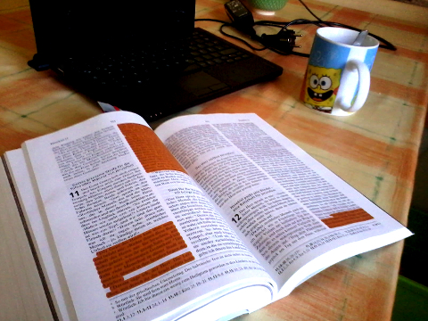

<b>Der Artikel stammt aus dem Archiv!</b> Die Formatierung kann beschädigt sein.

<a href="http://www.the-independent-friend.de/files/2013-03-16-aufgeschlagen.jpg"  >

 Nein es handelt sich hier nicht um die <a href="http://de.wikipedia.org/wiki/Bibel_in_gerechter_Sprache"><i>"Bibel in gerechter Sprache"</i></a>! Bei der <i>"Die GerechtigkeitsBibel"</i> handelt es sich um eine besondere Ausgabe der <a href="http://de.wikipedia.org/wiki/Hoffnung_f%C3%BCr_alle"><i>"Hoffnung für alle"</i></a>-Übersetzung deren Stellen, die sich mit dem Thema Armut und Gerechtigkeit beschäftigen farblich herausgehoben sind. Und das sind wirklich eine Menge stellen! Da mich das Thema Gerechtigkeit im Kontext der Bibel schon immer gefesselt hat, habe ich nur kurz gezögert und die Ausgabe bestellt.

<!--break-->

In einschlägigen Kreisen hat die Ausgabe natürlich sofort reflexartig Widerspruch ausgelöst. im konservative-evangelikale Lager sieht man traditionell die Mission in Zentrum der Bemühungen. Der Glaube an Gott und das Bekenntnis zu Jesus Christus, scheint "das allein selig machende" zu sein. Als Quäker sehe ich das natürlich anders. Ich sage: Wenn ich kein gerechten Lebenswandel führe - oder mich zu mindestens darum bemühe - sollte ich mich besser nicht in den Glauben wähnen vor Gott gerechtfertigt zu sein. Die Entgegnung von konservative-evangelikale Christen darauf ist dann meist, das ein glaubender und bekennender Christ sekundär ein gerechten Lebenswandel führt. Quasi als <i>Abfallprodukt</i>. 

Ich glaube aber nicht, das Gerechtigkeit ein <i>Selbstläufer</i> ist. Weder bei <i>"widergeborenen Christen"</i> noch bei Atheisten oder Buddhisten. Es ist selten so, das Jemand der ungerecht handelt, sich darüber bewusst ist. In aller Regel hat das ungerechte Handeln eine Grund/Begründung, die es in den Augen des ungerechte Handelnden legitimieren.  Auch die Mehrheit der KZ-Wachmannschaft wird sich (vermutlich) bei ihrem Handeln im Recht gefühlt haben. Wenn sich nun ein SS-Wachmann sich nun zu Gott bekennt ändert das erst mal gar nichts an der Situation. Und die Mehrzahl der SS- und Wehrmachtsangehörige werden - formal - einer christlichen Konfession angehört haben. Das zeigt mir, das es sehr wohl nötig ist sich als Christ von der Bibel, von anderen Christen und von Nichtchristen sich über die Frage der Gerechtigkeit schulen und belehren zu lassen. Und in der <i>"Die GerechtigkeitsBibel"</i> sehe ich ein wichtigen Beitrag dazu.

Leider gibt es die Bibel aber nicht als eBook. So liegt jetzt das Buch bei mir in der Küche, und ich habe schon öfter Morgens kurz vor dem Losgehen beim Frühstückskaffee ein paar Seiten gelesen. Als Taschenbuch ohne Hardcover ist das Buch für den Transport schlecht geeignet. Beim Lesen ist mir aufgefallen, das Stellen nicht markiert sind die ich markiert hätte und umgekehrt, gibt es Stellen wo ich mich frage warum sie markiert sind. Im Vorwort wird geschrieben, das man sich bei den Markierten stellen an dem englischen Original-Projekt "Poverty and Justice Bible" orientiert hat und man sich sehr wohl bewusst ist, das es unterschiedliche Meinungen gibt, welche Stellen markiert werden sollten. Ich finde die Markierungen trotzdem sinnvoll. Ich finde es auch interessant, gebrauchte Bücher mit Markierungen und handschriftlichen Notizen anzusehen. Bei der <i>"Die GerechtigkeitsBibel"</i> ist es so ähnlich.

Noch ein Wort zur "Hoffnung für alle"-Übersetzung an sich: Die Übersetzung ist sehr beliebt. Vielleicht sogar der Zeit die beliebteste Übersetzung neuerer Zeit. Die Bibel ist in dieser Übersetzung leicht, flüssig und verständlich zu lesen, was den Erfolg ausmachen wird. Kritisiert wird, das die Übersetzung an einigen Stellen zu Frei sei und eine Interpretation des Textes vorweg nimmt. Als "niedrigschwelliges Angebot" und Einstig finde ich die Übersetzung nicht schlecht. Als Konvertit oder Alltagsgestresster mit wenig Zeit, ringt man sowieso nicht mit jedem Wort. Man will das Gosse Ganze erfassen und verstehen und sich nicht eine halbe Stunde an einem einzigen Satz abmühen der kein Sinn ergeben will. Ich habe hier auch noch die <a href="http://de.wikipedia.org/wiki/Elberfelder_Bibel">Elberfelder</a>, in einem robusten Einband. Da kann ich dann auch mal vergleichen. Was bestimmt auch Sinn macht.

