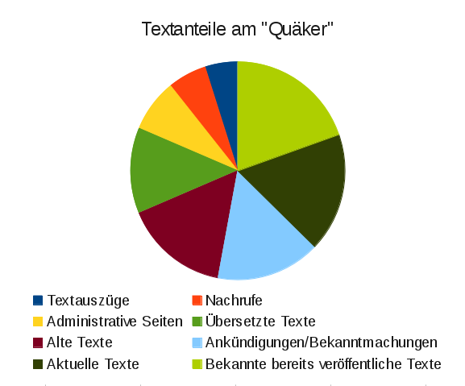

<b>Der Artikel stammt aus dem Archiv!</b> Die Formatierung kann beschädigt sein.

Ich habe mir den Spaß gemacht und die aktuelle  "Quäker"-Heftausgabe statistisch ausgewertet. Über die Aussagekraft lässt sich natürlich immer streiten. Ich lasse das Bild ein fach mal unkommentiert  so stehen.

<!--break-->

 Inhaltlich kann ich den Artikel von Martin Januschek empfehlen. Unter der abscheckenden Überschrift <i>"Quäkers tun't spreach ein richtig gut Deutsch - Kolumne Teil 8: Sense of the Meeting"</i> ist ihm ein kurzer verständlicher Text gelungen. Er vertritt nachvollziehbar die Meinung, das man im Deutschen sehr wohl ohne den Begriff/Redewendung "Sense of the Meeting" aus käme.

<h2>Nachtrag</h2>

Vielleicht doch noch eine Erläuterung zur Grafik:  Der Unterschied zwischen "Alte Texte" und "Bekannte bereits veröffentlichte Texte" ist, das ich mir bei den "Alte Texte" nicht sicher bin, ob die schon mal veröffentlicht wurden. Es gibt keine redaktionellen Infos dazu in dem Heft. Also ist Lila und Hellgrün möglicherweise zusammen zu zählen. Die Seitenzahlen verteilen sich nach meiner Zählung so:

<table border="0">
  <tr><th>Seitentyp</th><th>Seitenzahl</th></tr>
  <tr><td>Textauszüge</td><td>2,5</td>
  <tr><td>Nachrufe</td><td>3</td>
  <tr><td>Administrative Seiten</td><td>4</td>
  <tr><td>Übersetzte Texte</td>	<td>6,5</td>
  <tr><td>Alte Texte</td><td>8</td>
  <tr><td>Ankündigungen/Bekanntmachungen</td><td>8</td>
  <tr><td>Aktuelle Texte</td><td>9
  <tr><td>Bekannte bereits veröffentliche Texte</td><td>10</td>
</table>

