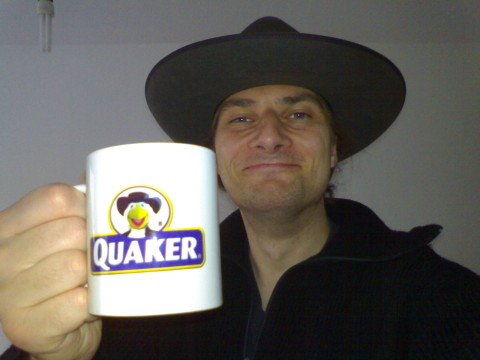

**Der Artikel stammt aus dem Archiv!** Die Formatierung kann beschädigt sein.

Erstveröffentlichung: Mo, 22/09/2008 - 21:23 — OlafRadicke

Manch mal nervt <s>nicht</s> mich das elitäre Gehabe in Quäkerversammlungen. Diese andächtige, salbungsvolle Sprechen. Ich dachte, Quäker haben keine Sakramente? Ich dachte, für Quäker ist das gesamte Leben eine Andacht und ein Sakrament? Ich kann mir aber nicht vorstellen, wie dann mit derselben Feierlichkeit der Versammlungen auch auf dem Klo das Klopapier abgerissen wird, mit dem man sich dann salbungsvoll den Arsch abwischt. Das würde mich eher erinnern an eine Achtsamkeitübung im Zen.

Es wird seit langem von den meisten Mitliedern auf den Hut verzichtet, keine graue Kleidung mehr getragen, konfessionelle Mischehen sind kein Problem mehr, der eine oder andere sieht auch kein Problem mehr im Konsum von Alkohol. Aber in der Kommunikation innerhalb der Gesellschaft gibt es scheinbar immer noch sehr starke Normierung. Da muss dann immer ruhig, leise und bedächtig gesprochen werden, wenn man als <i>quäkerisch</i> gälten möchte.

Warum eigentlich? Es gab unter den <i>Frühen Freunden</i> jede Menge raue Gesellen. G. Fox gehörte bestimmt auch dazu... Also ich plädiere dafür, mal etwas lockerer zu werden. Als Übung könnten wir doch mal eine Jahresversammlung in Clowns-Kostümen abhalten! Die deutsche Jahresversammlung hat keine 300 Mitglieder. Eigentlich  gesellschaftlich völlig bedeutungslos. Wann wurde denn das letztemal von der Deutschen Jahresversammlung eine Erklärung zu irgendeinem gesellschaftlichen Problem veröffentlicht. Das GYM (German Yearly Meeting) schweigt zu den Auslandseinsätzen der Bundeswehr, zur Massenarbeitslosigkeit, zur Zwei-Klassen-Medizin, zur Kinderarmut, zur Bahnprivatisierung und zum Raubtierkapitalismus, zur Mindestlohn-Debatte, zum Pflegenotstand in Krankenhäusern und Altersheimen. Wenn das GYM den Menschen in Deutschland und den Mächtigen dieser Welt nichts mehr zu sagen hat, dann können wir uns auch eine rote Clowns-Nase in unseren Versammlungen aufstecken und einen Finger in den Po stecken. Es wird sowieso keinen interessieren, ob bei den Quäkern Leute mit dem Finger im Po und Clowns-Nase herum laufen ...oder im China ein Sack Reis umfällt.

Sicher, wer nichts macht, macht auch nichts falsch. Aber definitiv auch nichts richtig! Hat sich eine Versammlung schon mal ernsthaft in den letzten Jahren gefragt, warum es Quäker geben sollte und warum etwas fehlen würde, wenn es sie nicht mehr gäbe? Das ist auch die Frage, die sich der Mennonit Wolfgang Krauß kürzlich in seinem Artikel stellte (ich berichtete: "Wachsen aus den Wurzeln" - Überlegungen bei den Mennoniten <a href="http://www.the-independent-friend.de/?q=node/271">http://www.the-independent-friend.de/?q=node/271</a>). Eine Auseinandersetzung tut bitter Not.

 Dieser Text ist unter einer <a rel="license" href="http://creativecommons.org/licenses/by-sa/3.0/de/">Creative Commons-Lizenz</a> lizenziert. **Und** unter der <a href="http://de.wikipedia.org/wiki/GFDL">GNU-Lizenz für freie Dokumentation</a> in der Version 1.2 vom November 2002 (abgekürzt GNU-FDL oder GFDL). Zitate und verlinkte Texte unterliegen den Urheberrecht der jeweiligen Autoren.
