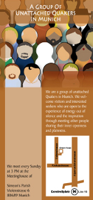

**Der Artikel stammt aus dem Archiv!** Die Formatierung kann beschädigt sein.

Die Unabhängige Versammlung in München hat sich eigene Flyer erstellt. Sie können auf der Kampangenseite heruntergeladen werden: http://WasKannstDuSelbstSagen.de/

Bevor ich weiter auf die neuen Flyer eingehe, möchte ich die Flyer des GYM noch mal analysieren. Dann wird auch recht schnell klar warum auch ich das große Bedürfnis hatte, einen völlig neuen Flyer zu gestalten.

<!--break-->
 
Also das aller Erste was mir sehr aufstösst, ist das dass GYM immer in dritter Person von sich selbst spricht. In dem Flyer heißt es u.a.:

<ul>
<li><i>"Im Allgemeinen glauben **die** Freunde..."</i> </li>
<li><i>"**Die** Freunde kommen zusammen..."</i>  </li>
<li><i>"**Die** Freunde kommen aus der Christlichen Tradition..."</i>  </li>
<li><i>"**Sie** wissen indessen um..."</i>  </li>
<li><i>"Die Andacht ist Mittelpunkt für das religiöse Leben in der Religiösen Gesellschaft **der** Freunde."</i>  </li>
<li><i>"**Freunde** sehen sich nicht in der Lage..."</i>  </li>
<li><i>"Göttliche Offenbarung ist nach **ihrer** Ansicht..."</i>  </li>
<li><i>"Es ist ein lebendiges Zeugnis **der** Freunde..."</i>  </li>
<li><i>"Das Fehlen eines verbindlichen Bekenntnisses heißt nicht, dass **es** Freunden ..."</i>  </li>
</ul>

Das wirkt auf mich völlig albern. Was will man damit zum Ausdruck bringen? Wahrscheinlich, das es eine unumstößliche und unzweifelhafte Tatsachenbehautung einer über alles schwebenden Autoritär wäre. Ich sag euch, wie es auf mich wirkt: Entweder litten die Autoren unter einer Persönlichkeitsspaltung, das sie von sich selbst in dritter Person sprachen, oder die Autoren fühlten sich garnicht als Quäker, so das sie auch nicht in **<i>WIR</i>**-Form sprechen konnten. Wenn das GYM vom Quäkertum spricht, als hätte es nichts mit einem selbst zu tun, könnte man auch auf die Idee kommen, das GYM ist keine Glaubensgemeinschaft, sondern ein Verein von Hobby-Historikern mit dem Schwerpunkt Quäkertum. Also er eine Geschichtswerkstatt von Hobby-Historikern. Der Geschichtsverein von Neandertal würde seinen Flyer bestimmt auch so beginnen lassen: <i>"Die Andacht ist Mittelpunkt für das religiöse Leben **der** Neandertaler Gesellschaft."</i>. Sie würden niemals schreiben: <i>"Die Andacht ist für **uns** Neandertaler Mittelpunkt **unseren** religiöse Lebens in **unsere** Gemeinschaft."</i> Weil sie sind ja keine Neandertaler. Also möchte uns das GYM mitteilen, das sie keine Quaker sind?

Na gut, auch wenn man das als dumme Flause abtut, gibt es noch andere Dinge, die ich für misslungen halte, an dem Flyer des GYM. Bevor ich in die Details gehe, sei noch angemerkt, das dass GYM drei Flyer hat mit den Titeln "Einführung", "Andacht" und "Frieden". In allen drei Flyern steht zu 50% der exakt selbe Text. Im folgenden beziehe ich mich auf den Flyer "Einführung".

Was mir an dem Flyer ("Einführung") sofort auffiel war die ewigen Wiederholungen. Die Anschrift des Quäkerhaus war zweimal vermerkt. Die Andacht wird an zwei verschiedenen Stellen behandelt, mit sich wiederholenden Inhalt:
<ul>
<li><i>"Die stille Andacht ist der Mittelpunkt **der** Quäkergemeinschaft.[...]"</i></li>
<li>Und an einer anderen Stelle: <i>"Die Andacht ist Mitte und Ausgangspunkt für das religiöse Leben in der Religiösen Gesellschaft **der** Freunde.[...]"</i></li>
</ul>
Die Formulierung <i>"religiöse Leben in der Religiösen Gesellschaft"</i> ist auch etwas unglücklich, ohne das jetzt weiter kommentieren zu wollen.  Das <i>"Christentum"</i> wird auch zweimal an unterschiedlichen Stellen abgehandelt:
<ul>
<li><i>"**Die** Religiöse Gesellschaft der Freunde hat ihre Wurzeln im Christentum[...]"</i></li>
<li>Und an einer anderen Stelle: <i>"**Die** Freunde kommen aus der christlichen Tradition und teilen deren Grundwerte.[...]"</i></li>
</ul>
...An welche <i>"christlichen Grundwerte"</i> sie da kontret denken bleibt offen. Ich hätte da zwar ein paar zynische Vorschläge, aber derer enthalte ich mich ausnahmsweise mal.

Witzig ist auch an dem Flyer, wie umständlich manche Sachen ausgedrückt sind. Einer dieser <i>Köstlichkeiten</i> ist z.B. dieser Satz:<i>"2. Einmal im Jahr findet die Jahresversammlung (mit Mitgliedsversammlung) statt. An ihr können Mitglieder, "Freunde der Freunde", Jungfreunde, Junioren, Kinder und Gäste teilnehmen."</i>

...Also alle ( - oder?)! Meine Herren! Man kann sich aber auch wirklich umständlich ausdrücken. Wahrscheinlich wollte man sich die Hintertür aufhalten, jemanden nach Hause schicken zu können, mit dem man ein Problem hat, in dem man ihm sagen kann: "Du warst nicht eingeladen, also bist du kein Gast und musst darum folglich gehen...". Wenn das wirklich der Grund war, muss ich sagen: ziemlich kleinmütig! Hab ich nicht den Arsch in der Hose, jemanden ins Gesicht zusagen: "Ich hab hier ein Problem mit <i>dir</i> und deshalb mach ich jetzt von mein Hausrecht Gebrauch, um dich zu bitten jetzt zu gehen..."? Und ach ja, was das "2." sollte ist mir auch schleierhaft geblieben. Es gibt zwar auch ein "1." aber ich kann bei besten willen keine Aufzählung darin sehen.

Einen anderen Kuriosen Satz fand ich unter der der Überschrift "Sakrament". Und zwar diesen hier: 

<i>"Die künstliche Unterscheidung zwischen dem Weltlichen und dem Religiösem ist für **die** Freunde gegenstandslos, so dass alles Leben, das im Geist gelebt wird, als sakramental zu verstehen ist."</i>

Was ein verqarzter Satz. Meine Fresse! Theologisch ist es bei den Frühen Freunden (den ersten Quäkern) total simpel: Gott allein ist Heilig. Gott wohnt nicht in Kirchen und materialisiert sich auch nicht in  Hostien. Also sind weder Gegenstände, oder Rituale noch Orte (an sich) "heilig". <i>Man</i> ist von Gott - dem "Innere Licht" - erfüllt und geleitet und führt ein "heiliges Leben" oder der Geist ist verdunkelt und man führt ein unheiliges Leben in Finsternis. So einfach <i>ist</i> oder <i>war</i> das.

Der erste Fehler der in dem Satz gemacht wurde, war "Weltlich" und "Religiös" singleich mit "heilig" und "profan" (unheilig) zu verwenden. Das musste schief gehen. Der nächste Fehler war, zu behaupten es würde keine Unterscheidung gemacht: <i>"[...]Unterscheidung zwischen dem Weltlichen und dem Religiösem ist für **die** Freunde gegenstandslos [...]"</i> um dann auf einmal mit einer Bedingung zu kommen <i>"[...]alles Leben, das im Geist gelebt wird, [...]"</i>. Jeder der logisch denken kann weis, wenn es eine Bedingung gibt, gibt es ein <i>entweder-oder</i>, also eine Unterscheidung, was aber im ersten Teil des Satzes ausgeschlossen wurde: <i>"[...]Unterscheidung zwischen dem Weltlichen und dem Religiösem ist für **die** Freunde gegenstandslos [...]"</i> ...Die Verwirrung ist komplett! Da bringt der Nachsatz <i>"[...]zu verstehen ist."</i> auch keine Rettung mehr, der versucht etwas als <i>a priori</i> da zu stellen. 

So, wer jetzt Lust bekommen hat sich mal die Flyer des GYM zu besorgen und durch zu lesen, wende sich an http://www.rgdf.de oder schreibe an: Quäkerhaus, Bombergallee 9, 31812 Bad Pyrmont. Dort und im Quäkerbüro in Berlin modern die Flyer vor sich hin. 

So und jetzt - wie schon oben Angekündigt - zu Selbstkritik, an den eigen Flyern. Wir haben da etliche Stunden und Wochen darüber gebrütet. Irgendwann wird man aber betriebsblind. Möglicherweise gibt es noch mehr Fehler, als die die mir aufgefallen sind. Den Flyer am PC zu entwerfen und ihn dann tatsächlich gedruckt vor sich zu haben, ist dann wirklich noch mal ein Unterschied. So sind mir die Fehler erst aufgefallen, als der Flyer dann gedruckt war - klar! 

Fehler Nummer eins: Der Flyer hat zwei Rückseiten und keine Vorderseite. Na ja, jedenfalls wirkt er so auf mich. Die Anfahrtsskize mit der Anschrift ist für Gewöhnlich immer auf der Rückseite. Bei uns ist sie aber auf dem Titelblatt. Deshalb sieht es einwenig wie die Rückseite aus. Da wir den Flyer zweisprachig gemacht haben, hat man dann also quasi zwei Rückseiten. Ein mal Deutsch, ein mal Englisch.

Der zweite Fehler ist der, das der Slogan <i>"Was Kannst Du Selbst Sagen"</i> nicht auf der Titelseite erscheint, was den Eindruck einer Rückseite noch verstärkt. Der zentrale Aufhänger fehlt deshalb. Es währe optimal gewesen, das der Slogan von der Titelseite dann im Innentext noch mal zum Schluss aufgegriffen würde.

Der Flyer ist aber ausdrücklich von uns unter der Creative Commons Lizenz gestellt worden. Auf der <a href="http://www.waskannstduselbstsagen.de/kampagnenmaterial.html">Website des Flyers</a> sind alle Materialien zu finden, die ihr bracht, um den Flyer nach zu bauen und natürlich auch zu verbessern. Die Lizenz verpflichtet euch aber, das ihr euer (veröffentlichtes) Ergebnis, unter den gleichen Bedingungen weiter gebt. So profitieren dann alle von den Verbesserungen. 

 Dieser Text ist unter einer <a rel="license" href="http://creativecommons.org/licenses/by-sa/3.0/de/">Creative Commons-Lizenz</a> lizenziert. **Und** unter der <a href="http://de.wikipedia.org/wiki/GFDL">GNU-Lizenz für freie Dokumentation</a> in der Version 1.2 vom November 2002 (abgekürzt GNU-FDL oder GFDL). Zitate und verlinkte Texte unterliegen den Urheberrecht der jeweiligen Autoren.
