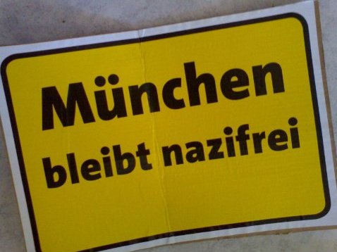

**Der Artikel stammt aus dem Archiv!** Die Formatierung kann beschädigt sein.

Wie schon letztes mal (Siehe: <a href="http://www.the-independent-friend.de/?q=node/556">Demo gegen Nazi-Aufmarsch in M&uuml;nchen</a>) war ich auch dieses Jahr wieder auf der Gegen-Demo zum &quot;Heldengedenkmarsch&quot; der Nazis. Das Pappschild das auf dem Bild zu sehen ist wurde mir in die Hand gedr&uuml;ckt. Keine sehr differenziert-akademische Aussage, aber aber eine klare Position. Das M&uuml;nchen nicht &quot;Nazifrei&quot; ist, und es deshalb auch nicht &quot;bleiben kann&quot; ist mir auch klar. In der Stra&szlig;e in der ich wohne, kann man z.B. in einem Wohnzimmer durch die Scheibe eine Reichskriegsflagge an der Wand sehen.
<!--break-->
Die Ruhte der des Nazi-Aufmarsch war dieses Jahr clever gew&auml;hlt. Sie f&uuml;hre lange Strecken an der Isar lang. Dadurch musste von der Polizei nur eine Seite der Rute abgesichert werden. Sie f&uuml;hrte vom Isartor &uuml;ber Steinsdorfer-/Widenmayer-Str (perverser weise) um den Friedensengel herum; &uuml;ber die Prinzregentenstr zur Neuen Staatskanzlei, wo die Abschlusskuntgebung war.
Die &quot;Nazi-Parade&quot; hatte etwa 100 Teilnehmer. Es waren 1800 Polizisten im Einsatz und ca. 3000 Gegendemonstranten unterwegs. Das hei&szlig;, auf zwei Demonstranten kam ungef&auml;hr ein Polizist. Bei der Auftakt-Veranstaltung der Gegendemonstranten auf dem Sendlingertor-Platz versammelten sich ca. 200-300 Autonome eingekesselt von der Polizei und zog von da aus los, zu ihrer eigenen Rute. Hinter ihr her ein riesen Tross an Polizei-Fahrzeugen. Als die dann weg waren, f&uuml;llte sich der Platz langsam mit Rentner, Kindern, V&auml;ter, M&uuml;ttern, Schwulen, Lesben, Tunten und allen m&ouml;glichen Volk. Die Stimmung war sehr friedlich und Weit und Breit keine Polizei mehr. Es sprachen verschiedene Vertretet der Stadt, der Kirchen und Soziale Gruppen zu den Versammelten. Um kurz vor ca. 14 Uhr trat ein KZ-&Uuml;berlebender an das Mikrophon. Er informierte dar&uuml;ber, das die Gruppe der Nazis sich jetzt in Bewegung gesetzt h&auml;tte und er sich jetzt auf machen werde, sich dieser friedlich in den Weg zu stellen. Darauf setzte sich der gro&szlig; teil der Zuh&ouml;rer gemeinsam in Bewegung, Richtung Nazi-Aufmarsch. Das Programm auf dem Sendlingertor-Platz ging dann mit einem Kabarettmitglied der &quot;M&uuml;nchner lach und schiess Gesellschaft&quot; weiter. Viel Publikum hatte er aber nicht mehr.
Ich setzte mich mit dem gr&ouml;&szlig;ten Teil der Demonstranten zusammen in Bewegung. Es ging mitten durch die Innenstadt am Marienplatz vorbei. Nirgends Polizei. Mitten durch die Massen von Leuten, die zum Shoppen in der Stadt waren. Zumeist mit entgeisterten Blicken. Ich dachte mir in dem Moment: Ja, M&uuml;nchen ist wohl f&uuml;r die Meisten in erster Linie eine Stadt zum Geld verdienen und Geld ausgeben. Vielleicht h&auml;tte die Gegendemo mehr Teilnehmer gehabt, wenn Fressgutscheine von McDonalds verteilt worden w&auml;re und und ein iPhone G4 verlost worden w&auml;re. &quot;Shoppen gegen Rechts!&quot; Ich denke schon, das M&uuml;nchen ziemlich unpolitisch ist. Die Demo gegen die <a href="http://www.the-independent-friend.de/?q=node/241">&quot;Feierliche Vereidigung der Bundeswehrsoldaten&quot;</a> war ja auch mehr als kl&auml;glich.
Als wir dann bei der Rute der Nazi-Aufmarsch ankamen, standen wir f&ouml;rmlich vor einer Wand von Polizei. Es gab zu keinem Zeitpunkt eine reelle Chance, sich den Nazis in den Weg zu stellen. Die Rute war hermetisch abgeriegelt. Erst ganz zum Schlu&szlig;, kam ich zu mindestens auf Sichtweite der Nazis, um mein Plakat hoch zu halten um mein Protest zu zeigen. Aber auch nur, weil die Rute kurzfristig umgeleitet wurde, durch die Nebenstra&szlig;e, in der ich zuf&auml;llig stand. Die Szene die sich mir bot, war einfach nur grotesk! Ein Typ, der vor den Gruppe von schwarz gekleideten 100 Leuten vor weg lief, hatte ein Holzkreuz in der Hand, &uuml;ber das ein verrosteter Stahlhelm des zweiten Weltkriegs hing. Das Kreuz ist in erster Linie immer noch das Symbol des Christentum. In dieser Kombination wirkte es auf mich einfach nur blasphemisch. Da hinter kam ein Lautsprecherwagen mit Marschmusik und zwei Fahnentr&auml;ger mit dem Bayrischen Wappen - was die Bayer unter den Gegendemonstranten sehr erz&uuml;rnte, und mit h&ouml;hnischen Kommentaren beantwortet wurde. Na gut, mit den blau-wei&szlig; Tischtuch an der Fahnenstange verbinde ich nichts.
Ich fand schade, das ich keine Bekannten unter den Demonstranten gesehen habe wie im letzten Jahr. Vielleicht h&auml;tte ich mal ein Telefon-Rundruf machen sollen. Als Fazit w&uuml;rde ich sagen, die Rute war dieses Jahr sehr clever von den Nazis gew&auml;hlt. Allerdings wird wohl kaum jemand die Nazi-Demo gesehen haben, weil dank der Polizei kaum jemand in Sichtweite kam. In so fern, war es eine Veranstaltung &quot;unter Ausschluss der &Ouml;ffentlichkeit&quot;. Die konsequente Weiterentwicklung der Idee w&auml;re, sich n&auml;chste mal eine Reithalle zu mieten, und dort drei Stunden unter Ausschuss der &Ouml;ffentlichkeit im Kreis zu marschieren. Oder noch besser: Dann k&ouml;nnte ich mich mit mein Plakat auf die Zuschauertrib&uuml;ne (wenn es eine Wettkampf-Halle ist) setzen und im Sitzen demonstrieren. Weil nach 5 Stunden Stehen und Laufen, taten meine Beine gestern ganz sch&ouml;n weh. Und ich k&ouml;nnte dann endlich was sehen und gesehen werden
Ach ja, mein eigener Slogan, den ich mir gestern an den Hut geheftet hatte war: &quot;Ungl&uuml;cklich das Land, das Helden n&ouml;tig hat.&quot;.

  
Dieser Text ist unter einer <a href="http://creativecommons.org/licenses/by-sa/3.0/de/" rel="license">Creative Commons-Lizenz</a> lizenziert. **Und** unter der <a href="http://de.wikipedia.org/wiki/GFDL">GNU-Lizenz f&uuml;r freie Dokumentation</a> in der Version 1.2 vom November 2002 (abgek&uuml;rzt GNU-FDL oder GFDL). Zitate und verlinkte Texte unterliegen den Urheberrecht der jeweiligen Autoren.
